# Technical Specifications

## 1. INTRODUCTION

### EXECUTIVE SUMMARY

| Project Overview | Engagerr |
| --- | --- |
| **Core Business Problem** | Content creators lack unified analytics across platforms to accurately value their content, while brands struggle to find and evaluate creators for partnerships based on reliable data. |
| **Key Stakeholders** | • Content Creators (independent creators, podcasters, athletes, celebrities)<br>• Brands seeking creator partnerships<br>• Marketing agencies managing creator relationships |
| **Value Proposition** | Engagerr's proprietary content mapping technology tracks parent/child content relationships across platforms, providing creators with holistic analytics and brands with data-driven creator discovery opportunities. |

Engagerr revolutionizes the creator economy by establishing a comprehensive two-sided marketplace that addresses the fragmentation of creator analytics and brand partnership processes. By leveraging advanced AI and sophisticated content relationship tracking, the platform creates unprecedented transparency and efficiency in creator-brand collaborations.

### SYSTEM OVERVIEW

#### Project Context

| Business Context | Description |
| --- | --- |
| **Market Positioning** | Positions at the intersection of creator analytics, brand partnership platforms, and content marketing tools |
| **Industry Challenge** | The creator economy lacks standardized metrics for content valuation across platforms and transparent matchmaking between creators and brands |
| **Target Market Segments** | • Content Creators seeking to monetize their influence<br>• Brands of all sizes seeking authentic creator partnerships<br>• Agencies managing creator relationships |

#### High-Level Description

Engagerr is a web-based platform built on NextJS that serves two distinct user types: content creators and brands. The system's primary innovation is its content relationship mapping technology that tracks how content evolves and spreads across platforms.

The platform architecture consists of:

1. **Analytics Engine** - Tracks hierarchical content relationships using graph database structures in Postgres
2. **Discovery Marketplace** - Facilitates creator-brand matching through AI-enhanced filtering and recommendations
3. **Transaction Management** - Handles contracts, payments, and partnership workflows
4. **Multi-model AI System** - Powers content analysis, relationship detection, and matchmaking using specialized models

The technical approach leverages server components for data-heavy operations, client components for interactive elements, and containerized AI model deployment for scalable processing.

#### Success Criteria

| Critical Success Factors | Measurable Objectives |
| --- | --- |
| **Creator Adoption** | • 10,000+ creators onboarded in year one<br>• 30% free-to-paid conversion rate<br>• 90% content successfully mapped across platforms |
| **Brand Engagement** | • 1,000+ brands actively using the platform<br>• 75% of brands initiating at least one partnership<br>• 40% annual subscription expansion |
| **Platform Performance** | • 99.9% uptime<br>• 95th percentile response time under 500ms<br>• AI analysis completed within 24 hours of content submission |
| **Economic Success** | • 75-80% gross margin<br>• 15-20% monthly growth in year one<br>• Balanced revenue mix across subscriptions, platform fees, and add-ons |

### SCOPE

#### In-Scope

**Core Features and Functionalities:**

- Content relationship tracking and mapping across platforms
- Multi-platform analytics unification and standardization
- AI-powered content performance insights and recommendations
- Creator discovery with advanced filtering capabilities
- Partnership workflow management (proposals, contracts, payments)
- Subscription-based access model with tiered plans
- Team collaboration tools for enterprise users

**Implementation Boundaries:**

- **Platforms:** Web application only (no native mobile apps)
- **User Groups:** Content creators, brands, and their team members
- **Data Domains:** Content metrics, audience analytics, engagement data, and transaction information
- **Integrations:** Major social media platforms, payment processors, and email services

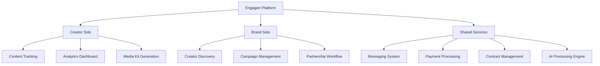

#### Out-of-Scope

- Native mobile applications (iOS/Android)
- Direct content creation or publishing tools
- Enterprise-level API access for external integrations
- White-label solutions and custom branding
- Advanced RFP campaign tools and auction-style bidding
- Custom research services and market analysis
- Legacy media integration (TV, print, radio)
- Content production services or creator talent management
- Advertising management beyond creator partnerships
- Direct integration with traditional agency workflows

Future phases may address these limitations based on market demand and platform maturity.

## 2. PRODUCT REQUIREMENTS

### 2.1 FEATURE CATALOG

#### Creator-Focused Features

| Feature ID | Feature Name | Category | Priority | Status |
| --- | --- | --- | --- | --- |
| F-001 | Creator Onboarding | User Management | Critical | Proposed |
| F-002 | Content Relationship Mapping | Content Tracking | Critical | Proposed |
| F-003 | Cross-Platform Analytics | Analytics | Critical | Proposed |
| F-004 | Audience Analysis | Analytics | High | Proposed |
| F-005 | Media Kit Generation | Marketplace | Medium | Proposed |
| F-006 | Content Repurposing Recommendations | AI Insights | Medium | Proposed |
| F-007 | Team Collaboration | User Management | Medium | Proposed |
| F-008 | Competitive Benchmarking | Analytics | Medium | Proposed |

#### Brand-Focused Features

| Feature ID | Feature Name | Category | Priority | Status |
| --- | --- | --- | --- | --- |
| F-009 | Brand Onboarding | User Management | Critical | Proposed |
| F-010 | Creator Discovery | Marketplace | Critical | Proposed |
| F-011 | Campaign Management | Partnership | High | Proposed |
| F-012 | AI-Powered Matching | Marketplace | High | Proposed |
| F-013 | RFP Campaign Creation | Partnership | Low | Proposed |
| F-014 | Custom Research | Insights | Low | Proposed |

#### Shared Platform Features

| Feature ID | Feature Name | Category | Priority | Status |
| --- | --- | --- | --- | --- |
| F-015 | Messaging System | Partnership | High | Proposed |
| F-016 | Contract Management | Partnership | High | Proposed |
| F-017 | Payment Processing | Partnership | Critical | Proposed |
| F-018 | Subscription Management | Business | Critical | Proposed |
| F-019 | Add-on Purchases | Business | Medium | Proposed |
| F-020 | Authentication System | Security | Critical | Proposed |

### 2.2 FEATURE DETAILS

#### F-001: Creator Onboarding

**Description:**
- **Overview:** Comprehensive onboarding process for content creators to register, connect social accounts, and initialize content analysis.
- **Business Value:** Critical entry point that drives platform adoption and data collection.
- **User Benefits:** Simplified process to bring all content under one analytics system.
- **Technical Context:** Requires seamless integration with social platforms and AI analysis initialization.

**Dependencies:**
- **Prerequisite Features:** Authentication System (F-020)
- **System Dependencies:** Database, Analytics Engine
- **External Dependencies:** Social Media Platform APIs
- **Integration Requirements:** OAuth for social platforms, Email service

#### F-002: Content Relationship Mapping

**Description:**
- **Overview:** Proprietary technology that tracks hierarchical content relationships from long-form to micro-content derivatives.
- **Business Value:** Core differentiator that enables holistic content valuation.
- **User Benefits:** Complete visibility of content journey and total reach.
- **Technical Context:** Implemented using graph database structures in Postgres.

**Dependencies:**
- **Prerequisite Features:** Creator Onboarding (F-001)
- **System Dependencies:** Graph Database, AI Processing Engine
- **External Dependencies:** Social Platform APIs
- **Integration Requirements:** Content metadata extraction, relationship detection

#### F-010: Creator Discovery

**Description:**
- **Overview:** Advanced search interface for brands to discover creators based on multiple criteria.
- **Business Value:** Primary conversion point for brand users.
- **User Benefits:** Data-driven creator selection based on verifiable metrics.
- **Technical Context:** Requires sophisticated filtering and AI-enhanced matching.

**Dependencies:**
- **Prerequisite Features:** Brand Onboarding (F-009), Content Relationship Mapping (F-002)
- **System Dependencies:** Search Indexing, Analytics Database
- **External Dependencies:** None
- **Integration Requirements:** AI matching system

#### F-017: Payment Processing

**Description:**
- **Overview:** Secure payment processing for marketplace transactions with escrow capabilities.
- **Business Value:** Enables platform fee collection and transaction safety.
- **User Benefits:** Secure, milestone-based payments with protection for both parties.
- **Technical Context:** Implemented through Stripe Connect with custom escrow logic.

**Dependencies:**
- **Prerequisite Features:** Contract Management (F-016)
- **System Dependencies:** Financial Database
- **External Dependencies:** Stripe API
- **Integration Requirements:** Payment processor webhooks, notification system

### 2.3 FUNCTIONAL REQUIREMENTS

#### F-002: Content Relationship Mapping

| Requirement ID | Description | Acceptance Criteria | Priority |
| --- | --- | --- | --- |
| F-002-RQ-001 | System must track parent/child content relationships across platforms using graph database structure | - Relationships stored and retrievable<br>- Content hierarchy accurately represented<br>- Updates propagate through relationship tree | Must-Have |
| F-002-RQ-002 | System must calculate total reach across all content derivatives with standardized metrics | - Aggregate metrics accurately calculated<br>- Duplicate audience eliminated<br>- Standardized formulas applied consistently | Must-Have |
| F-002-RQ-003 | System must provide visual representation of content relationships | - Interactive visualization rendered<br>- Performance metrics displayed<br>- Drill-down capability functional | Should-Have |
| F-002-RQ-004 | System must suggest potential content relationships using AI analysis | - Suggestions meet 85% accuracy<br>- New relationships identified within 24 hours<br>- Creator can approve/reject suggestions | Could-Have |

**Technical Specifications:**
- **Input Parameters:** Content URLs, platform identifiers, metadata
- **Output/Response:** Relationship graph, performance metrics, visualization
- **Performance Criteria:** Relationship analysis within 24 hours, sub-500ms graph retrieval
- **Data Requirements:** Content metadata, performance metrics, relationship mappings

**Validation Rules:**
- **Business Rules:** Content must be verified as owned by creator
- **Data Validation:** Platform-specific content identifiers must be valid
- **Security Requirements:** Content relationships visible only to owner and authorized team
- **Compliance Requirements:** Copyright verification, platform terms of service compliance

#### F-003: Cross-Platform Analytics

| Requirement ID | Description | Acceptance Criteria | Priority |
| --- | --- | --- | --- |
| F-003-RQ-001 | System must unify analytics from multiple platforms with standardized metrics | - Data from all platforms displayed<br>- Common metrics framework applied<br>- Historical data available | Must-Have |
| F-003-RQ-002 | System must visualize performance trends with interactive dashboards | - Time-series visualization functional<br>- Filter controls respond correctly<br>- Data updates reflected in real-time | Must-Have |
| F-003-RQ-003 | System must identify peak engagement times and patterns | - Engagement patterns highlighted<br>- Platform-specific insights provided<br>- Actionable recommendations generated | Should-Have |
| F-003-RQ-004 | System must enable comparative analysis between content families | - Multiple content sets comparable<br>- Key differences highlighted<br>- Performance ranking available | Should-Have |

**Technical Specifications:**
- **Input Parameters:** Platform identifiers, date ranges, metric selections
- **Output/Response:** Visualizations, metric summaries, trend analysis
- **Performance Criteria:** Dashboard loading under 500ms, real-time filtering
- **Data Requirements:** Time-series metrics, audience data, engagement metrics

**Validation Rules:**
- **Business Rules:** Metrics must be updated at least daily with timestamps
- **Data Validation:** Outlier detection and handling for abnormal metrics
- **Security Requirements:** Analytics visible only to account owner and authorized team
- **Compliance Requirements:** Platform terms compliance for data usage

#### F-010: Creator Discovery

| Requirement ID | Description | Acceptance Criteria | Priority |
| --- | --- | --- | --- |
| F-010-RQ-001 | System must provide multi-criteria search for creator discovery | - All specified filters functional<br>- Results update in real-time<br>- Sorting options work correctly | Must-Have |
| F-010-RQ-002 | System must display creator profiles with standardized performance metrics | - Consistent metric display<br>- Key performance indicators visible<br>- Content samples available | Must-Have |
| F-010-RQ-003 | System must recommend creators based on brand requirements | - AI matching produces relevant results<br>- Match score calculation transparent<br>- Recommendations refresh as criteria change | Should-Have |
| F-010-RQ-004 | System must enable saved searches and creator lists | - Lists saved to user account<br>- Multiple lists supported<br>- List sharing functional | Could-Have |

**Technical Specifications:**
- **Input Parameters:** Search criteria, industry filters, audience demographics
- **Output/Response:** Creator profiles, match scores, performance metrics
- **Performance Criteria:** Search results under 1 second, smooth pagination
- **Data Requirements:** Creator profiles, standardized metrics, content samples

**Validation Rules:**
- **Business Rules:** Creator privacy settings must be respected
- **Data Validation:** Search parameters validated for logical constraints
- **Security Requirements:** Creator contact information protected until opt-in
- **Compliance Requirements:** Equal opportunity in discovery algorithms

### 2.4 FEATURE RELATIONSHIPS

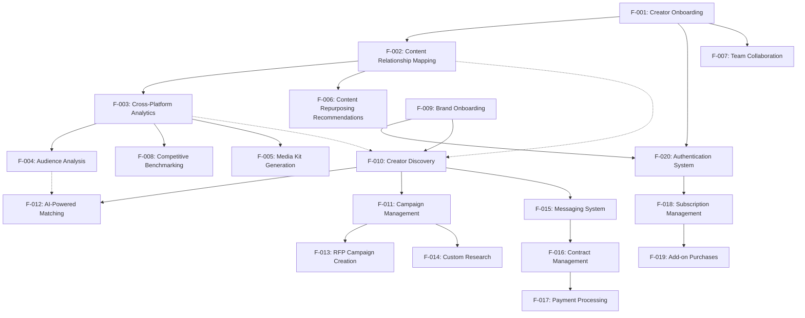

### 2.5 IMPLEMENTATION CONSIDERATIONS

#### Content Relationship Mapping (F-002)

| Consideration | Description |
| --- | --- |
| **Technical Constraints** | - Platform API rate limits<br>- Variable content metadata availability<br>- Graph database performance at scale |
| **Performance Requirements** | - Relationship analysis completed within 24 hours<br>- Graph queries under 500ms<br>- Support for at least 1000 content items per creator |
| **Scalability Considerations** | - Horizontal scaling for graph database<br>- Processing optimizations for large content volumes<br>- Efficient storage of relationship metadata |
| **Security Implications** | - Secure storage of platform API credentials<br>- Content access controls<br>- Relationship data privacy |
| **Maintenance Requirements** | - Regular updates for platform API changes<br>- Optimization of relationship detection algorithms<br>- Monitoring of false positive/negative rates |

#### Cross-Platform Analytics (F-003)

| Consideration | Description |
| --- | --- |
| **Technical Constraints** | - Inconsistent metrics across platforms<br>- Platform-specific data access limitations<br>- Time-series data volume |
| **Performance Requirements** | - Dashboard loading under 500ms<br>- Real-time filtering response<br>- Historical data retrieval optimization |
| **Scalability Considerations** | - Time-series data partitioning<br>- Query optimization for aggregate calculations<br>- Caching strategy for frequently accessed metrics |
| **Security Implications** | - Sensitive analytics data protection<br>- Platform authentication token security<br>- Compliance with platform data usage policies |
| **Maintenance Requirements** | - Regular updates to standardization formulas<br>- Monitoring of data collection accuracy<br>- Addition of new platform integrations |

#### Creator Discovery (F-010)

| Consideration | Description |
| --- | --- |
| **Technical Constraints** | - Complex multi-dimensional filtering<br>- Search index performance<br>- Real-time metric updates |
| **Performance Requirements** | - Search results under 1 second<br>- Smooth pagination experience<br>- Faceted filtering response under 300ms |
| **Scalability Considerations** | - Index optimization for growing creator database<br>- Efficient caching of common searches<br>- Background processing for recommendation engine |
| **Security Implications** | - Privacy controls for creator data<br>- Anonymized aggregated metrics<br>- Access controls for premium search features |
| **Maintenance Requirements** | - Regular re-indexing for optimal performance<br>- Refinement of matching algorithms<br>- Update of category taxonomies |

### 2.6 TRACEABILITY MATRIX

| Feature ID | Business Requirement | User Story | Technical Requirement |
| --- | --- | --- | --- |
| F-001 | Creator onboarding | "As a creator, I want to easily connect my social accounts to see all my analytics in one place" | Authentication system, OAuth integration |
| F-002 | Content mapping | "As a creator, I want to see how my content performs across platforms and formats" | Graph database, content relationship tracking |
| F-003 | Unified analytics | "As a creator, I want standardized metrics across platforms to understand my true reach" | Data normalization, analytics dashboard |
| F-010 | Creator discovery | "As a brand, I want to find creators who match my target audience and performance criteria" | Search indexing, filtering system |
| F-017 | Secure payments | "As a creator/brand, I want secure payments with milestone protection" | Stripe integration, escrow system |

## 3. TECHNOLOGY STACK

### 3.1 PROGRAMMING LANGUAGES

| Platform Component | Language | Version | Justification |
| --- | --- | --- | --- |
| Frontend | TypeScript | 5.0+ | Provides strong typing for enhanced reliability, developer productivity, and maintainable codebase at scale |
| Backend API Routes | TypeScript | 5.0+ | Ensures consistency across the stack, leveraging type safety for API contracts and shared types |
| Database Functions | SQL/PLPGSQL | 14+ | Required for Supabase stored procedures, triggers, and complex database operations |
| AI Prompting | Natural Language | N/A | Used for model instructions, prompt engineering, and guardrails in the multi-model AI system |

TypeScript has been selected as the primary language to maintain type safety across the entire application stack, significantly reducing runtime errors and improving developer productivity. The language's static typing and modern JavaScript features align perfectly with the React and NextJS ecosystem, while its comprehensive IDE support enhances the development experience.

### 3.2 FRAMEWORKS & LIBRARIES

#### Core Frameworks

| Framework | Version | Purpose | Justification |
| --- | --- | --- | --- |
| NextJS | 14.0+ | Full-stack application framework | Unified development model with server/client components, API routes, and optimized rendering strategies |
| React | 18.0+ | UI component framework | Component-based architecture for building interactive interfaces with efficient rendering |
| TailwindCSS | 3.3+ | Utility-first CSS framework | Rapid UI development with consistent design system and minimal CSS overhead |
| Shadcn UI | 0.5+ | Component library system | Unstyled, accessible components with TailwindCSS styling and full customization capabilities |
| Prisma | 5.0+ | Database ORM | Type-safe database access with automated migrations and query optimization |

#### Supporting Libraries

| Library | Version | Purpose | Justification |
| --- | --- | --- | --- |
| React Hook Form | 7.45+ | Form management | Performant, uncontrolled form handling with minimal re-renders |
| Yup | 1.2+ | Schema validation | Robust validation for forms and API inputs with TypeScript integration |
| Recharts | 2.7+ | Data visualization | Responsive, composable charting library built with React components |
| D3.js | 7.8+ | Complex visualizations | Advanced visualization capabilities for content relationship graphs |
| Lucide React | 0.279+ | Icon system | Consistent, lightweight SVG icon set with React integration |
| Zod | 3.22+ | Runtime validation | Type-safe validation for API inputs and outputs |
| React Query | 5.0+ | Data fetching | Server state management with caching, revalidation, and optimistic updates |

NextJS was selected as the core framework due to its unified application model that combines frontend and backend development. The App Router architecture supports both server and client components, enabling optimal rendering strategies for different parts of the application. This approach ensures fast loading times for data-heavy analytics pages while maintaining interactive UI elements for user engagement.

TailwindCSS combined with Shadcn UI provides a consistent design system that can scale with the application while maintaining performance. This combination allows for rapid UI development without sacrificing customization capabilities.

### 3.3 DATABASES & STORAGE

| Component | Technology | Version | Purpose | Justification |
| --- | --- | --- | --- | --- |
| Primary Database | PostgreSQL (Supabase) | 15+ | Relational data storage | Robust ACID compliance, graph relationship capabilities, and strong ecosystem |
| Graph Relationships | PostgreSQL with LTREE | 15+ | Content relationship mapping | Native hierarchical data structure support for content parent/child relationships |
| Database Access | Prisma ORM | 5.0+ | Type-safe database access | Generated TypeScript types, migration tools, and query optimization |
| Caching Layer | Supabase PostgreSQL Caching | N/A | Performance optimization | Row-level caching for frequently accessed analytics data |
| File Storage | Supabase Storage | N/A | Media and document storage | Integrated permissions with authentication system and CDN capabilities |
| Edge Caching | Vercel Edge Cache | N/A | Response caching | Global edge caching for static and dynamic content with minimal configuration |

The content relationship mapping technology, a core differentiator for Engagerr, is implemented using PostgreSQL's LTREE extension for hierarchical data structures. This approach leverages the native capabilities of PostgreSQL while providing the performance benefits of purpose-built graph databases.

Supabase was selected as the database provider due to its managed PostgreSQL service with additional features like Row Level Security (RLS), real-time subscriptions, and integrated storage. This combination provides a secure, scalable foundation for the application with minimal operational overhead.

Database partitioning strategies will be implemented for time-series analytics data to maintain query performance as the platform scales. This includes:

- Temporal partitioning for historical analytics
- Function-based sharding for large creator accounts
- Materialized views for common analytics queries

### 3.4 THIRD-PARTY SERVICES

| Service Category | Provider | Purpose | Integration Method |
| --- | --- | --- | --- |
| Authentication | Supabase Auth | User authentication and session management | Client SDK and server APIs |
| Payment Processing | Stripe | Subscription management and marketplace transactions | API with webhooks for events |
| Email Delivery | Resend | Transactional emails and notifications | API integration with templates |
| AI Processing | DeepSeek API | Primary language model for general tasks | API integration with caching |
| AI Processing | Hugging Face Inference API | Access to CLIP/BLIP for visual content analysis | API integration with result storage |
| AI Processing | Self-hosted Llama 3 | Content analysis and creative suggestions | Containerized deployment |
| AI Processing | Self-hosted Mistral | Content classification and initial matching | Containerized deployment |
| Social Media | Platform-specific APIs | Content and metrics retrieval | OAuth and REST APIs |
| Analytics | Vercel Analytics | User behavior tracking and performance monitoring | Built-in integration |
| Error Tracking | Sentry | Error monitoring and debugging | Client and server SDK |

The multi-model AI architecture is a key implementation decision, allowing for specialized models to handle different tasks:

- DeepSeek API for general language tasks where versatility is required
- Llama 3 (self-hosted) for content analysis and creative tasks requiring specialized training
- CLIP/BLIP for visual content analysis across images and videos
- Mistral for efficient classification and initial creator-brand matching

Social media platform integrations will be implemented through official APIs with appropriate rate limiting and caching strategies to avoid service disruptions. The authentication flow will use OAuth for secure access to creator content and metrics.

### 3.5 DEVELOPMENT & DEPLOYMENT

| Component | Technology | Purpose | Justification |
| --- | --- | --- | --- |
| Code Repository | GitHub | Version control and collaboration | Industry standard with robust CI/CD integration |
| CI/CD | Vercel CI/CD | Automated testing and deployment | Tight integration with NextJS deployments |
| Hosting | Vercel | Application hosting and serverless functions | Optimized for NextJS with global edge network |
| Database Hosting | Supabase | Managed PostgreSQL service | Seamless integration with application architecture |
| Development Environment | Next.js Dev Server | Local development | Hot module reloading and environment parity |
| Container Runtime | Docker | AI model hosting | Isolation and reproducible environments for AI models |
| Infrastructure as Code | Terraform | Infrastructure provisioning | Consistent environment configuration |
| Monitoring | Vercel Observability | Application performance monitoring | Built-in monitoring for NextJS applications |
| Logging | Vercel Logs | Centralized logging | Integrated with deployment platform |

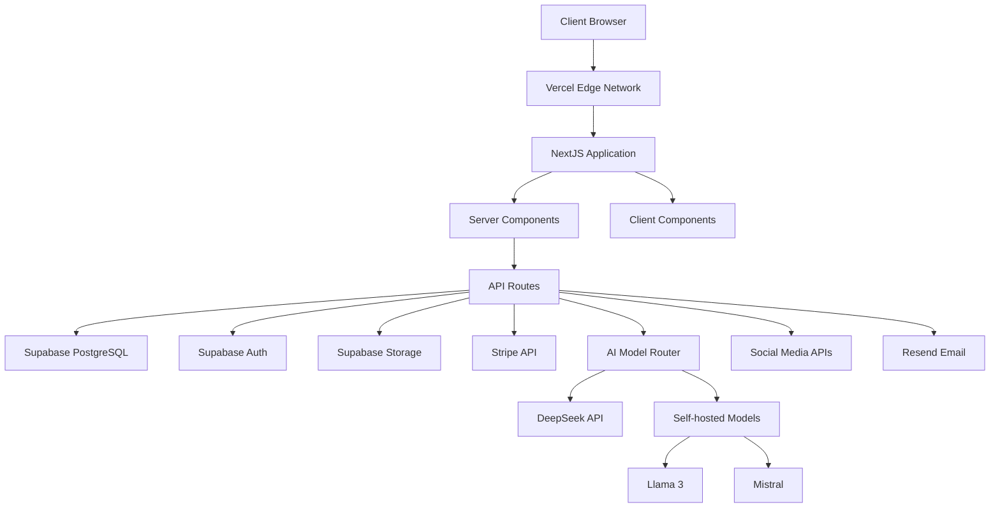

The development and deployment infrastructure is designed to minimize operational complexity while maintaining flexibility for future scaling. Vercel provides a managed platform optimized for NextJS applications with global edge delivery, while containerized AI models allow for specialized processing without vendor lock-in.

This architecture supports the progressive implementation priorities outlined in the requirements, enabling rapid development of core features while establishing a foundation for more advanced capabilities in future phases.

## 4. PROCESS FLOWCHART

### 4.1 SYSTEM WORKFLOWS

#### 4.1.1 Core Business Processes

The following workflows represent the primary user journeys and system processes that form the core of Engagerr's functionality:

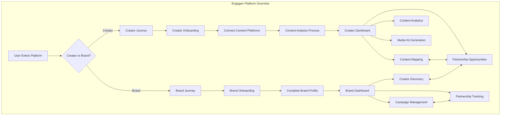

#### 4.1.2 Creator Onboarding Workflow

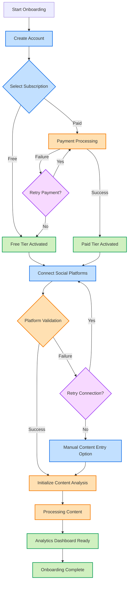

#### 4.1.3 Content Mapping Workflow

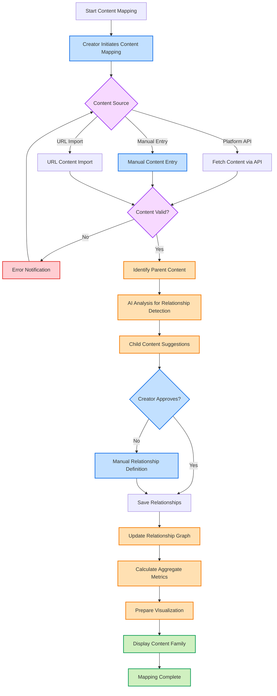

#### 4.1.4 Creator Discovery Workflow (Brand Perspective)

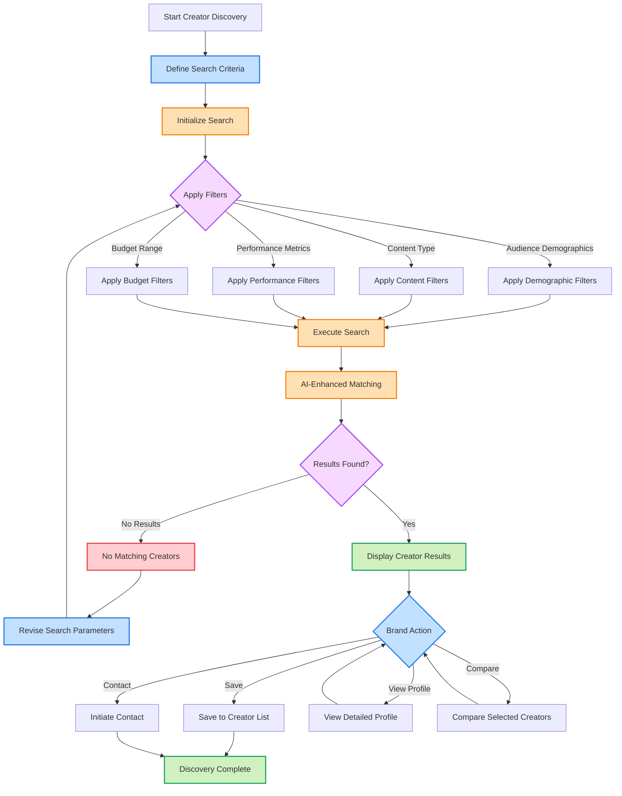

#### 4.1.5 Partnership Creation Workflow

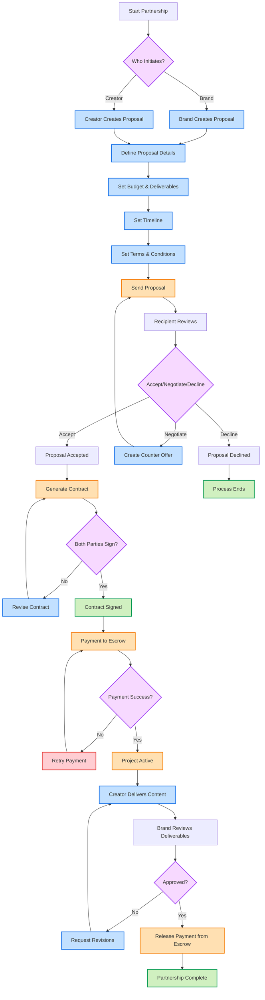

### 4.2 INTEGRATION WORKFLOWS

#### 4.2.1 Social Platform Integration Flow

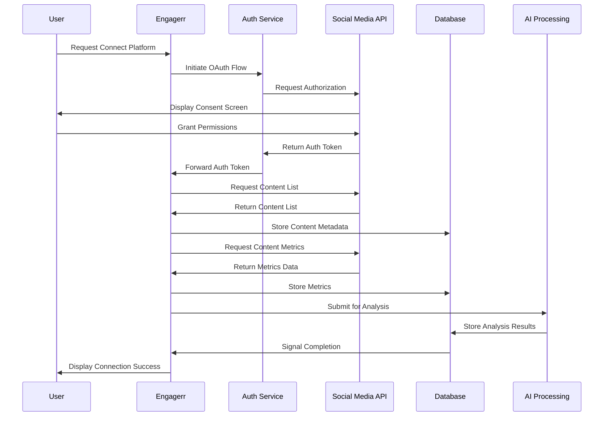

#### 4.2.2 AI Model Processing Flow

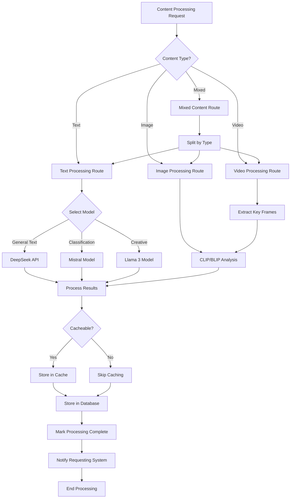

#### 4.2.3 Payment and Subscription Flow

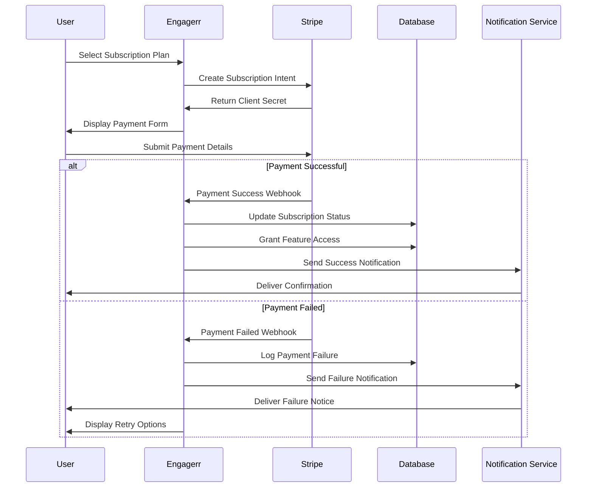

### 4.3 FLOWCHART REQUIREMENTS

#### 4.3.1 Creator Analytics Process Flow

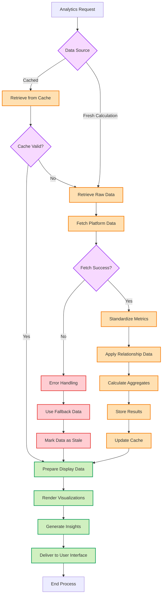

#### 4.3.2 Content Relationship Detection Process Flow

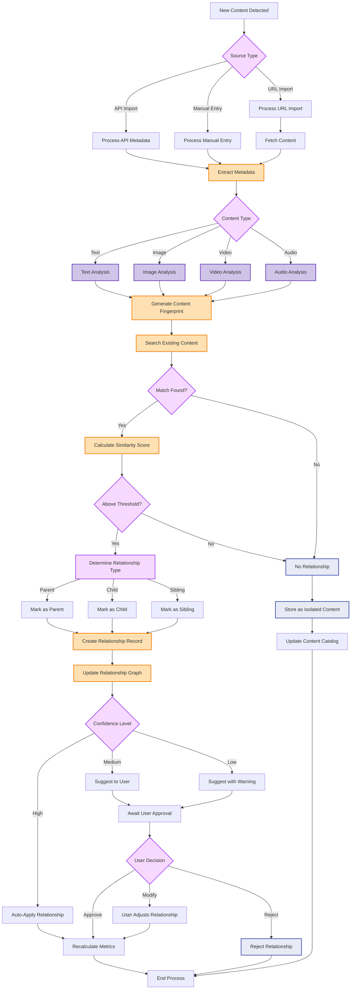

### 4.4 TECHNICAL IMPLEMENTATION

#### 4.4.1 State Management

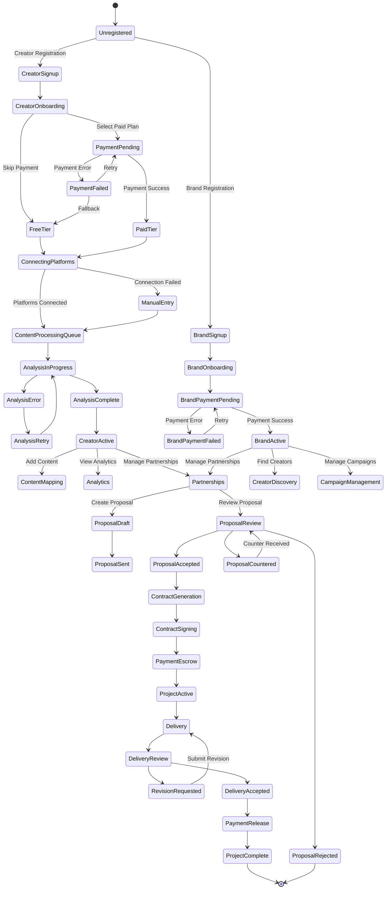

#### 4.4.2 Error Handling Flow

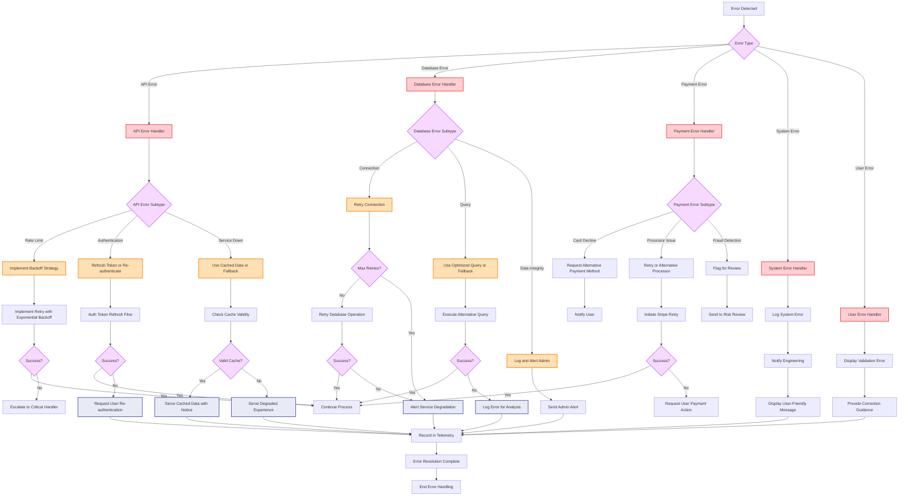

### 4.5 VALIDATION RULES

| Process Step | Business Rules | Data Validation | Authorization | Compliance |
|--------------|----------------|-----------------|---------------|------------|
| **Creator Onboarding** | - Free tier allows 1 platform<br>- Paid tiers unlock multiple platforms | - Valid email required<br>- Password complexity rules<br>- Required profile fields | - Email verification required<br>- OAuth validation for platforms | - GDPR consent required<br>- Age verification (13+)<br>- Terms acceptance |
| **Content Mapping** | - Content must be owned by creator<br>- Max 1000 content items per tier | - Valid platform IDs<br>- Content URLs must be accessible<br>- Required metadata fields | - Platform access tokens valid<br>- Creator owns content | - Content copyright verification<br>- Platform TOS compliance |
| **Analytics Processing** | - Daily metrics updates<br>- Historical data for paid tiers only | - Valid date ranges<br>- Statistical outlier detection<br>- Consistent metric formats | - Analytics visible to account owner and team | - Platform API compliance<br>- Data usage restrictions |
| **Creator Discovery** | - Results based on subscription tier<br>- Featured creators prioritized | - Valid search parameters<br>- Category taxonomy validation | - Private creator profiles hidden<br>- Premium results for paid tiers | - Equal opportunity in rankings<br>- Transparency in sponsored results |
| **Partnership Creation** | - Minimum contract value $100<br>- Platform fee applies to transactions | - Required contract fields<br>- Valid payment information<br>- Deliverable definitions | - Both parties must approve<br>- Contract signing verification | - Tax documentation (W9/W8)<br>- Transaction reporting<br>- Escrow regulations |

### 4.6 TIMING AND SERVICE LEVEL AGREEMENTS

| Process | Target Time | SLA | Recovery Procedure |
|---------|------------|-----|-------------------|
| **User Signup** | < 2 min | 99.9% completion rate | Automatic retry, manual verification option |
| **Platform Connection** | < 5 min | 95% success rate | Retry mechanism, manual entry fallback |
| **Content Analysis** | < 24 hrs | 98% completion rate | Queued processing, manual verification option |
| **Analytics Updates** | Daily | Daily refresh by 6:00 AM UTC | Degraded service with cached data |
| **Creator Search** | < 1 sec | 99% queries under threshold | Response time monitoring, query optimization |
| **Contract Generation** | < 30 sec | 99.5% completion rate | Template fallback, notification for edge cases |
| **Payment Processing** | < 1 min | 99.8% success rate | Automatic retry, manual intervention option |
| **Media Kit Generation** | < 2 min | 97% completion rate | Template fallback, staged generation |
| **API Response Times** | < 500ms | 95th percentile | Caching strategy, rate limiting, optimization |

## 5. SYSTEM ARCHITECTURE

### 5.1 HIGH-LEVEL ARCHITECTURE

#### 5.1.1 System Overview

Engagerr employs a modern full-stack architecture built around NextJS with a clear separation between server and client components to optimize both performance and developer experience. The architecture follows these key principles:

- **Hybrid Rendering Approach**: Server components for data-intensive operations and client components for interactive elements, leveraging NextJS 14's App Router architecture
- **API-First Design**: All functionality exposed through well-defined API routes to support both UI operations and future extensibility
- **Multi-Model AI Architecture**: Specialized AI models for different tasks (content analysis, relationship detection, creative suggestions) with intelligent routing
- **Event-Driven Integration**: Asynchronous processing for handling platform integrations, analytics calculations, and notification workflows
- **Graph-Based Data Modeling**: Hierarchical relationship tracking for content using PostgreSQL's LTREE extension

The system boundaries encompass the web application, serverless functions, database services, and containerized AI components, with well-defined interfaces to external services including social platforms, payment processors, and AI providers.

#### 5.1.2 Core Components Table

| Component | Primary Responsibility | Key Dependencies | Critical Considerations |
| --- | --- | --- | --- |
| **User Interface Layer** | Deliver interactive experiences for creators and brands | NextJS, React, TailwindCSS, Shadcn UI | Responsive design, performance optimization, accessibility |
| **Analytics Engine** | Process and standardize metrics across platforms | PostgreSQL, LTREE extension, Prisma ORM | Data normalization, hierarchical relationships, caching strategy |
| **Discovery Marketplace** | Match creators with brands based on criteria | Search indexing, AI matching models | Match quality, performance at scale, fairness in recommendations |
| **AI Processing System** | Analyze content and relationships with specialized models | DeepSeek, Llama 3, CLIP/BLIP, Mistral | Model selection logic, fallback mechanisms, processing queues |
| **Authentication System** | Manage user identity and session handling | Supabase Auth, SSO providers | Security, token management, permission scoping |
| **Transaction Management** | Handle payments, escrow, and contract workflows | Stripe, contract templates | Payment security, escrow compliance, transaction integrity |
| **Integration Framework** | Connect with social platforms and external services | Platform APIs, OAuth, webhooks | Rate limiting, credential security, resilience |
| **Storage Layer** | Manage structured data and file assets | Supabase PostgreSQL, Supabase Storage | Data modeling, access patterns, backup strategy |

#### 5.1.3 Data Flow Description

The Engagerr platform's data flow follows several key paths, with content and analytics data at the core of the system:

**Content Ingestion and Relationship Mapping:**
Content enters the system primarily through social platform API integrations. When a creator connects their accounts, the Integration Framework fetches content metadata using OAuth tokens. This raw content data passes to the AI Processing System, which analyzes content characteristics and identifies potential parent-child relationships. The Analytics Engine then stores these relationships in the graph structure, calculating standardized metrics that normalize platform-specific engagement data.

**Creator Discovery and Matching:**
When brands search for creators, the Discovery Marketplace component retrieves creator profiles and analytics data from the Storage Layer. Search criteria are processed through specialized indexing to optimize performance, while the AI Processing System enhances results by calculating compatibility scores. The resulting matched creators are presented through the User Interface Layer with their standardized metrics and content samples.

**Transaction Processing:**
Partnership workflows begin in the UI Layer and are managed by the Transaction Management component. Contract templates are populated with specific partnership details, then processed through e-signature flows. Payment information is securely transmitted to Stripe, with the Transaction Management component maintaining escrow status and milestone tracking. When deliverables are approved, payment release events trigger notifications and ledger updates.

**Caching and Data Persistence:**
Frequently accessed data, including analytics dashboards and search results, is cached at multiple levels: edge caching for public profiles, row-level caching for personalized analytics, and application-level caching for AI-processed insights. Time-series analytics data is partitioned in the database for performance, while content relationship data leverages specialized graph structures.

#### 5.1.4 External Integration Points

| System Name | Integration Type | Data Exchange Pattern | Protocol/Format | SLA Requirements |
| --- | --- | --- | --- | --- |
| **Social Platform APIs** | OAuth-based data access | Scheduled polling with webhook events | REST/JSON | 95% availability, retry with backoff |
| **Stripe** | Payment processing | Event-driven with webhooks | REST/JSON | 99.9% availability, instant notification |
| **DeepSeek API** | AI processing | Request-response with caching | REST/JSON | 98% availability, <2s response time |
| **Hugging Face Inference** | Visual content analysis | Asynchronous batch processing | REST/JSON | 95% availability, 5-minute processing |
| **Resend** | Email delivery | Asynchronous with status callbacks | REST/JSON | 99% delivery rate, <1min latency |
| **SSO Providers** | Authentication | Delegated authorization | OAuth 2.0/OIDC | 99.9% availability, <500ms response |

### 5.2 COMPONENT DETAILS

#### 5.2.1 Analytics Engine

**Purpose and Responsibilities:**
- Process and normalize metrics from multiple social platforms into standardized formats
- Maintain hierarchical content relationships using graph database structures
- Calculate aggregate performance metrics across content families
- Generate insights and recommendations based on performance patterns
- Provide time-series analytics for trend visualization

**Technologies and Frameworks:**
- PostgreSQL with LTREE extension for hierarchical relationship tracking
- Prisma ORM for type-safe database access
- NextJS API routes for data processing endpoints
- D3.js and Recharts for visualization generation

**Key Interfaces:**
- `/api/analytics/[platformId]` - Platform-specific metrics retrieval
- `/api/content/[contentId]/family` - Content relationship data access
- `/api/metrics/aggregate` - Standardized cross-platform metrics
- `/api/insights/[creatorId]` - AI-generated performance insights

**Data Persistence:**
- Time-series partitioning for historical metrics
- Materialized views for commonly accessed aggregates
- Relationship graph structures for content mapping
- Cache tables for frequently accessed analytics data

**Scaling Considerations:**
- Horizontal scaling for read-heavy analytics queries
- Scheduled background processing for metric updates
- Incremental computation for large creator accounts
- Multi-tiered caching strategy (edge, application, database)

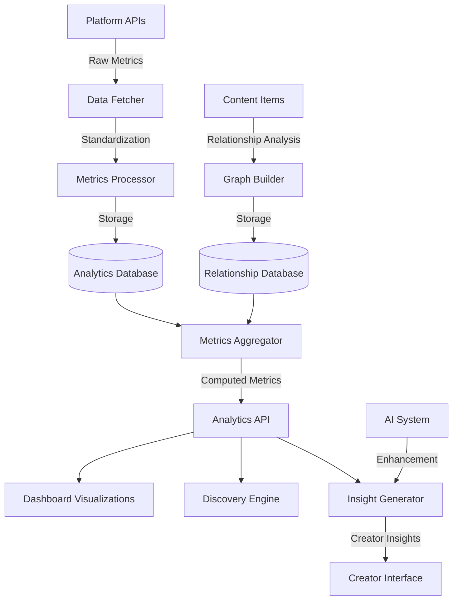

#### 5.2.2 Discovery Marketplace

**Purpose and Responsibilities:**
- Facilitate creator discovery based on brand criteria
- Apply sophisticated filtering and matching algorithms
- Present standardized creator metrics for comparison
- Manage saved searches and favorite creators
- Generate AI-enhanced recommendations

**Technologies and Frameworks:**
- PostgreSQL with full-text search capabilities
- Prisma for database access
- NextJS API routes
- AI matching models for recommendation enhancement

**Key Interfaces:**
- `/api/discovery/search` - Multi-criteria creator search
- `/api/discovery/recommend` - AI-enhanced recommendations
- `/api/creators/[creatorId]` - Creator profile and metrics
- `/api/brands/[brandId]/saved` - Saved searches and favorites

**Data Persistence:**
- Indexed creator profiles with denormalized metrics
- Search history and user preferences
- Match score calculations and compatibility data
- Saved lists and collections

**Scaling Considerations:**
- Search query optimization and caching
- Pagination strategies for large result sets
- Background processing for recommendation generation
- Incremental index updates for profile changes

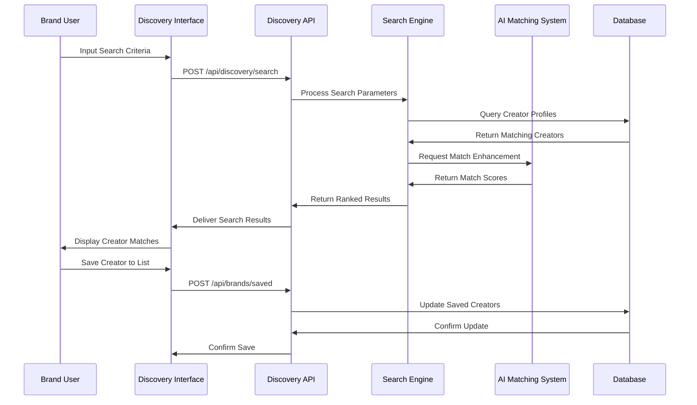

#### 5.2.3 AI Processing System

**Purpose and Responsibilities:**
- Analyze content across formats (text, image, video)
- Detect relationships between content items
- Generate creative suggestions and insights
- Enhance discovery matching with compatibility scoring
- Classify content and audience characteristics

**Technologies and Frameworks:**
- DeepSeek API for general language tasks
- Self-hosted Llama 3 for content analysis (containerized)
- CLIP/BLIP via Hugging Face for visual content analysis
- Mistral for classification tasks (containerized)
- Model routing framework for optimal selection

**Key Interfaces:**
- `/api/ai/analyze` - Content analysis endpoint
- `/api/ai/relationships` - Content relationship detection
- `/api/ai/suggestions` - Creative repurposing suggestions
- `/api/ai/classify` - Content and audience classification
- `/api/ai/match` - Creator-brand compatibility scoring

**Data Persistence:**
- Analysis results cache
- Model selection rules
- Processing job queue
- Fallback configuration

**Scaling Considerations:**
- Load balancing across model instances
- Queuing system for peak demand handling
- Graceful degradation with simplified models
- Result caching for common analysis patterns

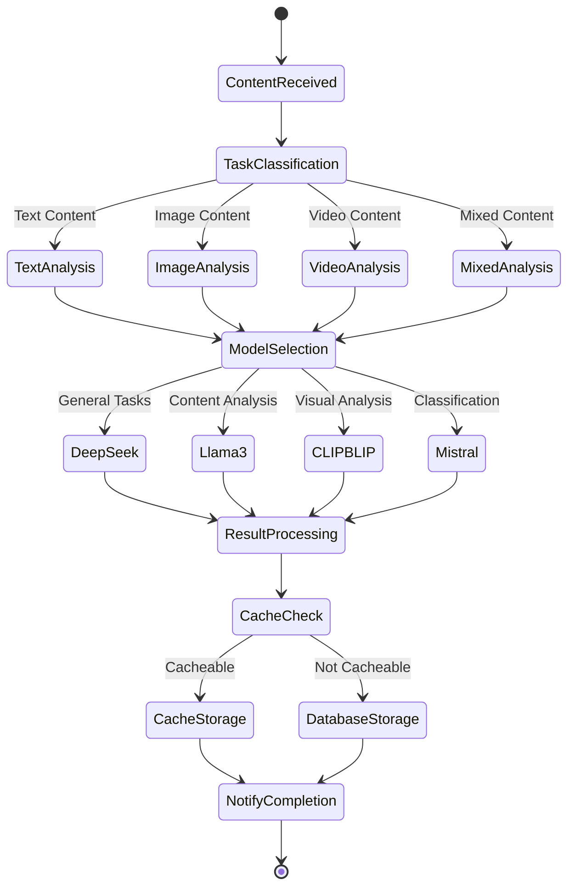

#### 5.2.4 Transaction Management

**Purpose and Responsibilities:**
- Handle subscription management and billing
- Process marketplace transactions between creators and brands
- Manage escrow for milestone-based payments
- Generate and track partnership contracts
- Reconcile financial records and reporting

**Technologies and Frameworks:**
- Stripe for payment processing and subscription management
- NextJS API routes for transaction endpoints
- PostgreSQL for transaction record storage
- Contract template rendering system

**Key Interfaces:**
- `/api/subscriptions` - Subscription management
- `/api/payments/escrow` - Escrow management
- `/api/contracts` - Contract generation and management
- `/api/transactions/history` - Transaction history
- `/api/webhooks/stripe` - Payment webhook processing

**Data Persistence:**
- Transaction records with audit trail
- Contract versions and signatures
- Payment statuses and escrow holdings
- Subscription details and billing history

**Scaling Considerations:**
- Transaction isolation for payment processing
- Idempotent webhook handling
- Financial reconciliation processes
- Regulatory compliance with financial regulations

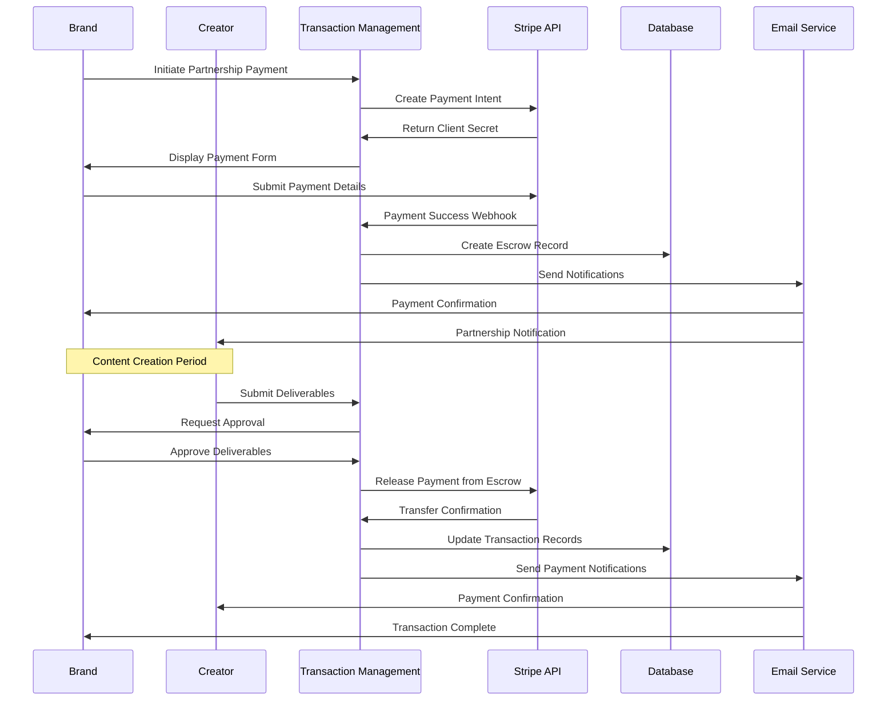

#### 5.2.5 Integration Framework

**Purpose and Responsibilities:**
- Connect with external social media platforms
- Manage API authentication and token refresh
- Handle rate limiting and request throttling
- Process webhook notifications from integrations
- Standardize platform-specific data formats

**Technologies and Frameworks:**
- NextJS API routes for integration endpoints
- OAuth libraries for authentication flows
- Webhook handlers for event processing
- Caching mechanisms for response data

**Key Interfaces:**
- `/api/integrations/[platform]/connect` - Platform connection
- `/api/integrations/[platform]/content` - Content retrieval
- `/api/integrations/[platform]/metrics` - Metrics retrieval
- `/api/webhooks/[platform]` - Platform webhook processing
- `/api/integrations/status` - Integration health status

**Data Persistence:**
- OAuth tokens and refresh credentials
- Platform-specific metadata
- Request quotas and rate limits
- Webhook processing status

**Scaling Considerations:**
- Distributed token management
- Backoff strategies for API rate limits
- Parallel request handling for multi-platform operations
- Fault tolerance for external service disruptions

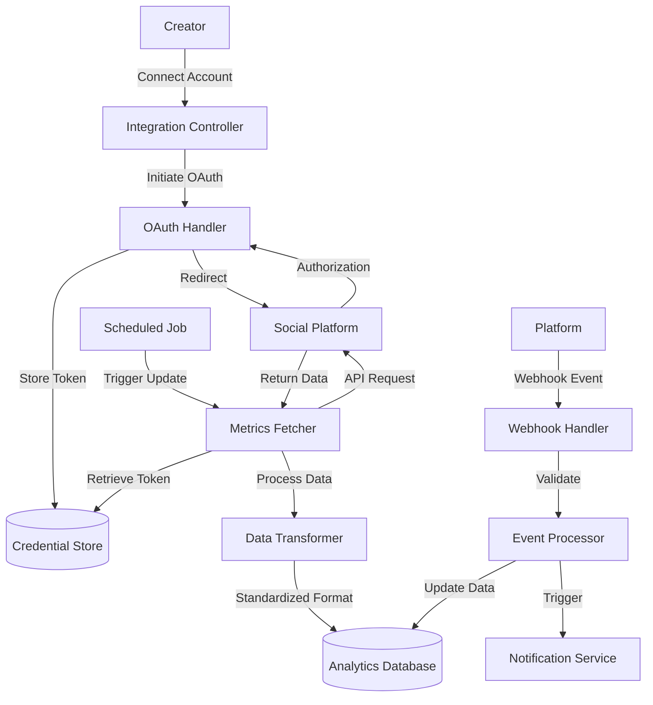

### 5.3 TECHNICAL DECISIONS

#### 5.3.1 Architecture Style Decisions

| Decision Area | Selected Approach | Alternatives Considered | Rationale |
| --- | --- | --- | --- |
| **Frontend Architecture** | NextJS with App Router | SPA with API backend, Micro-frontends | Unified development model with server/client components optimizes both UX performance and developer productivity |
| **Backend Approach** | Serverless/Edge Functions | Containerized services, Traditional servers | Reduced operational complexity, automatic scaling, and global deployment with minimal configuration |
| **Database Architecture** | PostgreSQL with graph extensions | Dedicated graph database, NoSQL solution | Leverages powerful relational capabilities while supporting hierarchical content relationships without introducing additional infrastructure |
| **AI Processing Model** | Multi-model specialized approach | Single general-purpose model, External vendor lock-in | Enables task-specific optimization, cost control, and graceful degradation with fallback options |

The NextJS App Router architecture was selected to unify the development model while providing flexibility in rendering strategies. This approach allows server components to handle data-intensive operations (analytics processing, creator discovery) with reduced JavaScript payload, while client components manage interactive elements (form inputs, visualizations).

For content relationship tracking, we chose PostgreSQL with LTREE extension rather than a dedicated graph database. This decision allows us to maintain a single database technology while efficiently modeling hierarchical relationships. The trade-off of slightly reduced specialized graph querying capabilities is offset by simplified operations and existing team expertise.

```mermaid
flowchart TD
    subgraph "Architecture Decision: Multi-Model AI System"
        A[Problem: Different AI Tasks Have Different Requirements]
        A --> B{Decision Factors}
        B --> C[Performance Requirements]
        B --> D[Cost Considerations]
        B --> E[Specialization Needs]
        B --> F[Operational Complexity]
        
        C --> G[Decision]
        D --> G
        E --> G
        F --> G
        
        G --> H[Multi-Model Architecture with Routing]
        
        H --> I[Benefits]
        I --> J[Optimized performance for each task]
        I --> K[Cost control through task-specific models]
        I --> L[Specialized capabilities for content analysis]
        I --> M[Fault tolerance through fallbacks]
        
        H --> N[Trade-offs]
        N --> O[Increased system complexity]
        N --> P[Model version management]
        N --> Q[Potential consistency variations]
    end
```

#### 5.3.2 Communication Pattern Choices

| Pattern | Application Area | Justification |
| --- | --- | --- |
| **Request-Response** | User-initiated actions, API queries | Synchronous feedback for user actions with immediate confirmation |
| **Webhook Events** | Platform notifications, payment updates | Efficient handling of external system events without polling |
| **Queued Processing** | Content analysis, batch operations | Handles variable processing loads and long-running tasks without blocking |
| **Pub-Sub** | Notifications, real-time updates | Decouples event producers and consumers for flexible scaling |

For real-time user interactions, the system employs request-response patterns to provide immediate feedback. However, for computationally intensive operations like content analysis and relationship mapping, queued processing enables background execution without affecting user experience.

External integrations primarily use webhook events to receive timely updates from platforms without implementing polling mechanisms. This approach reduces unnecessary API calls while ensuring prompt processing of important events like content updates or payment status changes.

#### 5.3.3 Data Storage Solution Rationale

| Data Category | Storage Solution | Key Considerations |
| --- | --- | --- |
| **User Profiles & Authentication** | Supabase Auth with PostgreSQL | Built-in security features, OAuth integration, row-level security policies |
| **Content Relationships** | PostgreSQL with LTREE | Hierarchical relationship modeling with efficient querying capabilities |
| **Analytics Metrics** | PostgreSQL with time-series partitioning | Optimized for time-range queries with efficient storage of historical data |
| **Media Assets** | Supabase Storage | Content delivery network integration, permission-based access control |
| **Search Indexes** | PostgreSQL full-text search | Unified technology stack with powerful text search capabilities |

The decision to use PostgreSQL as the primary data store provides a unified storage solution with the flexibility to handle various data models. For content relationships, the LTREE extension enables hierarchical relationship tracking without introducing a separate graph database technology.

Time-series analytics data is partitioned by time ranges to maintain query performance as historical data grows. This approach allows efficient pruning or archiving of older data while maintaining quick access to recent metrics that are more frequently queried.

#### 5.3.4 Caching Strategy Justification

| Cache Level | Implementation | Purpose | Invalidation Strategy |
| --- | --- | --- | --- |
| **Edge Caching** | Vercel Edge Network | Public content, static assets | Time-based with surrogate keys |
| **Application Cache** | Server memory, Redis (future) | Computed results, API responses | Selective invalidation on writes |
| **Database Cache** | Materialized views, result cache | Frequent queries, aggregations | Scheduled or event-triggered refresh |
| **Browser Cache** | HTTP caching, SWR pattern | UI components, user preferences | Stale-while-revalidate pattern |

The multi-level caching strategy optimizes performance across different layers of the application. At the edge, Vercel's global network caches static assets and public content to reduce latency for users worldwide.

For frequently accessed but computation-heavy data such as analytics dashboards, application-level caching stores processed results to avoid redundant calculations. The stale-while-revalidate pattern ensures users see immediate results while data refreshes in the background.

Database caching through materialized views provides optimized access to complex aggregations without repeated computation. This approach is particularly valuable for standardized metrics that combine data from multiple platforms.

#### 5.3.5 Security Mechanism Selection

| Security Area | Selected Approach | Justification |
| --- | --- | --- |
| **Authentication** | Supabase Auth with JWT | Built-in secure token handling with support for multiple providers |
| **Authorization** | Row Level Security (RLS) policies | Database-enforced access control with fine-grained permissions |
| **API Protection** | Route middleware with token validation | Consistent verification layer for all API endpoints |
| **Sensitive Data** | Encryption at rest, tokenization | Protection of financial and personal information |
| **External Tokens** | Encrypted vault storage | Secure management of social platform credentials |

Supabase Auth was selected for its comprehensive authentication capabilities combined with PostgreSQL's Row Level Security for fine-grained authorization. This approach enforces access control at the database level, preventing unauthorized data access even if application logic contains vulnerabilities.

For external integrations, platform API tokens are stored in an encrypted credential vault rather than directly in the database. This isolation provides an additional security layer for these sensitive credentials that grant access to creator accounts on external platforms.

### 5.4 CROSS-CUTTING CONCERNS

#### 5.4.1 Monitoring and Observability Approach

Engagerr implements a comprehensive monitoring strategy to ensure system health and performance:

- **Application Performance Monitoring**:
  - Vercel Analytics for server-side performance metrics
  - Web Vitals tracking for client-side experience
  - Custom instrumentation for critical business processes

- **Infrastructure Monitoring**:
  - Supabase metrics for database performance
  - Vercel function invocation and error tracking
  - AI model latency and throughput metrics

- **Business Metrics**:
  - User acquisition and conversion funnels
  - Subscription status and renewal tracking
  - Platform engagement and retention metrics

- **Alerting Strategy**:
  - Tiered alert severity (P1-P4) based on business impact
  - On-call rotation for critical issues
  - Automated incident response for common scenarios

Dashboards are organized by audience (Engineering, Product, Executive) with appropriate levels of detail and business context.

#### 5.4.2 Logging and Tracing Strategy

| Log Category | Implementation | Retention | Purpose |
| --- | --- | --- | --- |
| **Application Logs** | Structured JSON via Vercel Logs | 30 days | Debugging, audit trail |
| **Request Logs** | Edge function logs | 7 days | Performance analysis, debugging |
| **Error Logs** | Structured with context, Sentry integration | 90 days | Error resolution, pattern detection |
| **Security Logs** | Append-only with user context | 1 year | Security investigation, compliance |

The logging strategy emphasizes structured data over free-text to enable efficient querying and analysis. Each log entry includes:

- Request correlation ID for end-to-end tracing
- User context (when applicable)
- Environment information
- Performance metrics for critical operations

Log levels are carefully controlled to balance visibility with storage efficiency, with production environments focusing on actionable information while development environments provide verbose context.

#### 5.4.3 Error Handling Patterns

Engagerr implements a layered error handling approach:

1. **Client-Side Error Handling**:
   - Graceful degradation of UI components
   - Retry mechanisms with exponential backoff
   - User-friendly error messages with recovery actions
   - Error boundaries to contain component failures

2. **Server-Side Error Handling**:
   - Structured error responses with status codes
   - Detailed logging with contextual information
   - Automatic retry for transient failures
   - Circuit breakers for external dependencies

3. **Database Error Handling**:
   - Transaction isolation for critical operations
   - Fallback mechanisms for read operations
   - Constraint violation handling with clear messages
   - Query timeout management

```mermaid
flowchart TD
    A[Error Detected] --> B{Error Type}
    
    B -->|Client UI Error| C[Error Boundary]
    B -->|API Error| D[API Error Handler]
    B -->|External Service| E[Integration Error Handler]
    B -->|Database Error| F[Database Error Handler]
    
    C --> G[Render Fallback UI]
    G --> H[Log Error Details]
    H --> I[Report to Monitoring]
    
    D --> J[Format Error Response]
    J --> K{Recoverable?}
    K -->|Yes| L[Implement Retry]
    K -->|No| M[Return Error Code]
    
    E --> N[Check Circuit Breaker]
    N --> O{Circuit Open?}
    O -->|Yes| P[Use Fallback Data]
    O -->|No| Q{Retry Appropriate?}
    Q -->|Yes| R[Backoff and Retry]
    Q -->|No| S[Fail Operation]
    
    F --> T{Transaction Active?}
    T -->|Yes| U[Rollback Transaction]
    T -->|No| V[Isolated Error]
    U --> W[Return Database Error]
    V --> W
```

#### 5.4.4 Authentication and Authorization Framework

The authentication and authorization framework is built on these key principles:

- **Multi-factor Authentication**:
  - Optional for all users
  - Required for financial operations
  - Required for team administrators

- **Role-Based Access Control**:
  - Platform-level roles (Admin, User)
  - Creator account roles (Owner, Editor, Analyst, Viewer)
  - Brand account roles (Owner, Campaign Manager, Viewer)

- **Resource-Level Permissions**:
  - Content access controls
  - Analytics visibility settings
  - Partnership visibility rules

- **API Access Security**:
  - Token-based authentication
  - Scoped permissions for each token
  - Rate limiting per endpoint

The implementation uses Supabase Auth for identity management coupled with PostgreSQL Row Level Security policies that enforce access controls at the database level.

#### 5.4.5 Performance Requirements and SLAs

| Service Component | Performance Target | Degradation Threshold | Critical Threshold |
| --- | --- | --- | --- |
| **Dashboard Loading** | < 500ms | > 1 second | > 3 seconds |
| **Search Results** | < 1 second | > 2 seconds | > 5 seconds |
| **API Response** | < 200ms | > 500ms | > 2 seconds |
| **Content Analysis** | < 24 hours | > 48 hours | > 72 hours |
| **Platform Availability** | 99.9% | < 99.5% | < 99% |

Performance is monitored against these targets with automated alerts when degradation thresholds are crossed. The system implements graceful degradation strategies:

- Progressive loading of dashboard components
- Cached results when real-time data is unavailable
- Simplified AI models during peak load periods
- Prioritization of critical business functions

#### 5.4.6 Disaster Recovery Procedures

Engagerr's disaster recovery strategy focuses on data preservation and service continuity:

- **Data Backup**:
  - Automated database backups every 6 hours
  - Point-in-time recovery for the past 7 days
  - Weekly full backups stored in secondary region

- **Recovery Time Objectives (RTO)**:
  - Critical functions: 1 hour
  - Full platform functionality: 4 hours
  - Historical data access: 24 hours

- **Recovery Procedures**:
  - Documented step-by-step recovery playbooks
  - Regular recovery testing through simulated failures
  - Automated restoration processes where possible

- **Business Continuity**:
  - Read-only mode capabilities for essential functions
  - Communication templates for incident updates
  - Escalation procedures and contact hierarchies

The system architecture supports rapid recovery through its cloud-native design, with stateless components that can be quickly redeployed and database systems with robust backup and restore capabilities.

## 6. SYSTEM COMPONENTS DESIGN

### 6.1 USER INTERFACE COMPONENTS

#### 6.1.1 Component Architecture

Engagerr's user interface follows a hierarchical component architecture using React and NextJS, with clear separation between server and client components to optimize performance and interactivity.

```mermaid
flowchart TD
    subgraph "UI Architecture"
        A[App Router] --> B[Layout Components]
        B --> C[Page Components]
        
        C --> D[Server Components]
        C --> E[Client Components]
        
        D --> F[Data Fetching]
        D --> G[Initial Rendering]
        
        E --> H[Interactive Elements]
        E --> I[Client-side State]
        
        subgraph "Component Types"
            J[Containers]
            K[Feature Components]
            L[UI Elements]
            M[Layout Structures]
        end
        
        F --> N[(Server Data)]
        I --> O{Client Actions}
    end
```

The UI architecture implements these key design patterns:

- **Atomic Design Methodology**: Components are organized in a hierarchy from atoms to organisms to templates
- **Component Composition**: Smaller, focused components are composed into feature-rich interfaces
- **Container/Presentational Pattern**: Clear separation between data management and visual presentation
- **Server/Client Component Split**: Strategic use of server components for data-heavy operations

#### 6.1.2 Creator-Side Components

| Component | Type | Responsibility | Key Dependencies |
| --- | --- | --- | --- |
| CreatorDashboard | Server + Client | Main dashboard interface for creators | Analytics Provider, Layout System |
| ContentMapper | Client | Interface for managing content relationships | Graph Visualization, Form System |
| AnalyticsOverview | Server + Client | Display standardized metrics and insights | Chart Library, Data Fetching |
| MediaKitGenerator | Server + Client | Build and customize creator media kits | Template System, Export Manager |
| ContentCalendar | Client | Display and manage content schedule | Calendar Library, Drag-Drop System |
| AudienceInsights | Server | Analyze and display audience demographics | Chart Library, AI Insights |
| ContentPerformance | Server + Client | Detailed content metrics visualization | Chart Library, Filtering System |

The Creator Dashboard implements a modular widget system that allows customization of the analytics display:

```mermaid
classDiagram
    class DashboardLayout {
        +header: DashboardHeader
        +sidebar: NavigationSidebar
        +content: ReactNode
        +render()
    }
    
    class WidgetGrid {
        +widgets: Widget[]
        +layout: GridLayout
        +addWidget(widget)
        +removeWidget(id)
        +saveLayout()
    }
    
    class Widget {
        <<abstract>>
        +id: string
        +title: string
        +size: WidgetSize
        +render()
    }
    
    class MetricsWidget {
        +metrics: Metric[]
        +timeRange: DateRange
        +refreshData()
    }
    
    class ContentFamilyWidget {
        +rootContentId: string
        +relationshipData: RelationshipNode[]
        +expandNode(nodeId)
    }
    
    class InsightsWidget {
        +insights: Insight[]
        +generateInsights()
    }
    
    DashboardLayout o-- WidgetGrid
    WidgetGrid o-- Widget
    Widget <|-- MetricsWidget
    Widget <|-- ContentFamilyWidget
    Widget <|-- InsightsWidget
```

The Content Mapper component provides an interactive interface for visualizing and managing content relationships:

```mermaid
flowchart TD
    A[Content Mapper] --> B[Relationship Graph]
    A --> C[Content Browser]
    A --> D[Relationship Editor]
    
    B --> E[Interactive Visualization]
    B --> F[Performance Overlay]
    
    C --> G[Platform Filter]
    C --> H[Content List]
    C --> I[Search/Filter]
    
    D --> J[Relationship Form]
    D --> K[AI Suggestions]
    D --> L[Manual Linking]
    
    E --> M{User Interaction}
    M -->|Click Node| N[Select Content]
    M -->|Drag Connection| O[Create Relationship]
    M -->|Hover| P[Show Details]
```

#### 6.1.3 Brand-Side Components

| Component | Type | Responsibility | Key Dependencies |
| --- | --- | --- | --- |
| BrandDashboard | Server + Client | Main dashboard interface for brands | Metrics Provider, Layout System |
| CreatorDiscovery | Server + Client | Search and filter creators | Search System, Filtering Engine |
| CampaignManager | Server + Client | Manage active and past campaigns | Status Tracking, Reporting Tools |
| CreatorProfile | Server | Display creator details and metrics | Analytics Provider, Media Renderer |
| ProposalBuilder | Client | Create and manage partnership proposals | Form System, Template Engine |
| MessagingInterface | Client | Communicate with creators | Real-time Updates, Notification System |
| RoiCalculator | Client | Estimate and track campaign returns | Chart Library, Formula Engine |

The Creator Discovery interface implements a sophisticated filtering system:

```mermaid
classDiagram
    class DiscoveryPage {
        +searchParams: SearchParams
        +results: PaginatedResults
        +updateSearch(params)
        +render()
    }
    
    class FilterPanel {
        +filters: Filter[]
        +activeFilters: ActiveFilter[]
        +applyFilter(filter)
        +removeFilter(id)
        +clearAllFilters()
    }
    
    class Filter {
        <<abstract>>
        +id: string
        +label: string
        +value: any
        +render()
    }
    
    class RangeFilter {
        +min: number
        +max: number
        +step: number
    }
    
    class CategoryFilter {
        +options: Option[]
        +multiSelect: boolean
    }
    
    class ResultsGrid {
        +creators: Creator[]
        +layout: GridLayout
        +sortOption: SortOption
        +loading: boolean
    }
    
    class CreatorCard {
        +creator: Creator
        +metrics: MetricSummary
        +saveToList()
        +viewProfile()
        +initiateContact()
    }
    
    DiscoveryPage o-- FilterPanel
    DiscoveryPage o-- ResultsGrid
    FilterPanel o-- Filter
    Filter <|-- RangeFilter
    Filter <|-- CategoryFilter
    ResultsGrid o-- CreatorCard
```

#### 6.1.4 Shared UI Components

| Component | Type | Description | Implementation Details |
| --- | --- | --- | --- |
| NavigationSidebar | Client | Primary application navigation | Dynamic navigation based on user type and permissions |
| MessageCenter | Client | Communication hub for notifications and messages | Real-time updates with unread indicators |
| ProfileManager | Client | User profile and settings management | Form-based with immediate validation |
| DataTable | Client | Standardized tabular data display | Virtualized for performance with sorting and filtering |
| MetricsCard | Server | Display of key performance indicators | Themed variations with trend indicators |
| FilterSystem | Client | Standardized filtering interface | Composable filter components with saved preferences |
| ChartComponents | Client | Data visualization library | Wrapper around Recharts with consistent styling |

The interface component library implements a consistent design system based on Shadcn UI with custom extensions:

```mermaid
flowchart TD
    subgraph "Design System"
        A[Design Tokens] --> B[Typography System]
        A --> C[Color System]
        A --> D[Spacing System]
        A --> E[Breakpoints]
        
        B --> F[Base Components]
        C --> F
        D --> F
        E --> F
        
        F --> G[Composite Components]
        
        G --> H[Feature Components]
        
        F --> I[Shadcn UI Extensions]
    end
```

#### 6.1.5 State Management Strategy

Engagerr implements a tiered state management approach based on the scope and complexity of state:

| State Scope | Implementation | Use Cases | Persistence |
| --- | --- | --- | --- |
| **Component State** | React's useState and useReducer | Form inputs, UI toggles, local component state | None - memory only |
| **Feature State** | React Context | Wizard flows, multi-step forms, shared feature state | Optional sessionStorage |
| **Global UI State** | Zustand store | Theme preferences, UI settings, global modals | localStorage |
| **Server State** | React Query | API data fetching, caching, and synchronization | Cache with revalidation |
| **Form State** | React Hook Form | Complex forms with validation | Form-specific persistence |

The state management strategy prioritizes performance by minimizing unnecessary re-renders through:

- Strategic use of memoization (useMemo, useCallback, memo)
- Context splitting to prevent unrelated updates
- Optimistic UI updates for improved perceived performance
- Intelligent caching with stale-while-revalidate patterns

### 6.2 ANALYTICS ENGINE

#### 6.2.1 Engine Architecture

The Analytics Engine is the core component that processes, standardizes, and visualizes creator content performance across platforms. Its architecture consists of multiple specialized modules working together:

```mermaid
flowchart TD
    A[Integration Framework] -->|Raw Data| B[Analytics Engine]
    
    subgraph "Analytics Engine"
        B --> C[Data Normalizer]
        B --> D[Relationship Processor]
        B --> E[Metrics Calculator]
        B --> F[Insight Generator]
        B --> G[Visualization Renderer]
        
        C --> H[(Standardized Metrics)]
        D --> I[(Relationship Graph)]
        
        H --> E
        I --> E
        
        E --> J[(Computed Metrics)]
        J --> F
        J --> G
    end
    
    G -->|Dashboard Data| K[UI Components]
    F -->|Insights & Recommendations| K
```

#### 6.2.2 Data Normalizer Module

The Data Normalizer handles the complex task of standardizing inconsistent metrics across different platforms, implementing these key processes:

- **Metric Mapping**: Converts platform-specific metrics into standard definitions
- **Unit Normalization**: Standardizes units of measurement across platforms
- **Engagement Weighting**: Applies configurable weights to different engagement types
- **Time Normalization**: Adjusts for time zone differences and reporting periods
- **Anomaly Detection**: Identifies and handles statistical outliers

Metric standardization follows these transformation rules:

| Platform Metric | Standardization Process | Output Metric |
| --- | --- | --- |
| Platform A Views + Platform B Views | Direct sum with duplication correction | Total Views |
| Platform A Likes + Platform B Hearts + Platform C Reactions | Weighted normalization with platform coefficients | Standardized Engagements |
| Platform A Watch Time + Platform B Average View Duration * Views | Time-based normalization with completion rate adjustment | Total Watch Minutes |
| Platform A Comments + Platform B Replies | Direct sum with sentiment analysis | Total Comments |
| Platform A Shares + Platform B Retweets + Platform C Reposts | Direct sum with attribution tracking | Total Shares |

#### 6.2.3 Relationship Processor Module

The Relationship Processor is responsible for creating and maintaining the hierarchical content relationship graph, implementing these core functions:

- **Relationship Detection**: Uses AI analysis to identify related content
- **Graph Management**: Maintains the content family graph structure
- **Hierarchy Validation**: Ensures logical parent-child relationships
- **Attribution Tracking**: Follows content as it moves across platforms
- **Performance Inheritance**: Propagates metrics up/down the content hierarchy

The relationship graph model implements the following structure:

```mermaid
classDiagram
    class ContentNode {
        +id: string
        +platform: string
        +platformId: string
        +type: ContentType
        +creator: Creator
        +datePublished: Date
        +metrics: Metrics
        +metadata: Metadata
    }
    
    class RelationshipEdge {
        +id: string
        +sourceId: string
        +targetId: string
        +relationshipType: RelationshipType
        +confidence: number
        +creationMethod: CreationMethod
        +dateCreated: Date
    }
    
    class ContentFamily {
        +id: string
        +rootContentId: string
        +name: string
        +description: string
        +nodes: ContentNode[]
        +edges: RelationshipEdge[]
        +aggregateMetrics: AggregateMetrics
    }
    
    class RelationshipType {
        <<enumeration>>
        PARENT
        CHILD
        DERIVATIVE
        REPURPOSED
        REACTION
        REFERENCE
    }
    
    class CreationMethod {
        <<enumeration>>
        SYSTEM_DETECTED
        AI_SUGGESTED
        USER_DEFINED
        PLATFORM_LINKED
    }
    
    ContentFamily "1" o-- "many" ContentNode
    ContentFamily "1" o-- "many" RelationshipEdge
    RelationshipEdge --> RelationshipType
    RelationshipEdge --> CreationMethod
```

#### 6.2.4 Metrics Calculator Module

The Metrics Calculator processes standardized platform data and relationship information to produce comprehensive analytics, implementing these functions:

- **Metric Aggregation**: Combines metrics across platforms with deduplication
- **Performance Scoring**: Calculates composite performance scores from raw metrics
- **Trend Analysis**: Identifies performance patterns over time
- **Audience Deduplication**: Estimates unique audience across content family
- **Benchmark Comparison**: Evaluates metrics against relevant benchmarks

```mermaid
sequenceDiagram
    participant RP as Relationship Processor
    participant DN as Data Normalizer
    participant MC as Metrics Calculator
    participant DB as Database
    participant IG as Insight Generator
    
    RP->>MC: Content Relationship Graph
    DN->>MC: Standardized Platform Metrics
    MC->>MC: Deduplication Analysis
    MC->>MC: Metric Aggregation
    MC->>MC: Performance Scoring
    MC->>DB: Store Computed Metrics
    MC->>IG: Send Computed Metrics
    
    Note over MC: Audience overlap estimation using platform data and relationship properties
```

The metrics calculation implements these key algorithms:

| Metric | Calculation Method | Considerations |
| --- | --- | --- |
| **Total Reach** | Sum of unique viewers across content family with overlap estimation | Requires platform-specific audience identifiers or statistical modeling |
| **Engagement Rate** | Weighted sum of interactions divided by reach | Weights vary by platform and interaction type |
| **Content Value** | Engagement rate × reach × monetization factor | Monetization factor derived from industry benchmarks |
| **Performance Score** | Weighted combination of all metrics compared to benchmarks | Machine learning model trained on successful content |
| **Audience Retention** | Analysis of view duration across content formats | Adjusted for platform-specific viewing patterns |

#### 6.2.5 Insight Generator Module

The Insight Generator analyzes computed metrics to produce actionable insights and recommendations, implementing these functions:

- **Pattern Recognition**: Identifies successful content patterns
- **Anomaly Detection**: Highlights unusual performance changes
- **Opportunity Identification**: Suggests platforms or formats for expansion
- **Competitive Analysis**: Compares performance to similar creators
- **Recommendation Engine**: Suggests content strategies based on performance

The insight generation process follows this workflow:

```mermaid
flowchart TD
    A[Computed Metrics] --> B[Insight Processor]
    C[Historical Trends] --> B
    D[Benchmark Data] --> B
    E[Creator Goals] --> B
    
    B --> F{Insight Type}
    
    F -->|Performance| G[Performance Insights]
    F -->|Content| H[Content Strategy Insights]
    F -->|Audience| I[Audience Insights]
    F -->|Platform| J[Platform Optimization]
    F -->|Monetization| K[Monetization Insights]
    
    G --> L[Insight Output]
    H --> L
    I --> L
    J --> L
    K --> L
    
    L --> M[Priority Ranking]
    M --> N[Natural Language Generation]
    N --> O[Actionable Recommendations]
```

#### 6.2.6 Visualization Renderer Module

The Visualization Renderer transforms complex analytics data into intuitive visual representations, implementing these functions:

- **Chart Generation**: Creates standardized chart configurations
- **Interactive Visualization**: Builds interactive data explorations
- **Relationship Visualization**: Renders the content relationship graph
- **Dashboard Assembly**: Combines visualizations into cohesive dashboards
- **Export Formatting**: Prepares visualizations for media kits and exports

```mermaid
classDiagram
    class VisualizationRenderer {
        +renderChart(config, data)
        +renderGraph(nodes, edges, options)
        +renderDashboard(widgets, layout)
        +renderExport(template, data)
    }
    
    class ChartConfig {
        +type: ChartType
        +data: DataSeries[]
        +options: ChartOptions
        +interactions: InteractionConfig
    }
    
    class GraphConfig {
        +nodes: GraphNode[]
        +edges: GraphEdge[]
        +layout: LayoutType
        +theme: GraphTheme
        +interactions: GraphInteractions
    }
    
    class ExportTemplate {
        +sections: TemplateSection[]
        +theme: ExportTheme
        +format: ExportFormat
    }
    
    class DashboardConfig {
        +widgets: DashboardWidget[]
        +layout: GridLayout
        +theme: DashboardTheme
    }
    
    VisualizationRenderer --> ChartConfig
    VisualizationRenderer --> GraphConfig
    VisualizationRenderer --> ExportTemplate
    VisualizationRenderer --> DashboardConfig
```

### 6.3 DISCOVERY MARKETPLACE

#### 6.3.1 Marketplace Architecture

The Discovery Marketplace facilitates connections between brands and creators through advanced search, matching, and communication features:

```mermaid
flowchart TD
    A[Brand User] --> B[Discovery Marketplace]
    
    subgraph "Discovery Marketplace"
        B --> C[Search Engine]
        B --> D[Matching System]
        B --> E[Profile System]
        B --> F[Communication Hub]
        B --> G[Partnership Workflow]
        
        C --> H[(Search Index)]
        D --> I[(Match Rules)]
        E --> J[(Creator Profiles)]
        
        H --> K[Search API]
        I --> L[Recommendation API]
        J --> M[Profile API]
    end
    
    K --> N[Discovery Interface]
    L --> N
    M --> O[Profile Detail Interface]
    F --> P[Messaging Interface]
    G --> Q[Partnership Management]
```

#### 6.3.2 Search Engine Module

The Search Engine provides sophisticated creator discovery based on multiple criteria, implementing these functions:

- **Multi-factor Search**: Combines audience, performance, and content factors
- **Faceted Filtering**: Allows drill-down through multiple filter dimensions
- **Geo-targeting**: Filters creators by audience geography
- **Keyword Analysis**: Searches creator content for relevant themes
- **Saved Searches**: Preserves complex search parameters for reuse

The search index is structured with these key elements:

| Index Component | Data Elements | Update Frequency | Search Capabilities |
| --- | --- | --- | --- |
| **Creator Profile** | Name, bio, platforms, category, tags | On profile update | Exact match, partial match, fuzzy search |
| **Content Catalog** | Content types, titles, descriptions, tags | On content update | Keyword search, phrase matching, semantic search |
| **Audience Demographics** | Age ranges, gender, geography, interests | Daily | Range filtering, geo-targeting, interest matching |
| **Performance Metrics** | Engagement rates, growth trends, reach | Daily | Range filtering, comparative operators, trending detection |
| **Partnership History** | Categories, brands, performance | On partnership completion | Category matching, exclusion filtering, success rate filtering |

```mermaid
classDiagram
    class SearchQuery {
        +filters: SearchFilter[]
        +sort: SortOption
        +page: number
        +pageSize: number
        +execute() SearchResult
    }
    
    class SearchFilter {
        <<interface>>
        +field: string
        +operator: FilterOperator
        +value: any
        +validate() boolean
    }
    
    class RangeFilter {
        +min: number
        +max: number
    }
    
    class CategoryFilter {
        +categories: string[]
        +matchType: MatchType
    }
    
    class GeoFilter {
        +locations: GeoLocation[]
        +radius: number
    }
    
    class TextFilter {
        +searchText: string
        +fields: string[]
        +matchType: TextMatchType
    }
    
    class SearchResult {
        +creators: CreatorProfile[]
        +totalCount: number
        +facets: SearchFacet[]
        +appliedFilters: SearchFilter[]
    }
    
    SearchFilter <|-- RangeFilter
    SearchFilter <|-- CategoryFilter
    SearchFilter <|-- GeoFilter
    SearchFilter <|-- TextFilter
    SearchQuery --> SearchResult
```

#### 6.3.3 Matching System Module

The Matching System uses AI to connect brands with relevant creators, implementing these functions:

- **Compatibility Scoring**: Calculates brand-creator fit across multiple dimensions
- **Audience Alignment**: Analyzes audience overlap between brand and creator
- **Content Affinity**: Evaluates content style and quality match
- **Value Alignment**: Assesses brand and creator values compatibility
- **Success Prediction**: Estimates partnership success probability

The matching algorithm uses this multi-factor approach:

```mermaid
flowchart TD
    A[Brand Profile] --> B[Matching Engine]
    C[Creator Profiles] --> B
    
    subgraph "Matching Engine"
        B --> D[Feature Extraction]
        D --> E[Audience Matcher]
        D --> F[Content Matcher]
        D --> G[Performance Matcher]
        D --> H[Value Matcher]
        
        E --> I[Weighted Score Calculation]
        F --> I
        G --> I
        H --> I
        
        I --> J[Match Ranking]
        J --> K[Explanation Generator]
    end
    
    J --> L[Match Results]
    K --> M[Match Explanations]
```

The matching system uses these scoring components:

| Component | Weight | Data Sources | Calculation Method |
| --- | --- | --- | --- |
| **Audience Match** | 40% | Brand target audience, creator audience demographics | Jaccard similarity of audience segments with demographic weighting |
| **Content Relevance** | 25% | Brand categories, creator content topics | Semantic similarity of content themes with recency weighting |
| **Performance Match** | 20% | Brand KPI preferences, creator performance metrics | Normalized score based on performance in relevant metrics |
| **Value Alignment** | 15% | Brand values, creator content sentiment | Semantic analysis of value statements and content sentiment |

#### 6.3.4 Profile System Module

The Profile System manages comprehensive creator and brand profiles, implementing these functions:

- **Profile Management**: Maintains detailed profile information
- **Media Kit Generation**: Creates branded media kits for creators
- **Verification System**: Verifies creator identity and metrics
- **Portfolio Display**: Showcases creator content samples
- **Performance Dashboard**: Displays key creator metrics

The creator profile model contains these key elements:

```mermaid
classDiagram
    class CreatorProfile {
        +id: string
        +name: string
        +bio: text
        +category: Category[]
        +platforms: ConnectedPlatform[]
        +demographics: AudienceDemographics
        +performanceMetrics: PerformanceMetrics
        +portfolioItems: PortfolioItem[]
        +partnershipHistory: Partnership[]
        +pricing: PricingModel
        +availability: AvailabilityStatus
    }
    
    class ConnectedPlatform {
        +platform: PlatformType
        +handle: string
        +url: string
        +followers: number
        +engagement: number
        +verified: boolean
        +contentCount: number
    }
    
    class AudienceDemographics {
        +ageRanges: AgeDistribution
        +genderDistribution: GenderDistribution
        +topLocations: GeoDistribution
        +interests: InterestDistribution
        +devices: DeviceDistribution
    }
    
    class PerformanceMetrics {
        +totalReach: number
        +engagementRate: number
        +contentValue: number
        +growthRate: number
        +postFrequency: number
        +platformBreakdown: PlatformMetrics[]
    }
    
    class PortfolioItem {
        +id: string
        +title: string
        +platform: PlatformType
        +contentType: ContentType
        +url: string
        +thumbnail: string
        +metrics: ContentMetrics
        +featured: boolean
    }
    
    class PricingModel {
        +baseRate: number
        +platformRates: PlatformRate[]
        +packageDeals: Package[]
        +customServices: CustomService[]
    }
    
    CreatorProfile "1" o-- "many" ConnectedPlatform
    CreatorProfile "1" o-- "1" AudienceDemographics
    CreatorProfile "1" o-- "1" PerformanceMetrics
    CreatorProfile "1" o-- "many" PortfolioItem
    CreatorProfile "1" o-- "1" PricingModel
```

#### 6.3.5 Communication Hub Module

The Communication Hub facilitates interactions between brands and creators, implementing these functions:

- **Messaging System**: Provides thread-based conversations
- **Proposal Exchange**: Enables formal partnership proposals
- **File Sharing**: Supports attachments and reference materials
- **Template Library**: Offers message and proposal templates
- **Notification System**: Alerts users to new communications

The messaging system follows this workflow:

```mermaid
sequenceDiagram
    participant Brand as Brand
    participant CH as Communication Hub
    participant Creator as Creator
    
    Brand->>CH: Initiate Contact
    CH->>Creator: Deliver Message
    CH->>Creator: Send Notification
    Creator->>CH: View Message
    CH->>Brand: Delivery Confirmation
    Creator->>CH: Send Response
    CH->>Brand: Deliver Response
    CH->>Brand: Send Notification
    
    Brand->>CH: Send Partnership Proposal
    CH->>Creator: Deliver Proposal
    CH->>Creator: Send Notification
    Creator->>CH: Review Proposal
    Creator->>CH: Send Counter-Proposal
    CH->>Brand: Deliver Counter-Proposal
    
    Brand->>CH: Accept Terms
    CH->>Creator: Confirm Acceptance
    CH->>CH: Initialize Partnership
```

### 6.4 AI PROCESSING SYSTEM

#### 6.4.1 Multi-Model Architecture

The AI Processing System implements a sophisticated multi-model architecture to optimize performance, cost, and capabilities:

```mermaid
flowchart TD
    A[Content/Request] --> B[Task Classifier]
    
    B --> C{Task Type}
    
    C -->|General Text| D[LLM Selector]
    C -->|Visual Analysis| E[Vision Model Selector]
    C -->|Classification| F[Classifier Selector]
    C -->|Content Matching| G[Embedding Selector]
    
    D -->|Complex/Creative| H[DeepSeek API]
    D -->|Content Analysis| I[Llama 3]
    
    E --> J[CLIP/BLIP]
    
    F --> K[Mistral]
    
    G -->|Semantic Search| L[Sentence Embeddings]
    G -->|Content Similarity| M[SimCSE]
    
    H --> N[Result Processor]
    I --> N
    J --> N
    K --> N
    L --> N
    M --> N
    
    N --> O[Response Formatter]
    O --> P[Response Cache]
    P --> Q[Result]
```

#### 6.4.2 Model Selection Engine

The Model Selection Engine routes requests to the appropriate AI model based on task requirements, implementing these functions:

- **Task Classification**: Categorizes incoming requests by task type
- **Model Mapping**: Maps tasks to appropriate models
- **Load Balancing**: Distributes workload across model instances
- **Fallback Management**: Implements graceful degradation paths
- **Performance Monitoring**: Tracks model performance and latency

The model selection rules follow this decision matrix:

| Task Category | Primary Model | Fallback Model | Selection Criteria |
| --- | --- | --- | --- |
| **Content Analysis** | Llama 3 | DeepSeek API | Content length, complexity, required depth |
| **Creative Suggestions** | DeepSeek API | Llama 3 | Creativity requirements, context length |
| **Image Analysis** | CLIP/BLIP | External API | Image complexity, required detail level |
| **Classification** | Mistral | Llama 3 | Category complexity, confidence requirements |
| **Similarity Matching** | Sentence Embeddings | SimCSE | Match type, semantic requirements |
| **Partnership Matching** | Custom Ensemble | Mistral | Multiple factors, specialized scoring |

#### 6.4.3 Content Analysis Module

The Content Analysis Module processes content across formats to extract insights, implementing these functions:

- **Topic Extraction**: Identifies main themes and topics
- **Sentiment Analysis**: Determines emotional tone and sentiment
- **Quality Assessment**: Evaluates content quality metrics
- **Keyword Extraction**: Identifies key terms and phrases
- **Content Categorization**: Maps content to taxonomy categories

```mermaid
sequenceDiagram
    participant CM as Content Mapper
    participant AI as AI Processing System
    participant CA as Content Analysis Module
    participant DB as Database
    
    CM->>AI: Submit Content for Analysis
    AI->>CA: Route to Content Analysis
    CA->>CA: Preprocess Content
    
    alt Text Content
        CA->>CA: Extract Text Features
        CA->>CA: Topic Modeling
        CA->>CA: Sentiment Analysis
    else Image Content
        CA->>CA: Visual Feature Extraction
        CA->>CA: Object Recognition
        CA->>CA: Aesthetic Analysis
    else Video Content
        CA->>CA: Extract Key Frames
        CA->>CA: Scene Analysis
        CA->>CA: Temporal Feature Analysis
    end
    
    CA->>CA: Quality Scoring
    CA->>CA: Category Classification
    CA->>CA: Audience Appeal Prediction
    
    CA->>DB: Store Analysis Results
    CA->>AI: Return Analysis Summary
    AI->>CM: Deliver Content Insights
```

#### 6.4.4 Relationship Detection Module

The Relationship Detection Module identifies connections between content items, implementing these functions:

- **Similarity Detection**: Identifies content with similar themes or material
- **Derivative Recognition**: Detects content derived from source material
- **Reference Identification**: Finds content that references other content
- **Time-sequence Analysis**: Establishes chronological relationship patterns
- **Attribution Matching**: Connects content through attribution signals

```mermaid
flowchart TD
    A[Content Items] --> B[Feature Extraction]
    
    B --> C[Text Features]
    B --> D[Visual Features]
    B --> E[Metadata Features]
    B --> F[Temporal Features]
    
    C --> G[Feature Vectors]
    D --> G
    E --> G
    F --> G
    
    G --> H[Similarity Calculation]
    G --> I[Hierarchical Analysis]
    
    H --> J[Similarity Matrix]
    I --> K[Hierarchy Graph]
    
    J --> L[Relationship Candidate Generation]
    K --> L
    
    L --> M[Relationship Scoring]
    M --> N[Confidence Calculation]
    
    N --> O{Confidence Level}
    O -->|High| P[Automatic Linking]
    O -->|Medium| Q[Suggested Linking]
    O -->|Low| R[Manual Review Required]
```

The relationship detection uses these similarity metrics:

| Feature Type | Similarity Method | Threshold | Weight |
| --- | --- | --- | --- |
| **Text Content** | Semantic embedding similarity | 0.85+ | 35% |
| **Visual Elements** | CLIP embedding similarity | 0.80+ | 25% |
| **Metadata Patterns** | Feature correlation | 0.70+ | 15% |
| **Publishing Pattern** | Temporal proximity | Platform-specific | 10% |
| **Creator Attribution** | Reference detection | Platform-specific | 15% |

#### 6.4.5 Recommendation Engine Module

The Recommendation Engine generates personalized suggestions for creators and brands, implementing these functions:

- **Content Strategy Recommendations**: Suggests content types and topics
- **Platform Optimization**: Recommends platform-specific strategies
- **Creator Recommendations**: Suggests relevant creators for brands
- **Partnership Opportunities**: Identifies potential brand partnerships
- **Growth Opportunities**: Highlights expansion opportunities

```mermaid
classDiagram
    class RecommendationEngine {
        +generateContentRecommendations(creatorId)
        +generatePlatformRecommendations(creatorId)
        +generateCreatorRecommendations(brandId)
        +generatePartnershipRecommendations(entityId)
        +generateGrowthRecommendations(creatorId)
    }
    
    class RecommendationStrategy {
        <<interface>>
        +generateRecommendations(input, options)
    }
    
    class ContentRecommendationStrategy {
        -analyzePerformancePatterns()
        -identifyContentGaps()
        -evaluateAudiencePreferences()
        -suggestContentTopics()
    }
    
    class PlatformRecommendationStrategy {
        -analyzePerformanceByPlatform()
        -identifyExpansionOpportunities()
        -evaluatePlatformAudience()
        -suggestContentAdaptations()
    }
    
    class CreatorRecommendationStrategy {
        -analyzeBrandRequirements()
        -evaluateCreatorPerformance()
        -calculateCompatibilityScores()
        -rankRecommendations()
    }
    
    RecommendationEngine --> RecommendationStrategy
    RecommendationStrategy <|-- ContentRecommendationStrategy
    RecommendationStrategy <|-- PlatformRecommendationStrategy
    RecommendationStrategy <|-- CreatorRecommendationStrategy
```

### 6.5 TRANSACTION MANAGEMENT

#### 6.5.1 Transaction System Architecture

The Transaction Management system handles all financial aspects of the platform, from subscriptions to marketplace payments:

```mermaid
flowchart TD
    A[User] --> B[Transaction Management]
    
    subgraph "Transaction Management"
        B --> C[Subscription Manager]
        B --> D[Marketplace Payment Processor]
        B --> E[Escrow Service]
        B --> F[Contract Manager]
        B --> G[Invoice Generator]
        
        C --> H[(Subscription Records)]
        D --> I[(Payment Records)]
        E --> J[(Escrow Records)]
        F --> K[(Contract Records)]
        
        H --> L[Stripe Integration]
        I --> L
        J --> L
    end
    
    L --> M[Stripe API]
    F --> N[Contract Templates]
    G --> O[Invoice Templates]
```

#### 6.5.2 Subscription Manager Module

The Subscription Manager handles all subscription-related functionality, implementing these functions:

- **Plan Management**: Maintains subscription plan definitions
- **Billing Cycles**: Manages recurring billing processes
- **Upgrade/Downgrade**: Handles plan changes and proration
- **Trial Processing**: Manages free trial periods and conversions
- **Payment Failure Handling**: Implements retry and recovery logic

The subscription workflow follows this state machine:

```mermaid
stateDiagram-v2
    [*] --> Unsubscribed
    
    Unsubscribed --> TrialActive: Start Trial
    Unsubscribed --> PendingPayment: Select Plan
    
    TrialActive --> PendingPayment: Trial Ending
    TrialActive --> Unsubscribed: Cancel Trial
    
    PendingPayment --> SubscriptionActive: Payment Success
    PendingPayment --> PaymentFailed: Payment Failure
    
    PaymentFailed --> RetryPending: Schedule Retry
    PaymentFailed --> Unsubscribed: Max Retries Exceeded
    
    RetryPending --> PendingPayment: Attempt Retry
    
    SubscriptionActive --> PendingRenewal: Approaching Renewal
    SubscriptionActive --> PendingChange: Change Plan
    SubscriptionActive --> PendingCancellation: Request Cancellation
    
    PendingRenewal --> SubscriptionActive: Renewal Success
    PendingRenewal --> PaymentFailed: Renewal Failure
    
    PendingChange --> SubscriptionActive: Change Processed
    
    PendingCancellation --> Unsubscribed: End of Billing Cycle
    PendingCancellation --> SubscriptionActive: Cancel Cancellation
    
    SubscriptionActive --> Unsubscribed: Immediate Cancellation
```

#### 6.5.3 Marketplace Payment Processor

The Marketplace Payment Processor handles creator-brand financial transactions, implementing these functions:

- **Payment Collection**: Processes initial payment collection
- **Fee Calculation**: Computes platform fees based on transaction
- **Payment Distribution**: Distributes funds to appropriate parties
- **Refund Processing**: Handles full or partial refunds
- **Dispute Management**: Manages payment disputes and resolutions

```mermaid
sequenceDiagram
    participant Brand as Brand
    participant MPP as Marketplace Payment Processor
    participant Stripe as Stripe
    participant Escrow as Escrow Service
    participant Creator as Creator
    
    Brand->>MPP: Initiate Payment
    MPP->>MPP: Calculate Fees
    MPP->>Stripe: Create Payment Intent
    Stripe->>Brand: Display Payment Form
    Brand->>Stripe: Submit Payment Details
    Stripe->>MPP: Payment Success Webhook
    MPP->>Escrow: Create Escrow Record
    MPP->>Brand: Payment Confirmation
    
    Note over Brand,Creator: Partnership Execution Period
    
    Creator->>MPP: Request Payment Release
    MPP->>Brand: Request Approval
    Brand->>MPP: Approve Release
    MPP->>Escrow: Release Funds
    MPP->>Stripe: Process Transfer
    MPP->>MPP: Calculate Final Fees
    Stripe->>Creator: Transfer Funds
    MPP->>Creator: Payment Confirmation
    MPP->>Brand: Transaction Complete
```

#### 6.5.4 Escrow Service Module

The Escrow Service secures payments during partnership execution, implementing these functions:

- **Funds Holding**: Securely holds funds during project execution
- **Milestone Management**: Supports partial releases based on milestones
- **Release Authorization**: Enforces approval requirements for fund release
- **Dispute Handling**: Provides mechanisms for payment disputes
- **Timeout Management**: Handles automatic releases after timeout periods

```mermaid
classDiagram
    class EscrowService {
        +createEscrow(paymentId, terms)
        +holdFunds(amount, payerId, receiverId)
        +releaseFunds(escrowId, amount)
        +processMilestone(escrowId, milestoneId)
        +initiateDispute(escrowId, reason)
        +resolveDispute(disputeId, resolution)
    }
    
    class EscrowRecord {
        +id: string
        +paymentId: string
        +payerId: string
        +receiverId: string
        +amount: number
        +platformFee: number
        +status: EscrowStatus
        +createdAt: Date
        +updatedAt: Date
        +terms: EscrowTerms
        +milestones: Milestone[]
        +releases: Release[]
        +dispute: Dispute
    }
    
    class Milestone {
        +id: string
        +escrowId: string
        +name: string
        +description: string
        +amount: number
        +dueDate: Date
        +status: MilestoneStatus
        +deliverables: Deliverable[]
    }
    
    class Release {
        +id: string
        +escrowId: string
        +amount: number
        +reason: string
        +approvedBy: string
        +releasedAt: Date
        +status: ReleaseStatus
    }
    
    class Dispute {
        +id: string
        +escrowId: string
        +raisedBy: string
        +reason: string
        +evidence: Evidence[]
        +status: DisputeStatus
        +resolution: Resolution
    }
    
    EscrowService --> EscrowRecord
    EscrowRecord "1" o-- "many" Milestone
    EscrowRecord "1" o-- "many" Release
    EscrowRecord "1" o-- "0..1" Dispute
```

#### 6.5.5 Contract Manager Module

The Contract Manager handles legal agreements between parties, implementing these functions:

- **Template Management**: Maintains contract templates by partnership type
- **Custom Clause Library**: Provides reusable contract clauses
- **Dynamic Generation**: Creates customized contracts from templates
- **E-Signature Process**: Manages the signature workflow
- **Version Control**: Tracks contract versions and amendments

```mermaid
flowchart TD
    A[Partnership Created] --> B[Contract Manager]
    
    B --> C[Template Selection]
    C --> D[Partnership Data Injection]
    D --> E[Custom Terms Addition]
    E --> F[Contract Generation]
    
    F --> G[Internal Review]
    G --> H{Approved?}
    
    H -->|No| I[Revision]
    I --> F
    
    H -->|Yes| J[Signature Request]
    
    J --> K[Brand Signature]
    J --> L[Creator Signature]
    
    K --> M{All Signed?}
    L --> M
    
    M -->|No| N[Signature Reminder]
    N --> J
    
    M -->|Yes| O[Contract Finalization]
    O --> P[Trigger Payment Flow]
    O --> Q[Store Final Contract]
    
    Q --> R[Contract Repository]
```

### 6.6 INTEGRATION FRAMEWORK

#### 6.6.1 Integration Architecture

The Integration Framework connects Engagerr with external platforms and services through a unified interface:

```mermaid
flowchart TD
    A[Engagerr Core] --> B[Integration Framework]
    
    subgraph "Integration Framework"
        B --> C[Authentication Manager]
        B --> D[Request Orchestrator]
        B --> E[Response Transformer]
        B --> F[Webhook Handler]
        B --> G[Rate Limiter]
        
        C --> H[(Auth Credentials)]
        D --> I[Adapter Registry]
        
        I --> J[Platform A Adapter]
        I --> K[Platform B Adapter]
        I --> L[Platform C Adapter]
        I --> M[Payment Adapter]
        I --> N[Email Adapter]
    end
    
    J --> O[Platform A API]
    K --> P[Platform B API]
    L --> Q[Platform C API]
    M --> R[Stripe API]
    N --> S[Resend API]
    
    F --> T[Webhook Events]
```

#### 6.6.2 Platform Adapters

The Platform Adapters provide standardized interfaces to diverse social media platforms, implementing these functions:

- **Authentication Flow**: Manages OAuth and token refresh
- **Content Retrieval**: Fetches content metadata and media
- **Metrics Collection**: Gathers performance analytics
- **Audience Data**: Retrieves audience demographics
- **Platform Limitations**: Handles platform-specific constraints

Each adapter implements this common interface:

```mermaid
classDiagram
    class PlatformAdapter {
        <<interface>>
        +connect(userId): AuthResult
        +fetchContent(userId, options): ContentResult
        +fetchMetrics(userId, contentId, options): MetricsResult
        +fetchAudience(userId, options): AudienceResult
        +refreshToken(userId): AuthResult
    }
    
    class YouTubeAdapter {
        -apiClient: YouTubeClient
        +connect(userId): AuthResult
        +fetchContent(userId, options): ContentResult
        +fetchMetrics(userId, contentId, options): MetricsResult
        +fetchAudience(userId, options): AudienceResult
        +refreshToken(userId): AuthResult
    }
    
    class TikTokAdapter {
        -apiClient: TikTokClient
        +connect(userId): AuthResult
        +fetchContent(userId, options): ContentResult
        +fetchMetrics(userId, contentId, options): MetricsResult
        +fetchAudience(userId, options): AudienceResult
        +refreshToken(userId): AuthResult
    }
    
    class InstagramAdapter {
        -apiClient: InstagramClient
        +connect(userId): AuthResult
        +fetchContent(userId, options): ContentResult
        +fetchMetrics(userId, contentId, options): MetricsResult
        +fetchAudience(userId, options): AudienceResult
        +refreshToken(userId): AuthResult
    }
    
    PlatformAdapter <|-- YouTubeAdapter
    PlatformAdapter <|-- TikTokAdapter
    PlatformAdapter <|-- InstagramAdapter
```

#### 6.6.3 Authentication Manager

The Authentication Manager secures platform integration credentials, implementing these functions:

- **OAuth Flow**: Implements OAuth authorization process
- **Token Storage**: Securely stores access and refresh tokens
- **Automatic Refresh**: Handles token expiration and renewal
- **Credential Revocation**: Manages disconnection and token revocation
- **Permission Scoping**: Ensures appropriate permission levels

```mermaid
sequenceDiagram
    participant U as User
    participant AM as Auth Manager
    participant PA as Platform Adapter
    participant P as Platform
    participant KV as Secret Store
    
    U->>AM: Connect Platform
    AM->>PA: Initiate OAuth Flow
    PA->>P: Request Authorization URL
    P->>PA: Return Auth URL
    PA->>AM: Redirect to Auth URL
    AM->>U: Display Platform Login
    
    U->>P: Authenticate and Approve
    P->>AM: Redirect with Auth Code
    
    AM->>PA: Exchange Code for Tokens
    PA->>P: Token Request
    P->>PA: Return Access/Refresh Tokens
    
    PA->>AM: Return Token Information
    AM->>KV: Encrypt and Store Tokens
    AM->>U: Confirm Connection
    
    Note over AM,PA: Later - Token Refresh
    
    AM->>KV: Retrieve Refresh Token
    AM->>PA: Request Token Refresh
    PA->>P: Refresh Token Request
    P->>PA: Return New Access Token
    PA->>AM: Return Updated Token
    AM->>KV: Update Stored Tokens
```

#### 6.6.4 Rate Limiter Module

The Rate Limiter manages API request quotas to prevent throttling, implementing these functions:

- **Quota Management**: Tracks and enforces API rate limits
- **Request Throttling**: Delays requests to stay within limits
- **Priority Queuing**: Prioritizes critical requests over routine ones
- **Batch Processing**: Combines requests when appropriate
- **Backoff Strategy**: Implements exponential backoff for failures

```mermaid
flowchart TD
    A[API Request] --> B[Rate Limiter]
    
    B --> C{Quota Available?}
    
    C -->|Yes| D[Process Request]
    C -->|No| E{Request Priority}
    
    E -->|High| F[Queue in Priority Lane]
    E -->|Normal| G[Queue in Standard Lane]
    E -->|Low| H[Queue in Background Lane]
    
    F --> I{Emergency Override?}
    I -->|Yes| D
    I -->|No| J[Wait for Next Quota Window]
    
    G --> J
    H --> J
    
    J --> K{Quota Reset}
    K --> L[Dequeue Based on Priority]
    L --> D
    
    D --> M{Request Success?}
    
    M -->|Yes| N[Return Response]
    M -->|No| O{Retriable Error?}
    
    O -->|Yes| P[Calculate Backoff]
    P --> Q[Wait Backoff Period]
    Q --> D
    
    O -->|No| R[Return Error]
```

#### 6.6.5 Webhook Handler Module

The Webhook Handler processes asynchronous events from external platforms, implementing these functions:

- **Event Registration**: Configures webhook endpoints for platforms
- **Signature Verification**: Validates event authenticity
- **Event Routing**: Directs events to appropriate handlers
- **Retry Management**: Handles failed event processing
- **Event Logging**: Maintains audit trail of received events

```mermaid
classDiagram
    class WebhookHandler {
        +registerWebhooks(platformId, userId)
        +processWebhook(platformId, payload, signature)
        +verifySignature(platformId, payload, signature)
        +routeEvent(platformId, eventType, payload)
        +logEvent(platformId, eventType, payload)
    }
    
    class WebhookProcessor {
        <<interface>>
        +canProcess(eventType): boolean
        +process(payload): ProcessResult
    }
    
    class ContentUpdateProcessor {
        +canProcess(eventType): boolean
        +process(payload): ProcessResult
        -updateContentRecord(contentId, data)
        -triggerAnalyticsRefresh(contentId)
    }
    
    class MetricsUpdateProcessor {
        +canProcess(eventType): boolean
        +process(payload): ProcessResult
        -updateMetricsRecord(contentId, metrics)
        -recalculateAggregates(creatorId)
    }
    
    class PaymentEventProcessor {
        +canProcess(eventType): boolean
        +process(payload): ProcessResult
        -handlePaymentSuccess(paymentId)
        -handlePaymentFailure(paymentId, reason)
    }
    
    WebhookHandler --> WebhookProcessor
    WebhookProcessor <|-- ContentUpdateProcessor
    WebhookProcessor <|-- MetricsUpdateProcessor
    WebhookProcessor <|-- PaymentEventProcessor
```

### 6.7 STORAGE SYSTEM

#### 6.7.1 Data Model Architecture

The Storage System implements a comprehensive data model to support all platform functions:

```mermaid
flowchart TD
    A[Application Services] --> B[Storage System]
    
    subgraph "Storage System"
        B --> C[Relational Database]
        B --> D[Graph Extensions]
        B --> E[File Storage]
        B --> F[Cache Layer]
        
        C --> G[(User Data)]
        C --> H[(Business Data)]
        C --> I[(Analytics Data)]
        C --> J[(Transaction Data)]
        
        D --> K[(Content Relationships)]
        
        E --> L[(Media Assets)]
        E --> M[(Document Assets)]
        
        F --> N[(Query Cache)]
        F --> O[(Computed Results)]
    end
```

#### 6.7.2 Core Entity Models

The Storage System implements these core data models:

```mermaid
classDiagram
    class User {
        +id: string
        +email: string
        +name: string
        +userType: UserType
        +authProvider: AuthProvider
        +createdAt: DateTime
        +lastLoginAt: DateTime
    }
    
    class Creator {
        +id: string
        +userId: string
        +bio: string
        +category: string[]
        +profileImage: string
        +verificationStatus: VerificationStatus
        +subscriptionTier: SubscriptionTier
        +subscriptionStatus: SubscriptionStatus
    }
    
    class Brand {
        +id: string
        +userId: string
        +companyName: string
        +industry: string[]
        +logoImage: string
        +websiteUrl: string
        +subscriptionTier: SubscriptionTier
        +subscriptionStatus: SubscriptionStatus
    }
    
    class Platform {
        +id: string
        +creatorId: string
        +platformType: PlatformType
        +handle: string
        +url: string
        +authStatus: AuthStatus
        +lastSyncAt: DateTime
        +metrics: PlatformMetrics
    }
    
    class Content {
        +id: string
        +creatorId: string
        +platformId: string
        +externalId: string
        +title: string
        +description: string
        +contentType: ContentType
        +publishedAt: DateTime
        +url: string
        +thumbnail: string
        +metrics: ContentMetrics
    }
    
    class ContentRelationship {
        +id: string
        +sourceContentId: string
        +targetContentId: string
        +relationshipType: RelationshipType
        +confidence: number
        +creationMethod: CreationMethod
        +createdAt: DateTime
    }
    
    class Partnership {
        +id: string
        +brandId: string
        +creatorId: string
        +status: PartnershipStatus
        +contractId: string
        +proposedAt: DateTime
        +startedAt: DateTime
        +completedAt: DateTime
        +budget: number
        +platformFee: number
    }
    
    class Contract {
        +id: string
        +partnershipId: string
        +terms: string
        +status: ContractStatus
        +createdAt: DateTime
        +signedByCreatorAt: DateTime
        +signedByBrandAt: DateTime
        +documentUrl: string
    }
    
    class Payment {
        +id: string
        +partnershipId: string
        +amount: number
        +status: PaymentStatus
        +stripePaymentId: string
        +createdAt: DateTime
        +updatedAt: DateTime
    }
    
    User <|-- Creator
    User <|-- Brand
    Creator "1" o-- "many" Platform
    Creator "1" o-- "many" Content
    Content "1" o-- "many" ContentRelationship
    Creator "1" o-- "many" Partnership
    Brand "1" o-- "many" Partnership
    Partnership "1" -- "1" Contract
    Partnership "1" o-- "many" Payment
```

#### 6.7.3 Relationship Graph Model

The Relationship Graph Model handles hierarchical content connections:

```mermaid
flowchart TD
    subgraph "Content Graph Example"
        A[Podcast Episode] -->|"parent_of"| B[YouTube Video]
        A -->|"parent_of"| C[Blog Post]
        B -->|"parent_of"| D[Instagram Reel]
        B -->|"parent_of"| E[TikTok Clip]
        B -->|"parent_of"| F[YouTube Short]
        C -->|"parent_of"| G[Twitter Thread]
        E -->|"parent_of"| H[Instagram Story]
        D -->|"referenced_by"| I[User Comment Video]
    end
```

The relationship model is implemented using PostgreSQL's LTREE extension:

```mermaid
classDiagram
    class ContentNode {
        +id: string
        +creatorId: string
        +contentId: string
        +path: ltree
        +depth: integer
        +root_id: string
    }
    
    class ContentPath {
        +defineContentPath(contentId, parentId)
        +getContentTree(rootId)
        +getContentFamily(contentId)
        +getDescendants(contentId)
        +getAncestors(contentId)
    }
    
    class PathOperations {
        +addPathNode(contentId, parentPath)
        +removePathNode(contentId)
        +moveSubtree(contentId, newParentId)
        +findCommonAncestor(contentId1, contentId2)
    }
    
    ContentNode --> ContentPath
    ContentPath --> PathOperations
```

#### 6.7.4 Analytics Data Model

The Analytics Data Model efficiently stores time-series performance data:

```mermaid
classDiagram
    class DailyMetrics {
        +id: string
        +contentId: string
        +platformId: string
        +date: Date
        +views: number
        +engagements: number
        +shares: number
        +comments: number
        +watchTime: number
        +likes: number
        +clickthroughs: number
    }
    
    class AggregateMetrics {
        +id: string
        +creatorId: string
        +contentId: string
        +familyId: string
        +period: MetricPeriod
        +startDate: Date
        +endDate: Date
        +totalViews: number
        +totalEngagements: number
        +totalShares: number
        +totalComments: number
        +totalWatchTime: number
        +totalLikes: number
        +engagementRate: number
        +viewThroughRate: number
        +averageWatchTime: number
    }
    
    class AudienceMetrics {
        +id: string
        +creatorId: string
        +platformId: string
        +date: Date
        +ageRanges: JsonB
        +genderDistribution: JsonB
        +geographicDistribution: JsonB
        +deviceDistribution: JsonB
        +interestCategories: JsonB
    }
    
    class MetricsCalculation {
        +calculateDailyMetrics(contentId, date)
        +calculateAggregateMetrics(contentId, period)
        +calculateFamilyMetrics(familyId, period)
        +calculateCreatorMetrics(creatorId, period)
    }
    
    DailyMetrics --> MetricsCalculation
    AggregateMetrics --> MetricsCalculation
    AudienceMetrics --> MetricsCalculation
```

#### 6.7.5 File Storage System

The File Storage System manages media assets and documents:

```mermaid
flowchart TD
    A[File Upload] --> B{File Type}
    
    B -->|Image| C[Image Processor]
    B -->|Video| D[Video Processor]
    B -->|Document| E[Document Processor]
    
    C --> F[Image Optimization]
    F --> G[Create Variants]
    G --> H[Store Metadata]
    H --> I[Store in Supabase]
    
    D --> J[Video Thumbnail]
    J --> K[Video Metadata]
    K --> H
    
    E --> L[Document Parsing]
    L --> M[Text Extraction]
    M --> H
    
    I --> N[CDN Delivery]
    
    H --> O[(Database)]
```

### 6.8 CROSS-COMPONENT INTERACTION

#### 6.8.1 Content Analysis Workflow

```mermaid
sequenceDiagram
    participant UI as Creator Interface
    participant CM as Content Mapper
    participant IF as Integration Framework
    participant AE as Analytics Engine
    participant AI as AI Processing
    participant DB as Storage System
    
    UI->>CM: Add New Content
    
    alt Platform API Source
        CM->>IF: Fetch Content Data
        IF->>IF: Authenticate with Platform
        IF->>DB: Check Rate Limits
        IF->>IF: Send API Request
        IF->>CM: Return Content Data
    else Manual Entry
        UI->>CM: Submit Content Details
    end
    
    CM->>DB: Store Content Record
    CM->>AI: Request Content Analysis
    
    AI->>AI: Select Appropriate Models
    AI->>AI: Process Content
    AI->>AI: Generate Content Features
    AI->>AI: Detect Relationships
    AI->>DB: Store Analysis Results
    
    AI->>AE: Trigger Metrics Processing
    AE->>IF: Request Platform Metrics
    IF->>AE: Return Raw Metrics
    AE->>AE: Standardize Metrics
    AE->>AE: Calculate Aggregates
    AE->>DB: Store Processed Metrics
    
    DB->>CM: Notify Analysis Complete
    CM->>UI: Update Content Status
    UI->>UI: Display Content Family
```

#### 6.8.2 Creator Discovery Workflow

```mermaid
sequenceDiagram
    participant UI as Brand Interface
    participant DM as Discovery Marketplace
    participant SE as Search Engine
    participant AI as AI Processing
    participant AE as Analytics Engine
    participant DB as Storage System
    
    UI->>DM: Submit Search Criteria
    DM->>SE: Process Search Parameters
    SE->>DB: Query Creator Profiles
    DB->>SE: Return Matching Creators
    
    SE->>AI: Request Match Enhancement
    AI->>AI: Calculate Brand-Creator Fit
    AI->>DB: Retrieve Analytics Data
    DB->>AI: Return Performance Data
    AI->>AI: Generate Match Scores
    AI->>SE: Return Enhanced Matches
    
    SE->>AE: Request Performance Metrics
    AE->>AE: Calculate Standardized Metrics
    AE->>SE: Return Creator Metrics
    
    SE->>DM: Return Ranked Results
    DM->>UI: Display Creator Matches
    
    UI->>DM: Select Creator Profile
    DM->>DB: Request Detailed Profile
    DB->>DM: Return Profile Data
    DM->>UI: Display Detailed Profile
```

#### 6.8.3 Partnership Workflow

```mermaid
sequenceDiagram
    participant BI as Brand Interface
    participant CI as Creator Interface
    participant DM as Discovery Marketplace
    participant CH as Communication Hub
    participant TM as Transaction Management
    participant AI as AI Processing
    participant DB as Storage System
    
    BI->>DM: Discover Creator
    BI->>CH: Initiate Contact
    CH->>CI: Deliver Message
    CI->>CH: Respond to Inquiry
    CH->>BI: Deliver Response
    
    BI->>TM: Create Partnership Proposal
    TM->>AI: Generate Contract Terms
    AI->>TM: Return Suggested Terms
    TM->>CI: Send Partnership Proposal
    
    CI->>TM: Review Proposal
    CI->>TM: Request Modifications
    TM->>BI: Deliver Counter-Proposal
    BI->>TM: Accept Modified Terms
    
    TM->>TM: Generate Final Contract
    TM->>BI: Request Signature
    BI->>TM: Sign Contract
    TM->>CI: Request Signature
    CI->>TM: Sign Contract
    
    TM->>TM: Process Initial Payment
    TM->>TM: Create Escrow Record
    TM->>DB: Store Partnership Record
    
    CI->>CH: Submit Deliverables
    CH->>BI

## 6.1 CORE SERVICES ARCHITECTURE

### 6.1.1 SERVICE COMPONENTS

Engagerr utilizes a modular monolithic architecture built on NextJS rather than traditional microservices. The system is structured as functional service components within a unified application, maintaining clear boundaries and responsibilities while avoiding the operational complexity of distributed services.

```mermaid
flowchart TD
    Client[Client Browser] --> Edge[Vercel Edge Network]
    Edge --> NextJS[NextJS Application]
    
    subgraph "Engagerr Core Application"
        NextJS --> SSR[Server Components]
        NextJS --> CSR[Client Components]
        SSR --> APIRoutes[API Routes Layer]
        
        APIRoutes --> AE[Analytics Engine]
        APIRoutes --> DM[Discovery Marketplace]
        APIRoutes --> TM[Transaction Management]
        APIRoutes --> IF[Integration Framework]
        
        AE --> DB[(Supabase PostgreSQL)]
        DM --> DB
        TM --> DB
        IF --> DB
        
        APIRoutes --> AIRouter[AI Router]
    end
    
    subgraph "Containerized AI Services"
        AIRouter --> Llama[Llama 3 Container]
        AIRouter --> Mistral[Mistral Container]
    end
    
    subgraph "External Services"
        AIRouter --> DeepSeek[DeepSeek API]
        AIRouter --> CLIP[Hugging Face CLIP/BLIP]
        IF --> SocialAPIs[Social Platform APIs]
        TM --> Stripe[Stripe API]
        APIRoutes --> Resend[Resend Email]
    end
```

#### Service Boundaries and Responsibilities

| Service Component | Primary Responsibility | Implementation Approach | Key Interfaces |
| --- | --- | --- | --- |
| **Analytics Engine** | Normalize and process content metrics across platforms | NextJS API routes + Server Components | `/api/analytics/*` |
| **Discovery Marketplace** | Match creators with brands based on criteria | NextJS API routes + Server Components | `/api/discovery/*` |
| **Transaction Management** | Handle payments, contracts, and escrow | NextJS API routes + Server Components | `/api/transactions/*` |
| **Integration Framework** | Connect with external platforms | NextJS API routes | `/api/integrations/*` |
| **AI Router** | Route requests to appropriate AI models | NextJS API routes + External calls | `/api/ai/*` |
| **Containerized AI Models** | Process specialized AI tasks locally | Docker containers with API endpoints | Internal HTTP interfaces |

#### Inter-service Communication Patterns

Although Engagerr is not a traditional microservices architecture, the service components follow these communication patterns:

1. **Direct Function Calls**: For components within the NextJS application
2. **Internal HTTP**: For communication with containerized AI models
3. **External APIs**: For third-party services (Stripe, DeepSeek, social platforms)
4. **Server-Triggered Events**: For asynchronous processes and workflows

```mermaid
sequenceDiagram
    participant Client as Client Browser
    participant API as NextJS API Routes
    participant AE as Analytics Engine
    participant AI as AI Router
    participant ContAI as Containerized AI
    participant ExtAI as External AI APIs
    participant DB as Supabase Database
    
    Client->>API: Request Content Analysis
    API->>AE: Process Request
    AE->>DB: Retrieve Content Data
    DB->>AE: Return Content
    AE->>AI: Route for Analysis
    
    alt Complex Analysis
        AI->>ExtAI: Forward to DeepSeek
        ExtAI->>AI: Return Analysis
    else Standard Analysis
        AI->>ContAI: Forward to Local Model
        ContAI->>AI: Return Analysis
    end
    
    AI->>AE: Return Analysis Results
    AE->>DB: Store Results
    AE->>API: Complete Request
    API->>Client: Return Response
```

#### Retry and Fallback Mechanisms

| Service Component | Retry Strategy | Fallback Mechanism |
| --- | --- | --- |
| **AI Router** | Exponential backoff with 3 retries | Model switching (primary → secondary) |
| **Integration Framework** | Adaptive retry with rate-limit awareness | Cached data with degraded experience |
| **Transaction Management** | Immediate retry + manual resolution | Admin notification for intervention |

### 6.1.2 SCALABILITY DESIGN

Engagerr implements a scalability approach that leverages cloud-native capabilities while maintaining a cohesive application structure:

```mermaid
flowchart TD
    subgraph "Scalability Architecture"
        Client[Client Requests] --> EdgeNetwork[Vercel Edge Network]
        EdgeNetwork --> LoadBalancer[Automatic Load Balancing]
        LoadBalancer --> ServerlessFunc[Serverless Functions]
        LoadBalancer --> EdgeFunc[Edge Functions]
        
        ServerlessFunc --> AppCore[Core Application Logic]
        EdgeFunc --> CachedResponses[Cached Responses]
        
        AppCore --> ReadReplicas[Database Read Replicas]
        AppCore --> PrimaryDB[Primary Database]
        
        AppCore --> AIManager[AI Processing Manager]
        AIManager --> ContainerPool[Container Pool]
        ContainerPool --> AI1[AI Container 1]
        ContainerPool --> AI2[AI Container 2]
        ContainerPool --> AI3[AI Container 3]
        
        PrimaryDB --> ReadReplicas
    end
```

#### Horizontal/Vertical Scaling Approach

| Component | Scaling Approach | Implementation Method | Triggers |
| --- | --- | --- | --- |
| **NextJS Application** | Horizontal | Vercel serverless functions | Request volume, response time |
| **Database** | Read replicas + Vertical | Supabase managed scaling | Query volume, CPU utilization |
| **AI Containers** | Horizontal pool | Container orchestration | Processing queue depth |

#### Performance Optimization Techniques

1. **Edge Caching**:
   - Dashboard components cached at edge locations
   - Static assets globally distributed
   - SSR results cached based on user segments

2. **Database Optimization**:
   - Time-series partitioning for metrics data
   - Materialized views for common analytics queries
   - Read/write splitting for high-volume operations

3. **Compute Optimization**:
   - Model selection based on task complexity
   - Background processing for non-urgent tasks
   - Incremental static regeneration for dashboards

### 6.1.3 RESILIENCE PATTERNS

Engagerr implements resilience patterns to ensure system reliability even during component failures:

```mermaid
flowchart TD
    subgraph "Resilience Architecture"
        Client[Client Request] --> ErrorBoundary[React Error Boundary]
        Client --> APIRequest[API Request]
        
        ErrorBoundary --> FallbackUI[Fallback UI Component]
        APIRequest --> CircuitBreaker[Circuit Breaker]
        
        CircuitBreaker -->|Closed| Service[Service Component]
        CircuitBreaker -->|Open| Fallback[Fallback Response]
        
        Service --> ExternalDep[External Dependency]
        ExternalDep -->|Success| Response[Normal Response]
        ExternalDep -->|Failure| BulkheadPattern[Bulkhead Pattern]
        
        BulkheadPattern --> IsolatedFailure[Isolated Failure]
        IsolatedFailure --> DegradedMode[Degraded Mode]
        
        Service --> StoreDB[(Primary Database)]
        StoreDB --> CacheLayer[Cache Layer]
        StoreDB --> ReadReplica[(Read Replica)]
    end
```

#### Fault Tolerance Mechanisms

| Component | Fault Tolerance Pattern | Implementation |
| --- | --- | --- |
| **UI Layer** | Error Boundaries | React error boundaries with fallback components |
| **API Layer** | Circuit Breakers | Time-window based circuit breakers for external calls |
| **External Services** | Bulkhead Pattern | Isolated resource pools for each integration |

#### Service Degradation Policies

Engagerr implements graceful degradation to maintain core functionality during partial system failures:

1. **Analytics Degradation**:
   - Serve cached metrics data when real-time processing is unavailable
   - Display limited time ranges when historical data is inaccessible
   - Show platform-specific metrics when cross-platform aggregation fails

2. **AI Processing Degradation**:
   - Fall back to simpler models when advanced models are unavailable
   - Queue complex analysis tasks for delayed processing
   - Use pre-computed insights when real-time analysis is unavailable

3. **Transaction Degradation**:
   - Maintain read-only access to contract information during payment processing issues
   - Allow messaging when contract generation is unavailable
   - Provide manual payment instructions when automated processing fails

#### Data Redundancy Approach

| Data Category | Redundancy Strategy | Recovery Method |
| --- | --- | --- |
| **User Profiles** | Multiple database replicas | Automatic failover |
| **Analytics Data** | Time-series backups + Cached aggregates | Point-in-time recovery |
| **Content Relationships** | Graph structure backups | Rebuilding from source content |
| **Transaction Records** | Multi-region replication | Transaction log replay |

### 6.1.4 INTEGRATION RESILIENCE

```mermaid
stateDiagram-v2
    [*] --> Operational
    
    Operational --> Degraded: Minor Service Disruption
    Operational --> Partial: External API Failure
    Operational --> Offline: Critical Failure
    
    Degraded --> Operational: Service Restored
    Degraded --> Partial: Condition Worsens
    
    Partial --> Degraded: Partial Recovery
    Partial --> Operational: Full Recovery
    Partial --> Offline: Complete Failure
    
    Offline --> Partial: Critical Restoration
    Offline --> Operational: Full Restoration
    
    state Degraded {
        [*] --> CachedData
        CachedData --> LimitedFeatures
        LimitedFeatures --> DegradedNotification
    }
    
    state Partial {
        [*] --> CoreFunctionsOnly
        CoreFunctionsOnly --> AlternatePathways
        AlternatePathways --> UserNotification
    }
    
    state Offline {
        [*] --> MaintenancePage
        MaintenancePage --> StatusUpdates
        StatusUpdates --> RecoveryEstimate
    }
```

The integration resilience strategy ensures system stability even when external dependencies fail, implementing fallback mechanisms, circuit breakers, and recovery procedures for each integration point.

## 6.2 DATABASE DESIGN

### 6.2.1 SCHEMA DESIGN

The database architecture for Engagerr is built on PostgreSQL (via Supabase) and leverages specialized extensions to support the platform's unique requirements, particularly content relationship mapping and analytics processing.

#### Entity Relationship Model

```mermaid
erDiagram
    User ||--o{ Creator : "can be"
    User ||--o{ Brand : "can be"
    User ||--o{ TeamMember : "can be"
    Creator ||--o{ Platform : "connects to"
    Creator ||--o{ Content : "creates"
    Creator ||--o{ Partnership : "participates in"
    Brand ||--o{ Partnership : "initiates"
    Content ||--o{ ContentRelationship : "has source"
    Content ||--o{ ContentRelationship : "has target"
    Content ||--o{ ContentMetrics : "has"
    Platform ||--o{ Content : "hosts"
    Platform ||--o{ PlatformMetrics : "has"
    Partnership ||--o{ Contract : "has"
    Partnership ||--o{ Payment : "has"
    Contract ||--o{ Signature : "has"
    Creator ||--o{ AudienceMetrics : "has"
    Creator ||--o{ Subscription : "has"
    Brand ||--o{ Subscription : "has"
    Creator ||--o{ MediaKit : "has"
    Partnership ||--o{ Deliverable : "includes"

    User {
        uuid id PK
        string email
        string password_hash
        string full_name
        enum user_type
        timestamp created_at
        timestamp last_login
        boolean is_verified
        string auth_provider
    }

    Creator {
        uuid id PK
        uuid user_id FK
        string bio
        string[] categories
        string profile_image
        enum verification_status
        enum subscription_tier
        enum subscription_status
        jsonb settings
    }

    Brand {
        uuid id PK
        uuid user_id FK
        string company_name
        string[] industries
        string logo_image
        string website_url
        enum subscription_tier
        enum subscription_status
        jsonb settings
    }

    Platform {
        uuid id PK
        uuid creator_id FK
        enum platform_type
        string handle
        string url
        string access_token
        string refresh_token
        timestamp token_expires_at
        enum auth_status
        timestamp last_sync_at
    }

    Content {
        uuid id PK
        uuid creator_id FK
        uuid platform_id FK
        string external_id
        string title
        string description
        enum content_type
        timestamp published_at
        string url
        string thumbnail
        ltree path
    }

    ContentRelationship {
        uuid id PK
        uuid source_content_id FK
        uuid target_content_id FK
        enum relationship_type
        float confidence
        enum creation_method
        timestamp created_at
    }
```

#### Core Data Models

| Entity | Description | Key Attributes | Relationships |
| --- | --- | --- | --- |
| **User** | Base user account | id, email, password_hash, user_type | Parent to Creator, Brand |
| **Creator** | Content creator profile | user_id, bio, categories, verification_status | Owns Platform, Content |
| **Brand** | Brand/company profile | user_id, company_name, industries, logo_image | Initiates Partnership |
| **Platform** | Connected social platform | creator_id, platform_type, handle, tokens | Contains Content |
| **Content** | Content item across platforms | creator_id, platform_id, external_id, content_type | Has ContentMetrics, Relationships |
| **ContentRelationship** | Graph relationship between content | source_id, target_id, relationship_type | Links Content items |
| **Partnership** | Creator-brand collaboration | creator_id, brand_id, status, budget | Has Contract, Payments |
| **ContentMetrics** | Performance metrics for content | content_id, views, engagements, time_series_data | Belongs to Content |

#### Specialized Data Structures

**Content Relationship Graph Structure**

The content relationship mapping (core differentiator) is implemented using PostgreSQL's LTREE extension, allowing hierarchical relationships between content items to be efficiently stored and queried.

```mermaid
erDiagram
    Content ||--o{ ContentNode : "represented as"
    ContentNode ||--o{ ContentNode : "parent-child"
    
    ContentNode {
        uuid id PK
        uuid content_id FK
        ltree path
        int depth
        uuid root_id
    }
```

**Time-Series Analytics Data**

Analytics data is structured using a time-series approach with partitioning for efficient querying of historical metrics.

```mermaid
erDiagram
    Content ||--o{ DailyMetrics : "has"
    Creator ||--o{ AggregateMetrics : "has"
    
    DailyMetrics {
        uuid id PK
        uuid content_id FK
        uuid platform_id FK
        date metric_date
        int views
        int engagements
        int shares
        int comments
        int likes
        float watch_time
    }
    
    AggregateMetrics {
        uuid id PK
        uuid entity_id FK
        enum entity_type
        enum period_type
        date start_date
        date end_date
        jsonb metrics
    }
```

#### Indexing Strategy

| Table | Index Type | Columns | Purpose |
| --- | --- | --- | --- |
| Content | B-Tree | creator_id, platform_id | Efficient content lookup by creator and platform |
| Content | B-Tree | external_id, platform_id | Efficient lookup by platform-specific ID |
| Content | GiST | path | Hierarchical path queries for content relationships |
| ContentRelationship | B-Tree | source_content_id | Fast lookup of child content |
| ContentRelationship | B-Tree | target_content_id | Fast lookup of parent content |
| DailyMetrics | B-Tree | content_id, metric_date | Time-series metric retrieval |
| DailyMetrics | B-Tree | platform_id, metric_date | Platform-specific metric analysis |
| Partnership | B-Tree | creator_id, status | Creator partnership filtering |
| Partnership | B-Tree | brand_id, status | Brand partnership filtering |

#### Partitioning Approach

Time-series analytics data employs range partitioning by date to maintain query performance as historical data grows:

| Table | Partition Type | Partition Key | Strategy |
| --- | --- | --- | --- |
| DailyMetrics | Range | metric_date | Monthly partitions with 24-month retention |
| AudienceMetrics | Range | date | Monthly partitions with 24-month retention |
| AggregateMetrics | Range | end_date | Monthly partitions with 36-month retention |
| ContentMetrics | Range | date | Monthly partitions with 24-month retention |

#### Replication Configuration

```mermaid
flowchart TD
    PrimaryDB[(Primary Database)] --> ReadReplica1[(Read Replica 1)]
    PrimaryDB --> ReadReplica2[(Read Replica 2)]
    
    subgraph "Write Operations"
        WriteQueue[Write Queue] --> PrimaryDB
    end
    
    subgraph "Read Operations"
        AnalyticsQueries[Analytics Queries] --> ReadReplica1
        DiscoveryQueries[Discovery Queries] --> ReadReplica2
        UserQueries[User Queries] --> ReadBalancer[Read Balancer]
        ReadBalancer --> ReadReplica1
        ReadBalancer --> ReadReplica2
    end
```

The replication strategy employs:

| Replication Type | Purpose | Configuration |
| --- | --- | --- |
| Synchronous | Critical data (payments, contracts) | 1 sync replica with COMMIT guarantee |
| Asynchronous | Analytics and read-heavy operations | 2+ replicas with eventual consistency |
| Logical Replication | Historical metrics for reporting | Selective publication of time-series data |

#### Backup Architecture

| Backup Type | Frequency | Retention | Coverage |
| --- | --- | --- | --- |
| Full Database Backup | Daily | 30 days | All database objects and data |
| Incremental Backup | Hourly | 7 days | Transaction logs and changes |
| Point-in-Time Recovery | Continuous | 7 days | Transaction log streaming |
| Schema Backup | On migration | Unlimited | Database structure versions |

### 6.2.2 DATA MANAGEMENT

#### Migration Procedures

Engagerr uses Prisma ORM for database migrations, following this workflow:

```mermaid
flowchart TD
    Dev[Development Schema Changes] --> PrismaMigrate[Prisma Migrate]
    PrismaMigrate --> MigrationScript[Migration Script Generation]
    MigrationScript --> Review[Team Review]
    Review --> Test[Test Migration]
    Test --> ApplyStaging[Apply to Staging]
    ApplyStaging --> VerifyStaging[Verify Staging]
    VerifyStaging --> ApplyProduction[Apply to Production]
    ApplyProduction --> Monitoring[Post-Migration Monitoring]
```

| Migration Phase | Tools | Verification Steps |
| --- | --- | --- |
| Schema Design | Prisma Schema Language | Type checking, constraint validation |
| Migration Generation | Prisma Migrate | SQL preview, drift detection |
| Migration Application | Prisma CLI, Deployment Pipeline | Sequential application, transaction wrapping |
| Rollback Procedure | Reversion Migrations | Automated generation of down migrations |

#### Versioning Strategy

| Aspect | Approach | Implementation |
| --- | --- | --- |
| Schema Versioning | Semantic versioning | Major.Minor.Patch format with migrations |
| Migration Naming | Descriptive timestamps | `YYYYMMDDHHMMSS_descriptive_name` |
| Data Versioning | Row-based versioning | `created_at`, `updated_at`, `version` fields |
| API Compatibility | Schema evolution | Additive-only changes where possible |

#### Archival Policies

| Data Category | Active Retention | Archive Strategy | Purge Timeline |
| --- | --- | --- | --- |
| User Data | Indefinite | N/A - Retained while account active | On account deletion + 30 days |
| Content Metadata | Indefinite | N/A - Core business data | Never (historical value) |
| Metrics Data | 24 months active | Aggregation after 24 months | Raw data after 36 months |
| Transaction Records | 7 years active | Read-only archive after 2 years | Regulatory requirement-based |
| Platform Tokens | Until refresh/revocation | Encrypted backup | Immediate on disconnect |

#### Data Storage and Retrieval Mechanisms

| Data Type | Storage Mechanism | Retrieval Pattern | Optimization |
| --- | --- | --- | --- |
| Relational Data | PostgreSQL Tables | ORM-based access via Prisma | Prepared statements, connection pooling |
| Hierarchical Data | LTREE Path Structures | Path-based queries | Path indexing, subtree operations |
| Time-Series Data | Partitioned Tables | Range-based time queries | Partition pruning, materialized aggregates |
| File Assets | Supabase Storage | CDN-backed retrieval | Edge caching, signed URLs |
| Search Data | PostgreSQL Full-Text Search | Vector similarity queries | GIN indexes, stored procedures |

#### Caching Policies

| Cache Level | Implementation | Scope | Invalidation Strategy |
| --- | --- | --- | --- |
| Row Cache | Supabase Row Caching | Frequently accessed rows | Time-based with selective purging |
| Query Cache | Application-level caching | Common query results | Write-through invalidation |
| Aggregate Cache | Materialized Views | Pre-computed analytics | Scheduled or event-based refresh |
| Edge Cache | Vercel Edge Caching | Public creator profiles | Surrogate keys, stale-while-revalidate |

### 6.2.3 COMPLIANCE CONSIDERATIONS

#### Data Retention Rules

| Data Category | Retention Period | Justification | Implementation |
| --- | --- | --- | --- |
| User Accounts | Until deletion + 30 days | User autonomy + deletion buffer | Soft deletion with purge job |
| Payment Information | 7 years | Financial regulations | Encrypted storage, access logging |
| Communication Records | 2 years | Dispute resolution | Archived with limited access |
| Analytics Data | Aggregate indefinitely, raw 36 months | Business intelligence | Tiered storage with aggregation |
| Platform Tokens | Until revocation | Integration functionality | Encrypted vault with rotation |

#### Backup and Fault Tolerance Policies

```mermaid
flowchart TD
    Production[(Production DB)] -- "Continuous Streaming" --> WAL[Write-Ahead Logs]
    WAL -- "15-minute intervals" --> PointInTime[Point-in-Time Recovery]
    Production -- "Daily" --> FullBackup[Full Database Backup]
    Production -- "Hourly" --> IncrementalBackup[Incremental Backup]
    
    FullBackup -- "30-day retention" --> PrimaryStorage[Primary Backup Storage]
    IncrementalBackup -- "7-day retention" --> PrimaryStorage
    
    PrimaryStorage -- "Geo-replication" --> SecondaryStorage[Secondary Region Storage]
    
    PointInTime -- "7-day window" --> RecoverySystem[Recovery System]
    PrimaryStorage --> RecoverySystem
    SecondaryStorage --> DisasterRecovery[Disaster Recovery]
```

| Failure Scenario | Recovery Mechanism | Recovery Time Objective | Recovery Point Objective |
| --- | --- | --- | --- |
| Query Failure | Automatic retry with circuit breaker | Immediate | No data loss |
| Instance Failure | Replica promotion | < 1 minute | < 1 minute |
| Region Failure | Cross-region replica activation | < 15 minutes | < 15 minutes |
| Data Corruption | Point-in-time recovery | < 1 hour | < 15 minutes |
| Catastrophic Failure | Backup restoration | < 4 hours | < 24 hours |

#### Privacy Controls

| Privacy Aspect | Implementation | Scope |
| --- | --- | --- |
| Data Encryption | Column-level encryption for sensitive data | PII, payment info, platform credentials |
| Anonymization | Aggregation and pseudonymization for analytics | Audience demographics, engagement patterns |
| Data Portability | API-based export functionality | All user-owned content and data |
| Right to Erasure | Automated deletion workflow | All personal data except regulatory requirements |
| Consent Management | Granular permission storage | Platform access, data usage, communications |

#### Audit Mechanisms

| Audit Focus | Tracking Mechanism | Retention |
| --- | --- | --- |
| Data Access | Row-level access logging | 90 days |
| Schema Changes | Migration history with author details | Indefinite |
| Authentication Events | Login, logout, permission changes | 1 year |
| Financial Transactions | Immutable transaction log | 7 years |
| Admin Actions | Detailed action logging with justification | 3 years |

#### Access Controls

```mermaid
flowchart TD
    Auth[Authentication] --> RLS[Row Level Security]
    RLS --> Policies[Security Policies]
    
    Policies --> CreatorPolicy[Creator Data Policies]
    Policies --> BrandPolicy[Brand Data Policies]
    Policies --> SharedPolicy[Shared Resource Policies]
    Policies --> AdminPolicy[Administrative Policies]
    
    CreatorPolicy --> C1[Creator owns content]
    CreatorPolicy --> C2[Team access based on roles]
    
    BrandPolicy --> B1[Brand owns partnerships]
    BrandPolicy --> B2[Selective creator data access]
    
    SharedPolicy --> S1[Partnership dual ownership]
    SharedPolicy --> S2[Messaging participant access]
    
    AdminPolicy --> A1[Limited sensitive data access]
    AdminPolicy --> A2[Audit logging requirements]
```

The Row Level Security (RLS) model in Supabase enforces:

| Entity | Policy Type | Policy Rule |
| --- | --- | --- |
| User Data | Access | Only self or admin can view full profile |
| Creator Content | Ownership | Creator and authorized team members only |
| Analytics Data | Visibility | Based on subscription tier and ownership |
| Partnership Data | Dual Access | Both creator and brand have appropriate access |
| Platform Credentials | Restricted | Encrypted with application-level access only |

### 6.2.4 PERFORMANCE OPTIMIZATION

#### Query Optimization Patterns

| Query Pattern | Optimization Technique | Implementation |
| --- | --- | --- |
| Creator Analytics | Materialized views | Pre-calculated aggregates refreshed hourly |
| Content Relationships | Graph traversal functions | Custom LTREE path functions for hierarchy |
| Creator Discovery | Composite indexes | Multi-column indexes for filtered searches |
| Time-series Analytics | Partition pruning | Date-range queries mapped to specific partitions |
| Full-text Search | GIN indexes | Optimized indexes for content and profile search |

Frequently used query patterns are optimized through stored procedures:

```sql
-- Example of a stored procedure for efficient content family retrieval
CREATE OR REPLACE FUNCTION get_content_family(root_content_id UUID)
RETURNS TABLE (
    content_id UUID,
    title TEXT,
    content_type TEXT,
    platform_type TEXT,
    relationship_type TEXT,
    depth INT,
    metrics JSONB
) AS $$
BEGIN
    RETURN QUERY
    WITH RECURSIVE content_tree AS (
        -- Base query for root content
        SELECT 
            c.id AS content_id,
            c.title,
            c.content_type,
            p.platform_type,
            'ROOT' AS relationship_type,
            0 AS depth,
            jsonb_build_object(
                'views', cm.views,
                'engagements', cm.engagements,
                'shares', cm.shares
            ) AS metrics
        FROM content c
        JOIN platform p ON c.platform_id = p.id
        JOIN content_metrics cm ON c.id = cm.content_id
        WHERE c.id = root_content_id
        
        UNION ALL
        
        -- Recursive query for child content
        SELECT
            c.id AS content_id,
            c.title,
            c.content_type,
            p.platform_type,
            cr.relationship_type,
            ct.depth + 1,
            jsonb_build_object(
                'views', cm.views,
                'engagements', cm.engagements,
                'shares', cm.shares
            ) AS metrics
        FROM content c
        JOIN platform p ON c.platform_id = p.id
        JOIN content_relationship cr ON c.id = cr.target_content_id
        JOIN content_metrics cm ON c.id = cm.content_id
        JOIN content_tree ct ON ct.content_id = cr.source_content_id
        WHERE ct.depth < 5 -- Prevent infinite recursion and limit depth
    )
    SELECT * FROM content_tree
    ORDER BY depth, platform_type;
END;
$$ LANGUAGE plpgsql;
```

#### Caching Strategy

```mermaid
flowchart TD
    Request[Client Request] --> CacheCheck{Cache Valid?}
    
    CacheCheck -->|Yes| ServeCache[Serve Cached Data]
    CacheCheck -->|No| FetchData[Fetch Fresh Data]
    
    FetchData --> ProcessData[Process Data]
    ProcessData --> StoreCache[Update Cache]
    StoreCache --> ServeData[Serve Data]
    
    ServeCache --> Client[Client]
    ServeData --> Client
    
    subgraph "Cache Types"
        AppCache[Application Cache]
        DBCache[Database Cache]
        EdgeCache[Edge Cache]
        RedisCache[Redis Cache - Future]
    end
```

| Cache Type | Implementation | Use Cases | Invalidation |
| --- | --- | --- | --- |
| Application Cache | Server memory | API responses, computed values | TTL-based with manual purge |
| Database Cache | Materialized views | Aggregate analytics, rankings | Scheduled refresh (hourly) |
| Edge Cache | Vercel Edge | Public profiles, static assets | Surrogate keys, revalidation |
| Row Cache | Supabase caching | Frequently accessed entities | Write-through invalidation |

#### Connection Pooling

| Pool Type | Pool Size | Allocation Strategy | Monitoring |
| --- | --- | --- | --- |
| Default Pool | 10-50 connections | Dynamic based on load | Connection wait time, utilization |
| Analytics Pool | 5-20 connections | Dedicated for reporting queries | Query duration, pool saturation |
| Transaction Pool | 10-30 connections | Isolated for financial operations | Transaction rate, pool errors |

The connection pooling strategy is implemented through Supabase's managed PostgreSQL service with custom pool configurations:

```
PGBOUNCER_DEFAULT_POOL_SIZE=50
PGBOUNCER_DEFAULT_POOL_MODE=transaction
PGBOUNCER_MAX_CLIENT_CONN=500
PGBOUNCER_IDLE_TRANSACTION_TIMEOUT=300
```

#### Read/Write Splitting

```mermaid
flowchart TD
    Request[API Request] --> OperationType{Operation Type}
    
    OperationType -->|Write| PrimaryDB[(Primary Database)]
    OperationType -->|Read| ReadType{Read Type}
    
    ReadType -->|Analytics| AnalyticsReplica[(Analytics Replica)]
    ReadType -->|User Profile| ProfileReplica[(Profile Replica)]
    ReadType -->|Discovery| DiscoveryReplica[(Discovery Replica)]
    
    PrimaryDB -->|Replication| AnalyticsReplica
    PrimaryDB -->|Replication| ProfileReplica
    PrimaryDB -->|Replication| DiscoveryReplica
```

The read/write splitting strategy employs:

| Operation Type | Database Target | Consistency Level |
| --- | --- | --- |
| All writes | Primary database | Strong consistency |
| User profile reads | User replica (low latency) | Strong consistency |
| Analytics dashboard reads | Analytics replica (optimized) | Eventually consistent (< 5 min lag) |
| Creator discovery searches | Discovery replica (optimized) | Eventually consistent (< 15 min lag) |

#### Batch Processing Approach

| Process Type | Batch Strategy | Scheduling | Optimization |
| --- | --- | --- | --- |
| Platform Data Sync | Queue-based batching | Hourly with rate limiting | Priority-based for active creators |
| Analytics Calculation | Incremental processing | 15-minute intervals | Content family grouping |
| Notification Delivery | Bulk processing | 5-minute batches | Priority tiering |
| Search Index Updates | Debounced updates | Real-time + batch | Partial updates for critical changes |

Batch operations are optimized through database-native techniques:

```sql
-- Example of efficient batch update for metric normalization
INSERT INTO normalized_metrics (content_id, metric_date, views, engagement_rate, standardized_score)
SELECT 
    content_id,
    metric_date,
    views,
    CASE 
        WHEN platform_type = 'youtube' THEN engagements::float / NULLIF(views, 0) * 100
        WHEN platform_type = 'tiktok' THEN engagements::float / NULLIF(views, 0) * 85
        WHEN platform_type = 'instagram' THEN engagements::float / NULLIF(views, 0) * 120
        ELSE engagements::float / NULLIF(views, 0) * 100
    END AS engagement_rate,
    (views * 0.3) + (engagements * 0.5) + (shares * 0.2) AS standardized_score
FROM raw_platform_metrics
WHERE metric_date = CURRENT_DATE - INTERVAL '1 day'
ON CONFLICT (content_id, metric_date) 
DO UPDATE SET
    views = EXCLUDED.views,
    engagement_rate = EXCLUDED.engagement_rate,
    standardized_score = EXCLUDED.standardized_score;
```

### 6.2.5 DATABASE DIAGRAM

```mermaid
erDiagram
    User {
        uuid id PK
        string email
        string password_hash
        enum user_type
        timestamp created_at
        timestamp updated_at
        boolean is_verified
    }
    
    Creator {
        uuid id PK
        uuid user_id FK
        string bio
        string[] categories
        enum verification_status
        enum subscription_tier
    }
    
    Brand {
        uuid id PK
        uuid user_id FK
        string company_name
        string[] industries
        enum subscription_tier
    }
    
    Platform {
        uuid id PK
        uuid creator_id FK
        enum platform_type
        string handle
        encrypted access_token
        timestamp last_sync_at
    }
    
    Content {
        uuid id PK
        uuid creator_id FK
        uuid platform_id FK
        string external_id
        string title
        enum content_type
        timestamp published_at
        ltree path
    }
    
    ContentRelationship {
        uuid id PK
        uuid source_id FK
        uuid target_id FK
        enum relationship_type
        float confidence
    }
    
    ContentMetrics {
        uuid id PK
        uuid content_id FK
        date metric_date
        int views
        int engagements
        float engagement_rate
    }
    
    Partnership {
        uuid id PK
        uuid creator_id FK
        uuid brand_id FK
        enum status
        numeric budget
        timestamp created_at
    }
    
    Contract {
        uuid id PK
        uuid partnership_id FK
        jsonb terms
        enum status
        timestamp signed_at
    }
    
    Payment {
        uuid id PK
        uuid partnership_id FK
        numeric amount
        enum status
        timestamp processed_at
    }
    
    User ||--o{ Creator : has
    User ||--o{ Brand : has
    Creator ||--o{ Platform : connects
    Creator ||--o{ Content : creates
    Platform ||--o{ Content : hosts
    Content ||--o{ ContentMetrics : measures
    Content ||--o{ ContentRelationship : "source for"
    Content ||--o{ ContentRelationship : "target of"
    Creator ||--o{ Partnership : participates
    Brand ||--o{ Partnership : initiates
    Partnership ||--o{ Contract : includes
    Partnership ||--o{ Payment : processes
```

## 6.3 INTEGRATION ARCHITECTURE

### 6.3.1 API DESIGN

Engagerr implements a comprehensive API architecture to facilitate integration with multiple external platforms and services while maintaining security, performance, and developer experience.

#### Protocol Specifications

| Protocol | Usage | Implementation | Notes |
| --- | --- | --- | --- |
| REST | Primary API style | NextJS API routes | Used for most platform integrations and internal services |
| GraphQL | Limited usage | Apollo Client | Used selectively for complex data requirements |
| Webhooks | Event notifications | Custom handlers | Receives real-time updates from platforms and payment services |
| WebSockets | Real-time communication | Supabase Realtime | Used for messaging and notification delivery |

The API architecture follows these design principles:

- **Resource-Oriented Design**: APIs are organized around resources with clear naming conventions
- **Standard HTTP Methods**: Consistent use of GET, POST, PUT, DELETE for CRUD operations
- **Status Codes**: Proper HTTP status codes with standardized error responses
- **Content Negotiation**: Support for multiple formats with JSON as default

```mermaid
flowchart TD
    Client[Client Application] --> APIGateway[API Gateway Layer]
    
    APIGateway --> AuthN[Authentication]
    APIGateway --> AuthZ[Authorization]
    APIGateway --> RateLimit[Rate Limiting]
    APIGateway --> Logging[Request Logging]
    
    AuthN --> InternalAPI[Internal API Routes]
    AuthZ --> InternalAPI
    RateLimit --> InternalAPI
    Logging --> InternalAPI
    
    InternalAPI --> CoreServices[Core Services]
    InternalAPI --> ExternalAdapter[External Service Adapters]
    
    ExternalAdapter --> SocialAPIs[Social Platform APIs]
    ExternalAdapter --> PaymentAPI[Payment Services]
    ExternalAdapter --> EmailAPI[Email Services]
    ExternalAdapter --> AIAPI[AI Services]
```

#### Authentication Methods

| Authentication Type | Implementation | Usage | Security Considerations |
| --- | --- | --- | --- |
| OAuth 2.0 | Social platform SDKs | Platform integrations | Token storage in secure vault |
| JWT | NextAuth.js | Internal API access | Short expiration with refresh |
| API Keys | Custom headers | Partner access | Rate limiting and scope control |
| Session Cookies | Supabase Auth | Web application | HTTP-only, secure flags enabled |

The OAuth flow for social platform integrations follows this sequence:

```mermaid
sequenceDiagram
    participant User
    participant Engagerr
    participant Platform
    
    User->>Engagerr: Connect Platform Account
    Engagerr->>Platform: Initiate OAuth Flow
    Platform->>User: Request Authorization
    User->>Platform: Grant Permission
    Platform->>Engagerr: Return Authorization Code
    Engagerr->>Platform: Exchange Code for Tokens
    Platform->>Engagerr: Return Access & Refresh Tokens
    Engagerr->>Engagerr: Store Tokens Securely
    Engagerr->>User: Confirm Connection
```

#### Authorization Framework

The authorization model implements multiple layers of access control:

- **Role-Based Access Control (RBAC)**: User roles determine feature access
- **Resource-Based Permissions**: Ownership and sharing rules govern resource access
- **Scoped Tokens**: OAuth access tokens with limited scope for platform operations
- **Row-Level Security (RLS)**: Database-level access control via Supabase policies

```mermaid
flowchart TD
    Request[API Request] --> AuthCheck{Authenticated?}
    
    AuthCheck -->|No| Reject[Reject Request 401]
    AuthCheck -->|Yes| RoleCheck{Role Check}
    
    RoleCheck -->|Insufficient| Forbidden[Forbidden 403]
    RoleCheck -->|Sufficient| ResourceCheck{Resource Access}
    
    ResourceCheck -->|Denied| Forbidden
    ResourceCheck -->|Granted| ScopeCheck{Token Scope}
    
    ScopeCheck -->|Invalid| Forbidden
    ScopeCheck -->|Valid| RLSCheck{Row-Level Security}
    
    RLSCheck -->|Denied| Forbidden
    RLSCheck -->|Granted| Proceed[Process Request]
```

#### Rate Limiting Strategy

Engagerr implements a multi-tier rate limiting strategy to ensure system stability and fair usage:

| Limit Type | Scope | Implementation | Behavior |
| --- | --- | --- | --- |
| Global API | Per IP address | Sliding window | 1000 requests per minute |
| User-based | Per user ID | Token bucket | Varies by subscription tier |
| Endpoint-specific | Per endpoint | Fixed window | Customized for endpoint sensitivity |
| Platform-aware | Per external platform | Leaky bucket | Respects external API quotas |

When rate limits are exceeded, the system:
1. Returns a 429 Too Many Requests status code
2. Includes Retry-After headers with backoff guidance
3. Provides remaining quota information in response headers
4. Logs excessive usage for abuse prevention

#### Versioning Approach

| Versioning Aspect | Strategy | Implementation |
| --- | --- | --- |
| API Versioning | URL Path-based | `/api/v1/resource` format |
| Deprecation Policy | Sunset header | Min. 6-month deprecation period |
| Backward Compatibility | Schema evolution | Additive changes where possible |
| Documentation | Versioned OpenAPI specs | Clear version differences highlighted |

The versioning strategy emphasizes stability while enabling evolution:

- **Interface Stability**: Breaking changes only in major version increments
- **Graceful Degradation**: New clients work with old servers and vice versa
- **Feature Flags**: Progressive feature rollout within versions
- **Change Logs**: Detailed documentation of changes between versions

#### Documentation Standards

| Documentation Element | Tool/Format | Purpose |
| --- | --- | --- |
| API Reference | OpenAPI (Swagger) | Machine-readable API specification |
| Integration Guides | Markdown + Code Examples | Step-by-step implementation guides |
| Authentication Docs | Interactive Tutorials | Secure implementation guidance |
| Webhooks Reference | Event Catalogs | Comprehensive event documentation |

All documentation follows these principles:
- Clear examples for every endpoint and parameter
- Interactive testing capabilities where possible
- Sample code in multiple languages (JavaScript, Python, PHP)
- Consistent terminology and formatting

### 6.3.2 MESSAGE PROCESSING

Engagerr implements event-driven architecture patterns to handle asynchronous integration flows, ensuring reliable message processing across system boundaries.

#### Event Processing Patterns

```mermaid
flowchart TD
    subgraph "Event Sources"
        PlatformEvents[Platform API Events]
        SystemEvents[Internal System Events]
        UserActions[User-Triggered Events]
        AIProcessing[AI Processing Events]
    end
    
    subgraph "Event Processing"
        EventRouter[Event Router]
        EventValidator[Event Validator]
        EventEnricher[Event Enricher]
        EventProcessor[Event Processor]
    end
    
    subgraph "Event Consumers"
        Analytics[Analytics Engine]
        Notifications[Notification Service]
        ContentProcess[Content Processor]
        IntegrationSync[Integration Sync]
    end
    
    PlatformEvents --> EventRouter
    SystemEvents --> EventRouter
    UserActions --> EventRouter
    AIProcessing --> EventRouter
    
    EventRouter --> EventValidator
    EventValidator --> EventEnricher
    EventEnricher --> EventProcessor
    
    EventProcessor --> Analytics
    EventProcessor --> Notifications
    EventProcessor --> ContentProcess
    EventProcessor --> IntegrationSync
```

The event processing system implements the following patterns:

| Pattern | Implementation | Use Cases |
| --- | --- | --- |
| Publisher-Subscriber | Custom implementation | Platform events, system notifications |
| Event Sourcing | Event log + processing | Creator activity, content updates |
| CQRS | Read/write separation | Analytics data processing, content mapping |
| Saga Pattern | State machines | Multi-step workflows like partnerships |

#### Message Queue Architecture

For reliable message processing, Engagerr employs a queue-based architecture:

```mermaid
flowchart TD
    Source[Event Source] --> Dispatcher[Event Dispatcher]
    
    Dispatcher --> PriorityQueue[Priority Queue]
    Dispatcher --> StandardQueue[Standard Queue]
    Dispatcher --> BackgroundQueue[Background Queue]
    
    PriorityQueue --> WorkerPool1[High Priority Workers]
    StandardQueue --> WorkerPool2[Standard Workers]
    BackgroundQueue --> WorkerPool3[Background Workers]
    
    WorkerPool1 --> DLQ1[Dead Letter Queue]
    WorkerPool2 --> DLQ2[Dead Letter Queue]
    WorkerPool3 --> DLQ3[Dead Letter Queue]
    
    DLQ1 --> ErrorHandler[Error Handler]
    DLQ2 --> ErrorHandler
    DLQ3 --> ErrorHandler
    
    ErrorHandler --> Retry[Retry Mechanism]
    ErrorHandler --> Alert[Alert System]
    
    Retry --> Dispatcher
```

| Queue Type | Purpose | Processing Characteristics |
| --- | --- | --- |
| Priority Queue | Critical operations (payments, contracts) | Immediate processing, dedicated workers |
| Standard Queue | Normal operations (content updates) | Balanced throughput, shared worker pool |
| Background Queue | Batch operations (analytics) | Resource-aware scheduling, lower priority |
| Dead Letter Queue | Failed message handling | Error analysis and recovery procedures |

The implementation leverages NextJS serverless functions with custom job scheduling and monitoring.

#### Stream Processing Design

For real-time data processing requirements, Engagerr implements streaming patterns:

```mermaid
flowchart TD
    Sources[Event Sources] --> StreamProcessor[Stream Processor]
    
    StreamProcessor --> Filter[Event Filter]
    Filter --> Transform[Event Transformer]
    Transform --> Enricher[Event Enricher]
    
    Enricher --> WindowProcessor[Window Processor]
    Enricher --> PatternDetector[Pattern Detector]
    
    WindowProcessor --> Aggregator[Metrics Aggregator]
    PatternDetector --> AlertGenerator[Alert Generator]
    
    Aggregator --> MetricsStore[Metrics Database]
    AlertGenerator --> NotificationSystem[Notification System]
```

| Stream Processing Element | Implementation | Application |
| --- | --- | --- |
| Event Filtering | Rule-based filtering | Platform-specific content filtering |
| Event Transformation | Schema normalization | Standardizing metrics across platforms |
| Window Processing | Time/count windows | Rolling metrics calculations |
| Pattern Detection | CEP rules | Engagement spike detection, trend identification |

The stream processing architecture primarily handles:
- Real-time analytics updates from platform webhooks
- Content publication and performance events
- Audience behavior pattern detection
- Creator-brand interaction events

#### Batch Processing Flows

For high-volume or computationally intensive processing, batch operations are implemented:

```mermaid
flowchart TD
    Scheduler[Job Scheduler] --> JobQueue[Job Queue]
    
    JobQueue --> Dispatcher[Job Dispatcher]
    
    Dispatcher --> Worker1[Worker 1]
    Dispatcher --> Worker2[Worker 2]
    Dispatcher --> Worker3[Worker 3]
    
    Worker1 --> ResultCollector[Result Collector]
    Worker2 --> ResultCollector
    Worker3 --> ResultCollector
    
    ResultCollector --> Storage[Data Storage]
    ResultCollector --> Notifications[Notifications]
```

| Batch Process | Scheduling | Resource Management |
| --- | --- | --- |
| Analytics Calculation | Hourly with daily aggregation | Optimized for off-peak processing |
| Content Analysis | Event-triggered with batching | Parallel processing with concurrency limits |
| Relationship Detection | Daily with incremental updates | Dedicated worker pools with priority |
| Media Kit Generation | On-demand with caching | Resource-aware scheduling |

Batch processes implement checkpoints and partial completion to ensure resilience during processing.

#### Error Handling Strategy

The messaging system implements a comprehensive error handling approach:

| Error Type | Handling Strategy | Recovery Mechanism |
| --- | --- | --- |
| Transient Errors | Retry with exponential backoff | Automatic retry up to configured threshold |
| Persistent Errors | Dead letter queue | Manual intervention after investigation |
| Data Validation Errors | Rejection with detailed logging | Schema validation before processing |
| Platform API Errors | Context-aware retry with circuit breaker | Fallback options with degraded functionality |

Error handling follows these principles:
- Explicit error types with structured logging
- Complete error context capture for debugging
- Non-destructive error handling to preserve message integrity
- Centralized error monitoring and alerting

### 6.3.3 EXTERNAL SYSTEMS

Engagerr integrates with multiple external systems to deliver its core functionality, employing consistent integration patterns while accommodating platform-specific requirements.

#### Third-party Integration Patterns

```mermaid
flowchart TD
    Engagerr[Engagerr Core] --> Adapter[Integration Adapter Layer]
    
    Adapter --> SocialAdapter[Social Media Adapters]
    Adapter --> PaymentAdapter[Payment Adapter]
    Adapter --> EmailAdapter[Email Adapter]
    Adapter --> AIAdapter[AI Service Adapter]
    
    SocialAdapter --> YouTube[YouTube API]
    SocialAdapter --> Instagram[Instagram API]
    SocialAdapter --> TikTok[TikTok API]
    SocialAdapter --> LinkedIn[LinkedIn API]
    SocialAdapter --> Twitter[Twitter API]
    
    PaymentAdapter --> Stripe[Stripe API]
    
    EmailAdapter --> Resend[Resend API]
    
    AIAdapter --> DeepSeek[DeepSeek API]
    AIAdapter --> HuggingFace[Hugging Face Inference API]
```

| Integration Pattern | Implementation | Applied To |
| --- | --- | --- |
| Adapter Pattern | Platform-specific adapters | Social media platforms, AI services |
| Facade Pattern | Simplified interfaces | Payment processing, email delivery |
| Circuit Breaker | Failure detection and prevention | All external services |
| Retry Pattern | Exponential backoff | Rate-limited services |

#### Social Platform Integrations

Engagerr integrates with major social media platforms to retrieve creator content and metrics:

```mermaid
sequenceDiagram
    participant Creator as Creator
    participant Engagerr as Engagerr
    participant Platform as Social Platform
    
    Creator->>Engagerr: Connect Platform Account
    Engagerr->>Platform: OAuth Authorization
    Platform->>Creator: Request Permission
    Creator->>Platform: Grant Permission
    Platform->>Engagerr: Authorization Tokens
    
    Engagerr->>Platform: Request Content List
    Platform->>Engagerr: Return Content Metadata
    
    Engagerr->>Platform: Request Content Metrics
    Platform->>Engagerr: Return Performance Data
    
    Engagerr->>Engagerr: Process & Store Data
    
    Platform->>Engagerr: Webhook (Content Update)
    Engagerr->>Platform: Request Updated Metrics
    Platform->>Engagerr: Return New Metrics
```

| Platform | Integration Method | Data Retrieved | Webhook Support |
| --- | --- | --- | --- |
| YouTube | YouTube Data API v3 | Videos, analytics, audience | Yes |
| Instagram | Graph API | Posts, Reels, audience | Limited |
| TikTok | TikTok API | Videos, performance, audience | Yes |
| Twitter/X | API v2 | Tweets, metrics, audience | Yes |
| LinkedIn | Marketing API | Posts, articles, audience | Limited |

Each platform integration implements:
- OAuth-based authentication with secure token storage
- Automated token refresh handling
- Rate limit awareness with adaptive throttling
- Standardized data transformation for consistent analytics

#### Payment Processing Integration

Engagerr uses Stripe for subscription billing and marketplace transactions:

```mermaid
sequenceDiagram
    participant User as User
    participant Engagerr as Engagerr
    participant Stripe as Stripe
    
    alt Subscription Payment
        User->>Engagerr: Select Subscription Plan
        Engagerr->>Stripe: Create Subscription
        Stripe->>Engagerr: Return Checkout Session
        Engagerr->>User: Redirect to Checkout
        User->>Stripe: Complete Payment
        Stripe->>Engagerr: Webhook (Payment Success)
        Engagerr->>User: Activate Subscription
    end
    
    alt Marketplace Transaction
        User->>Engagerr: Initiate Partnership Payment
        Engagerr->>Stripe: Create Payment Intent (Escrow)
        Stripe->>Engagerr: Return Client Secret
        Engagerr->>User: Display Payment Form
        User->>Stripe: Submit Payment
        Stripe->>Engagerr: Webhook (Payment Success)
        Engagerr->>Engagerr: Create Escrow Record
        
        Note over User,Stripe: Later - After Deliverables
        
        Engagerr->>Stripe: Transfer Funds to Creator
        Stripe->>Engagerr: Confirm Transfer
        Engagerr->>User: Payment Completion Notification
    end
```

| Stripe Feature | Implementation | Usage |
| --- | --- | --- |
| Stripe Checkout | Hosted payment pages | Subscription billing |
| Stripe Connect | Custom accounts | Marketplace payments |
| Payment Intents | Custom payment flow | Partnership transactions |
| Stripe Webhooks | Event-driven updates | Payment status tracking |

The payment integration prioritizes:
- Secure handling of financial transactions
- Compliance with financial regulations
- Transparent fee calculation and display
- Audit trail for all financial activities

#### AI Service Integrations

Engagerr implements a multi-model AI architecture with intelligent routing:

```mermaid
flowchart TD
    Request[AI Request] --> Classifier[Task Classifier]
    
    Classifier --> TaskRouter{Task Type}
    
    TaskRouter -->|Content Analysis| CA[Content Analysis Router]
    TaskRouter -->|Creative Generation| CG[Creative Generation Router]
    TaskRouter -->|Image Analysis| IA[Image Analysis Router]
    TaskRouter -->|Classification| CL[Classification Router]
    
    CA -->|Complex Analysis| DeepSeek[DeepSeek API]
    CA -->|Standard Analysis| Llama[Llama 3 Container]
    
    CG --> DeepSeek
    
    IA --> CLIP[CLIP/BLIP API]
    
    CL -->|Simple Classification| Mistral[Mistral Container]
    CL -->|Complex Classification| DeepSeek
    
    DeepSeek --> ResultProcessor[Result Processor]
    Llama --> ResultProcessor
    CLIP --> ResultProcessor
    Mistral --> ResultProcessor
```

| AI Service | Integration Method | Primary Usage | Fallback |
| --- | --- | --- | --- |
| DeepSeek API | REST API | General language tasks | OpenAI (if configured) |
| Llama 3 | Self-hosted container | Content analysis | DeepSeek API |
| CLIP/BLIP | Hugging Face Inference API | Visual content analysis | Cloud Vision API |
| Mistral | Self-hosted container | Classification tasks | Llama 3 |

The AI integration architecture implements:
- Intelligent model selection based on task requirements
- Result caching for performance optimization
- Fallback mechanisms for service disruptions
- Continuous evaluation of model performance

#### Email Service Integration

Engagerr uses Resend for transactional emails and notifications:

```mermaid
sequenceDiagram
    participant App as Engagerr
    participant Template as Email Template System
    participant Resend as Resend API
    participant User as User
    
    App->>Template: Request Email Generation
    Template->>App: Return Rendered Email
    App->>Resend: Send Email Request
    Resend->>User: Deliver Email
    Resend->>App: Delivery Status Webhook
    App->>App: Update Notification Status
```

| Email Type | Template Approach | Delivery Priority |
| --- | --- | --- |
| Account Verification | Static with dynamic tokens | Immediate |
| Partnership Updates | Dynamic with transaction details | High |
| Platform Notifications | Personalized with analytics data | Standard |
| Marketing Communications | Segmented with preference-based content | Scheduled |

The email integration provides:
- Consistent branding and responsive design
- Delivery tracking and bounce handling
- Compliance with anti-spam regulations
- A/B testing capabilities for key communications

#### API Gateway Configuration

Engagerr implements an API gateway pattern to manage external integrations:

```mermaid
flowchart TD
    Client[Client Request] --> Gateway[API Gateway]
    
    Gateway --> Auth[Authentication]
    Gateway --> RouteResolver[Route Resolver]
    Gateway --> RateLimit[Rate Limiter]
    Gateway --> Logger[Request Logger]
    
    RouteResolver --> InternalRoute[Internal API Routes]
    RouteResolver --> ExternalRoute[External Service Routes]
    
    ExternalRoute --> Adapter[Service Adapter]
    
    Adapter --> CircuitBreaker[Circuit Breaker]
    CircuitBreaker --> ExternalService[External Service]
    
    ExternalService --> ResponseTransformer[Response Transformer]
    ResponseTransformer --> Gateway
    
    InternalRoute --> CoreService[Core Service]
    CoreService --> Gateway
```

| Gateway Function | Implementation | Purpose |
| --- | --- | --- |
| Request Routing | NextJS middleware | Direct requests to appropriate handlers |
| Authentication | Token validation | Ensure secure access to resources |
| Rate Limiting | Token bucket algorithm | Prevent abuse and manage quotas |
| Circuit Breaking | Failure threshold monitoring | Prevent cascading failures |
| Request/Response Logging | Structured logging | Audit trail and debugging |

The API gateway provides:
- Unified interface for client applications
- Consistent error handling across services
- Security enforcement at the perimeter
- Performance monitoring and optimization

#### External Service Contracts

Engagerr maintains formal contracts with external service providers:

| Service Provider | Contract Type | SLA Requirements |
| --- | --- | --- |
| Stripe | Business Agreement | 99.99% uptime, <2hr incident response |
| DeepSeek | API Service Agreement | 99.9% availability, <500ms response time |
| Resend | Service Contract | 99.5% delivery rate, <3min delivery time |
| Social Platforms | Platform Developer Terms | Varies by platform |

Integration contracts are managed through:
- Formal documentation of integration requirements
- Regular compliance reviews and updates
- Monitoring of service performance against SLAs
- Established incident response procedures

### 6.3.4 INTEGRATION TESTING & MONITORING

The integration architecture includes comprehensive testing and monitoring frameworks to ensure reliability:

```mermaid
flowchart TD
    subgraph "Integration Testing"
        UnitTests[Unit Tests]
        IntegrationTests[Integration Tests]
        ContractTests[Contract Tests]
        E2ETests[End-to-End Tests]
    end
    
    subgraph "Monitoring Systems"
        HealthChecks[Health Checks]
        APIMetrics[API Metrics]
        ErrorTracking[Error Tracking]
        LatencyMonitoring[Latency Monitoring]
    end
    
    subgraph "Response Systems"
        Alerting[Alert System]
        Dashboards[Monitoring Dashboards]
        IncidentResponse[Incident Response]
        Runbooks[Recovery Runbooks]
    end
    
    IntegrationTests --> ContractTests
    UnitTests --> IntegrationTests
    ContractTests --> E2ETests
    
    HealthChecks --> Alerting
    APIMetrics --> Dashboards
    ErrorTracking --> IncidentResponse
    LatencyMonitoring --> Alerting
    
    Alerting --> IncidentResponse
    IncidentResponse --> Runbooks
```

| Monitoring Aspect | Implementation | Metrics |
| --- | --- | --- |
| Health Checks | Periodic endpoint verification | Availability, response codes |
| API Metrics | Request/response tracking | Latency, throughput, error rates |
| Error Tracking | Exception monitoring | Error frequency, patterns, impact |
| Rate Limit Status | Quota monitoring | Consumption rate, remaining capacity |

Integration health is maintained through:
- Proactive monitoring of integration endpoints
- Scheduled tests of critical integration paths
- Synthetic transactions for end-to-end verification
- Comprehensive logging of all integration activities

### 6.4 SECURITY ARCHITECTURE

#### 6.4.1 AUTHENTICATION FRAMEWORK

Engagerr implements a robust authentication framework built on Supabase Auth with enhanced security controls to protect both creator and brand accounts while maintaining a seamless user experience.

```mermaid
sequenceDiagram
    participant User
    participant Client as Engagerr Client
    participant Auth as Supabase Auth
    participant API as API Routes
    participant DB as Database

    User->>Client: Login Request
    Client->>Auth: Authentication Request
    Auth->>Auth: Validate Credentials
    
    alt Valid Credentials
        Auth->>DB: Create Session
        Auth->>Client: Return JWT + Refresh Token
        Client->>Client: Store JWT in Memory
        Client->>Client: Store Refresh Token (HTTP-only Cookie)
        Client->>User: Display Success & Redirect
    else Invalid Credentials
        Auth->>Client: Return Error
        Client->>User: Display Error Message
    end
    
    User->>Client: Access Protected Resource
    Client->>API: Request with JWT
    API->>API: Validate Token
    
    alt Valid Token
        API->>DB: Authorized Request (with RLS)
        DB->>API: Return Data
        API->>Client: Return Response
    else Invalid/Expired Token
        API->>Client: 401 Unauthorized
        Client->>Auth: Attempt Token Refresh
        Auth->>Client: New JWT (if refresh valid)
        Client->>API: Retry Request with New JWT
    end
```

**Identity Management**

| Method | Implementation | Purpose |
| --- | --- | --- |
| Email/Password | Supabase Auth | Primary authentication method |
| Social SSO | OAuth 2.0 (Google, Apple) | Simplified onboarding |
| Platform OAuth | OAuth 2.0 | Social platform integration |

**Multi-Factor Authentication (MFA)**

| MFA Type | Implementation | Requirement |
| --- | --- | --- |
| Time-based OTP | Supabase Auth MFA | Optional for standard accounts |
| App Authenticator | TOTP Standard | Required for financial operations |
| SMS Verification | Twilio integration | Required for Enterprise tier |

The MFA implementation follows a risk-based approach:

- Required for administrative actions
- Required for payment operations above $1,000
- Required when logging in from new devices
- Required for Enterprise accounts by default

**Session Management**

| Session Control | Implementation | Security Benefit |
| --- | --- | --- |
| Session Duration | 4-hour active JWT | Limits exposure of active sessions |
| Refresh Tokens | 30-day HTTP-only cookie | Secures long-term authorization |
| Concurrent Sessions | Session registry with limits | Prevents unauthorized access |
| Session Revocation | Immediate server-side invalidation | Mitigates compromised accounts |

The system automatically terminates sessions in the following conditions:
- Password change
- MFA reset
- Suspicious activity detection
- User-initiated logout
- Exceeding maximum concurrent sessions (varies by tier)

**Token Management**

Engagerr uses a multi-tiered token system:

- **Authentication JWT**: Short-lived (4 hours), used for API authentication
- **Refresh Tokens**: Longer-lived (30 days), stored in HTTP-only cookies with secure flag
- **Platform Access Tokens**: Encrypted storage with automatic rotation
- **API Access Tokens**: Scoped permissions with audit logging

**Password Policies**

| Policy Element | Requirement | Implementation |
| --- | --- | --- |
| Password Complexity | Minimum 10 characters with complexity | Client and server validation |
| Password History | No reuse of last 5 passwords | Password history table |
| Account Lockout | 5 failed attempts triggers 15-min cooldown | Progressive timeout with detection |
| Password Rotation | 90-day reminder (optional enforcement) | Notification with grace period |

#### 6.4.2 AUTHORIZATION SYSTEM

The authorization system implements multiple layers of access control to ensure users can only access resources they're entitled to.

```mermaid
flowchart TD
    Request[API Request] --> AuthN[Authentication Layer]
    AuthN --> ValidToken{Valid Token?}
    
    ValidToken -->|No| Reject[Reject Request 401]
    ValidToken -->|Yes| TokenClaims[Extract JWT Claims]
    
    TokenClaims --> RBAC[Role-Based Access]
    RBAC --> RoleCheck{Role Sufficient?}
    
    RoleCheck -->|No| Forbidden[Forbidden 403]
    RoleCheck -->|Yes| ResourceAuth[Resource Authorization]
    
    ResourceAuth --> Ownership{Resource Ownership?}
    Ownership -->|No| TeamAccess{Team Access?}
    Ownership -->|Yes| RLS[Row Level Security]
    
    TeamAccess -->|No| Forbidden
    TeamAccess -->|Yes| RLS
    
    RLS --> RLSPolicy{Policy Allows?}
    RLSPolicy -->|No| Forbidden
    RLSPolicy -->|Yes| Operation[Perform Operation]
    
    Operation --> AuditLog[Audit Logging]
    AuditLog --> Response[Send Response]
```

**Role-Based Access Control (RBAC)**

| Role | Description | Capabilities |
| --- | --- | --- |
| System Admin | Engagerr administrators | Full system access and administration |
| Creator Owner | Primary account holder | Full creator account management |
| Creator Manager | Delegated administrator | Content and analytics management |
| Creator Analyst | Team member | View-only for analytics and content |
| Brand Owner | Primary brand account | Full brand account management |
| Brand Manager | Campaign administrator | Campaign and partnership management |
| Brand Viewer | Team member | View-only for campaigns and analytics |

**Permission Management**

The system implements a granular permission system with:

- Base permissions derived from roles
- Additional permissions granted explicitly
- Resource-specific permissions (e.g., specific campaigns)
- Temporary elevated permissions with expiration

```mermaid
flowchart TD
    User[User] --> Roles[Has Roles]
    User --> DirectPerm[Direct Permissions]
    User --> TeamMembership[Team Memberships]
    
    Roles --> RolePerm[Role Permissions]
    TeamMembership --> TeamPerm[Team Permissions]
    
    RolePerm --> EffectivePerm[Effective Permissions]
    DirectPerm --> EffectivePerm
    TeamPerm --> EffectivePerm
    
    EffectivePerm --> AccessDecision[Access Decision]
```

**Resource Authorization Matrix**

| Resource | Public | Creator Viewer | Creator Owner | Brand Viewer | Brand Owner |
| --- | --- | --- | --- | --- | --- |
| Creator Profile | Read (partial) | Read | Read/Write | Read | Read |
| Analytics Data | No Access | Read | Read/Write | No Access | No Access |
| Brand Profile | Read (partial) | No Access | No Access | Read | Read/Write |
| Partnership Data | No Access | Read | Read/Write | Read | Read/Write |
| Content Map | No Access | Read | Read/Write | No Access | No Access |
| Contract Data | No Access | No Access | Read/Write | No Access | Read/Write |

**Policy Enforcement Points**

Authorization is enforced at multiple layers:

1. **API Middleware**: Route-level permission checks
2. **Row Level Security**: Database-level access control
3. **UI Components**: Visibility based on permissions
4. **Server Components**: Data access filtering

**Audit Logging**

| Event Category | Logged Data | Retention Period |
| --- | --- | --- |
| Authentication Events | User ID, timestamp, IP, device, success/failure | 1 year |
| Authorization Decisions | Resource, action, decision, policy applied | 90 days |
| Sensitive Operations | Full request details, affected resources | 3 years |
| Data Access | Resource type, operation, user context | 90 days |

For sensitive operations, the audit log includes:
- Pre-operation state
- Post-operation state
- Approval chains if applicable
- Related session context

#### 6.4.3 DATA PROTECTION

Engagerr implements a comprehensive data protection strategy to secure sensitive information throughout the application.

```mermaid
flowchart TD
    subgraph "Security Zones"
        Browser[Browser Environment]
        ServerApp[Server Application]
        Database[Database Layer]
        FileStorage[File Storage]
        ExternalServices[External Services]
    end
    
    Browser -->|TLS 1.3| ServerApp
    ServerApp -->|TLS 1.3| Database
    ServerApp -->|TLS 1.3| FileStorage
    ServerApp -->|TLS 1.3| ExternalServices
    
    subgraph "Data Classification"
        Public[Public Data]
        Internal[Internal Data]
        Confidential[Confidential Data]
        Restricted[Restricted Data]
    end
    
    Public -->|Minimal Protection| AccessControls
    Internal -->|Standard Protection| AccessControls
    Confidential -->|Enhanced Protection| AccessControls
    Restricted -->|Maximum Protection| AccessControls
    
    AccessControls --> Encryption
    AccessControls --> Masking
    AccessControls --> Tokenization
    
    Encryption -->|AES-256| EncryptedStorage
    Masking --> MaskedDisplay
    Tokenization --> TokenizedStorage
```

**Encryption Standards**

| Data Type | Encryption Method | Key Management |
| --- | --- | --- |
| Data at Rest | AES-256 | Supabase managed keys |
| Platform Credentials | AES-256 + Application-level encryption | Isolated encryption service |
| Sensitive PII | Column-level encryption | Application-managed keys |
| File Content | AES-256 | Supabase Storage encryption |

**Key Management**

The system implements a hierarchical key management system:

- **Master Keys**: Managed by Supabase and rotated annually
- **Data Encryption Keys**: Application-specific, rotated quarterly
- **User Encryption Keys**: Derived from authentication, rotated on password change
- **Session Keys**: Derived per session, expire with session

**Data Masking Rules**

| Data Type | Masking Rule | Application Context |
| --- | --- | --- |
| Payment Information | Last 4 digits only | Displays and reports |
| Email Addresses | username@domain → u*****@domain | Public profiles |
| Phone Numbers | (XXX) XXX-1234 → (XXX) XXX-**** | Limited visibility contexts |
| Analytics Data | Aggregated with minimum thresholds | Public sharing |

**Secure Communication**

All data transmission implements:

- TLS 1.3 for all HTTP traffic
- Certificate pinning for mobile clients (future)
- WebSocket security with token-based authentication
- API payload encryption for highly sensitive operations

**Compliance Controls**

| Compliance Requirement | Controls Implemented |
| --- | --- |
| GDPR | Data subject access, right to be forgotten, consent management |
| CCPA | Privacy notices, data sale opt-out, data access requests |
| PCI-DSS | Scope minimization, Stripe delegation, sensitive data handling |
| SOC 2 | Control framework, audit logging, security monitoring |

#### 6.4.4 SECURITY MONITORING AND RESPONSE

Engagerr implements a comprehensive security monitoring and incident response system.

```mermaid
flowchart TD
    subgraph "Security Monitoring"
        AuthLogs[Authentication Logs]
        APILogs[API Access Logs]
        DBLogs[Database Audit Logs]
        SystemLogs[System Logs]
        
        AuthLogs --> LogAggregator[Log Aggregator]
        APILogs --> LogAggregator
        DBLogs --> LogAggregator
        SystemLogs --> LogAggregator
        
        LogAggregator --> SIEM[Security Information & Event Management]
        
        SIEM --> RealTimeAlerts[Real-time Alerts]
        SIEM --> ThreatDetection[Threat Detection]
        SIEM --> ComplianceReporting[Compliance Reporting]
    end
    
    subgraph "Incident Response"
        Detection[Incident Detection]
        Classification[Severity Classification]
        Containment[Containment Measures]
        Investigation[Root Cause Analysis]
        Remediation[Remediation Actions]
        Recovery[Service Recovery]
        PostMortem[Post-Incident Analysis]
    end
    
    RealTimeAlerts --> Detection
    ThreatDetection --> Detection
    
    Detection --> Classification
    Classification --> Containment
    Containment --> Investigation
    Investigation --> Remediation
    Remediation --> Recovery
    Recovery --> PostMortem
    PostMortem --> SIEM
```

**Threat Monitoring**

| Threat Vector | Detection Method | Response Action |
| --- | --- | --- |
| Account Takeover | Login anomalies, geography changes | Step-up authentication, account freeze |
| API Abuse | Rate anomalies, pattern detection | Progressive rate limiting, IP blocking |
| Data Exfiltration | Volume anomalies, sensitive data access | Session termination, account review |
| Payment Fraud | Transaction pattern analysis | Transaction hold, risk review |

**Vulnerability Management**

| Component | Assessment Method | Remediation Timeline |
| --- | --- | --- |
| Application Code | Static analysis, regular penetration testing | Critical: 24h, High: 7d, Medium: 30d |
| Dependencies | Automated scanning, SCA | Critical: 24h, High: 7d, Medium: 30d |
| Infrastructure | Automated scanning, security audit | Critical: 24h, High: 7d, Medium: 30d |
| Third-party Services | Vendor assessment, API security review | Based on vendor SLA |

**Incident Response Plan**

1. **Detection**: Automated alerts and manual reporting channels
2. **Classification**: Impact assessment and severity assignment
3. **Containment**: Isolate affected systems and limit damage
4. **Eradication**: Remove threat vectors and vulnerabilities
5. **Recovery**: Restore services and validate security
6. **Lessons Learned**: Post-incident analysis and improvement

**Security Testing Schedule**

| Test Type | Frequency | Scope |
| --- | --- | --- |
| Penetration Testing | Quarterly | Full application stack |
| Vulnerability Scanning | Weekly | Application and infrastructure |
| Security Code Review | Continuous | All code changes |
| Red Team Exercise | Annually | Critical systems and workflows |

## 6.5 MONITORING AND OBSERVABILITY

### 6.5.1 MONITORING INFRASTRUCTURE

Engagerr implements a comprehensive monitoring strategy that spans all layers of the application stack, from frontend user experience to backend services and external integrations. The monitoring infrastructure is designed to provide both real-time operational visibility and long-term performance insights.

```mermaid
flowchart TD
    subgraph "User Experience"
        WebVitals[Web Vitals]
        UserJourneys[User Journeys]
        ErrorTelemetry[Error Telemetry]
    end
    
    subgraph "Application Layer"
        APIMetrics[API Metrics]
        ServerComponents[Server Components]
        ClientComponents[Client Components]
        AIProcessing[AI Processing]
    end
    
    subgraph "Infrastructure Layer"
        Vercel[Vercel Platform]
        Supabase[Supabase]
        AIContainers[AI Containers]
        ExternalAPIs[External APIs]
    end
    
    subgraph "Collection & Processing"
        VercelAnalytics[Vercel Analytics]
        Sentry[Error Tracking]
        CustomMetrics[Custom Metrics]
        LogCollector[Log Collector]
    end
    
    subgraph "Monitoring & Alerting"
        Dashboards[Operational Dashboards]
        AlertManager[Alert Manager]
        IncidentResponse[Incident Response]
        SLATracking[SLA Tracking]
    end
    
    WebVitals --> VercelAnalytics
    UserJourneys --> VercelAnalytics
    ErrorTelemetry --> Sentry
    
    APIMetrics --> CustomMetrics
    ServerComponents --> CustomMetrics
    ClientComponents --> VercelAnalytics
    AIProcessing --> CustomMetrics
    
    Vercel --> VercelAnalytics
    Supabase --> CustomMetrics
    AIContainers --> CustomMetrics
    ExternalAPIs --> CustomMetrics
    
    VercelAnalytics --> Dashboards
    Sentry --> AlertManager
    CustomMetrics --> Dashboards
    LogCollector --> Dashboards
    
    Dashboards --> AlertManager
    AlertManager --> IncidentResponse
    IncidentResponse --> SLATracking
```

#### Metrics Collection

| Metric Category | Collection Method | Frequency | Retention |
| --- | --- | --- | --- |
| Web Vitals | Vercel Analytics | Real-time | 90 days |
| API Performance | Custom middleware | Per request | 30 days (detailed), 1 year (aggregated) |
| Database Metrics | Supabase observability | 1-minute intervals | 14 days (detailed), 1 year (aggregated) |
| AI Processing | Custom instrumentation | Per operation | 14 days (detailed), 1 year (aggregated) |
| Integration Health | Proactive polling | 1-minute intervals | 14 days |

The metrics collection system implements:

- **Custom Middleware**: To capture API performance metrics without affecting response times
- **Structured Logging**: JSON-formatted logs with consistent schemas for automated parsing
- **Sampling Strategy**: 100% sampling of errors, configurable sampling of normal operations
- **Metric Aggregation**: Pre-aggregation of high-volume metrics to manage storage costs

#### Log Aggregation

Engagerr centralizes logs from all components to enable comprehensive troubleshooting and analysis:

| Log Source | Collection Method | Retention Strategy |
| --- | --- | --- |
| API Routes | Vercel Logs | 7 days full, 30 days sampled |
| Server Components | Structured logging | 7 days full, 30 days sampled |
| Client Errors | Sentry | 90 days |
| Database Operations | Supabase Logs | 7 days for queries, 30 days for errors |
| AI Processing | Container logs | 7 days |

Log aggregation is implemented with:

- **Correlation IDs**: Unique identifiers that follow requests through the entire system
- **Structured Data**: Consistent JSON format with standardized fields
- **Log Levels**: ERROR, WARN, INFO, DEBUG with appropriate filtering
- **PII Protection**: Automatic redaction of sensitive information

#### Distributed Tracing

Engagerr implements distributed tracing to track user requests across various services and components:

```mermaid
sequenceDiagram
    participant User as User
    participant Client as Browser
    participant API as API Route
    participant DB as Database
    participant AI as AI Service
    participant Ext as External API
    
    User->>Client: Interaction
    
    Note over Client,Ext: Trace ID: xyz-123
    
    Client->>API: Request (Trace ID: xyz-123)
    API->>DB: Database Query (Trace ID: xyz-123)
    DB->>API: Query Result
    API->>AI: AI Processing (Trace ID: xyz-123)
    AI->>API: AI Result
    API->>Ext: External Call (Trace ID: xyz-123)
    Ext->>API: External Response
    API->>Client: API Response
    Client->>User: UI Update
    
    Note over Client,Ext: Complete trace with timing
```

The distributed tracing implementation includes:

- **Automatic Instrumentation**: For NextJS routes and API calls
- **Manual Instrumentation**: For critical business operations
- **Latency Breakdown**: Detailed timing for each segment of a request
- **Error Correlation**: Linking errors to specific traces for context
- **Visualization**: Waterfall views of complex operations

#### Alert Management

The alert management system ensures that potential issues are promptly identified and addressed:

| Alert Category | Detection Method | Default Severity |
| --- | --- | --- |
| Service Availability | Health checks | Critical (P1) |
| Performance Degradation | Latency thresholds | High (P2) |
| Error Rate Spikes | Statistical anomaly detection | High (P2) |
| Integration Failures | API response monitoring | Medium (P3) |
| Resource Utilization | Threshold-based | Medium (P3) |

Alerts are managed through:

- **De-duplication**: Prevention of alert storms through intelligent grouping
- **Context Enrichment**: Additional information added to alerts for faster diagnosis
- **Routing Rules**: Alerts directed to appropriate teams based on service and severity
- **Notification Channels**: Multi-channel delivery (Slack, email, SMS) based on urgency
- **Suppression Windows**: During planned maintenance or known issues

#### Dashboard Design

Operational dashboards are organized to provide both high-level overview and detailed drill-down capabilities:

```mermaid
flowchart TD
    subgraph "Executive Dashboard"
        SLAs[SLA Compliance]
        BusinessMetrics[Business KPIs]
        SystemHealth[System Health]
        IncidentStatus[Active Incidents]
    end
    
    subgraph "Engineering Dashboard"
        ServiceHealth[Service Health Matrix]
        ErrorRates[Error Rates]
        Latency[API Latency]
        ResourceUsage[Resource Utilization]
        IntegrationStatus[Integration Status]
    end
    
    subgraph "Product Dashboard"
        UserEngagement[User Engagement]
        FeatureUsage[Feature Usage]
        Conversions[Conversion Metrics]
        UserJourneys[User Journey Completion]
    end
    
    subgraph "AI Operations Dashboard"
        ModelPerformance[Model Performance]
        ProcessingLatency[Processing Latency]
        InferenceVolume[Inference Volume]
        ErrorAnalysis[Error Analysis]
    end
    
    ExecutiveLink[Executive View] --- SLAs
    ExecutiveLink --- BusinessMetrics
    ExecutiveLink --- SystemHealth
    ExecutiveLink --- IncidentStatus
    
    EngineeringLink[Engineering View] --- ServiceHealth
    EngineeringLink --- ErrorRates
    EngineeringLink --- Latency
    EngineeringLink --- ResourceUsage
    EngineeringLink --- IntegrationStatus
    
    ProductLink[Product View] --- UserEngagement
    ProductLink --- FeatureUsage
    ProductLink --- Conversions
    ProductLink --- UserJourneys
    
    AILink[AI Operations View] --- ModelPerformance
    AILink --- ProcessingLatency
    AILink --- InferenceVolume
    AILink --- ErrorAnalysis
```

Dashboard design principles include:

- **Role-Based Views**: Tailored dashboards for different stakeholders
- **Progressive Disclosure**: Overview metrics with drill-down capabilities
- **Visual Hierarchy**: Critical metrics emphasized through design
- **Consistency**: Standard visualization types for similar metrics
- **Context**: Business context alongside technical metrics

### 6.5.2 OBSERVABILITY PATTERNS

#### Health Check Implementation

Engagerr implements a multi-layered health check system to verify the operational status of all services:

| Component | Health Check Type | Frequency | Failure Threshold |
| --- | --- | --- | --- |
| API Routes | HTTP Ping | 30 seconds | 3 consecutive failures |
| Database | Connection test | 1 minute | 2 consecutive failures |
| AI Services | Functional test | 2 minutes | 2 consecutive failures |
| External APIs | Synthetic transaction | 5 minutes | 3 consecutive failures |

The health check system provides:

- **Synthetic Transactions**: End-to-end tests that verify complete workflows
- **Deeper Health Probes**: Functional tests that verify actual capabilities
- **Regional Coverage**: Tests from multiple geographic locations
- **Dependency Mapping**: Understanding of upstream and downstream impacts

```mermaid
flowchart TD
    Scheduler[Health Check Scheduler] --> APICheck[API Health Checks]
    Scheduler --> DBCheck[Database Checks]
    Scheduler --> AICheck[AI Service Checks]
    Scheduler --> IntegrationCheck[Integration Checks]
    
    APICheck --> HealthStore[Health Status Store]
    DBCheck --> HealthStore
    AICheck --> HealthStore
    IntegrationCheck --> HealthStore
    
    HealthStore --> HealthDashboard[Health Dashboard]
    HealthStore --> AlertTrigger[Alert Triggers]
    
    AlertTrigger --> Notification[Notifications]
    AlertTrigger --> AutoRecovery[Automated Recovery]
    
    subgraph "Health Status"
        Healthy[Healthy]
        Degraded[Degraded]
        Unhealthy[Unhealthy]
        Unknown[Unknown]
    end
    
    HealthStore --> Healthy
    HealthStore --> Degraded
    HealthStore --> Unhealthy
    HealthStore --> Unknown
```

#### Performance Metrics

The platform tracks key performance metrics to ensure optimal user experience:

| Metric | Definition | Target | Critical Threshold |
| --- | --- | --- | --- |
| Page Load Time | Time to interactive | < 2 seconds | > 4 seconds |
| API Response Time | 95th percentile latency | < 500ms | > 1.5 seconds |
| AI Processing Time | Average processing time | < 5 seconds | > 30 seconds |
| Database Query Time | 95th percentile latency | < 200ms | > 500ms |

Performance tracking includes:

- **Real User Monitoring (RUM)**: Actual user experience metrics collected from browsers
- **Synthetic Monitoring**: Pre-defined user journeys executed at regular intervals
- **Performance Budgets**: Enforced limits on bundle sizes and rendering times
- **Performance Degradation Alerts**: Notifications when metrics trend toward thresholds

#### Business Metrics

Operational metrics are correlated with business outcomes to provide context:

| Business Metric | Operational Correlation | Dashboard Location |
| --- | --- | --- |
| Creator Onboarding Completion | API performance, AI processing time | Product & Executive |
| Brand-Creator Match Success | Discovery service performance, AI matching accuracy | Product & Executive |
| Platform Transaction Volume | Payment service availability, contract generation time | Executive & Finance |
| Content Analysis Throughput | AI service performance, queue backlog | AI Operations |

Business metrics monitoring provides:

- **Funnel Analysis**: Conversion tracking through critical flows
- **User Segmentation**: Metrics broken down by user type and tier
- **Cohort Tracking**: Performance trends across user cohorts
- **Revenue Impact Estimation**: Financial impact of technical issues

#### SLA Monitoring

The platform tracks performance against defined Service Level Agreements (SLAs):

| Service | SLA Target | Measurement Method | Reporting Frequency |
| --- | --- | --- | --- |
| Platform Availability | 99.9% uptime | Synthetic probes | Daily with monthly summary |
| API Response Time | 95% under 500ms | Request timing | Hourly with daily summary |
| Content Analysis | 98% within 24h | Processing timestamps | 6-hour intervals |
| Integration Availability | 99.5% success rate | Webhook delivery success | Daily with weekly summary |

SLA monitoring includes:

- **Error Budget Tracking**: Allowable downtime/performance degradation
- **SLA Violations**: Automatic alerting when approaching critical thresholds
- **SLA Reporting**: Regular reports for stakeholders with trend analysis
- **Compliance Dashboard**: Real-time view of SLA status

#### Capacity Tracking

Engagerr monitors resource utilization to predict and address capacity needs:

| Resource | Key Metrics | Warning Threshold | Critical Threshold |
| --- | --- | --- | --- |
| Database | Query volume, storage utilization | 70% | 85% |
| API Routes | Request volume, error rate | 70% throughput | 85% throughput |
| AI Processing | Queue depth, processing time | 8-hour backlog | 16-hour backlog |
| Storage | Growth rate, total utilization | 70% | 85% |

Capacity management involves:

- **Trend Analysis**: Historical usage patterns to predict future needs
- **Seasonal Adjustments**: Capacity planning for expected traffic spikes
- **Growth Modeling**: Capacity needs based on user acquisition targets
- **Resource Optimization**: Identification of inefficient resource usage

### 6.5.3 INCIDENT RESPONSE

#### Alert Routing & Workflow

Engagerr implements a structured alert routing system based on service and severity:

```mermaid
flowchart TD
    Alert[Alert Generated] --> Severity{Severity Level}
    
    Severity -->|P1 - Critical| Immediate[Immediate Response]
    Severity -->|P2 - High| Urgent[Urgent Response]
    Severity -->|P3 - Medium| Standard[Standard Response]
    Severity -->|P4 - Low| Scheduled[Scheduled Response]
    
    Immediate --> OnCall[Primary On-Call]
    Urgent --> OnCall
    Standard --> TeamQueue[Team Queue]
    Scheduled --> Backlog[Engineering Backlog]
    
    OnCall --> Acknowledge{Acknowledged?}
    
    Acknowledge -->|No| Escalate[Escalate to Secondary]
    Acknowledge -->|Yes| Investigate[Investigation]
    
    Escalate --> Investigate
    
    Investigate --> Mitigate[Mitigation]
    Mitigate --> Resolve[Resolution]
    Resolve --> PostMortem[Post-Mortem]
```

| Severity | Response Time | Escalation Path | Business Hours Only |
| --- | --- | --- | --- |
| P1 - Critical | 15 minutes | Engineer → Lead → CTO | No - 24/7 |
| P2 - High | 1 hour | Engineer → Lead | No - 24/7 |
| P3 - Medium | 4 hours | Team Queue → Lead | Yes |
| P4 - Low | 2 business days | Team Backlog | Yes |

The alert workflow includes:

- **Alert Enrichment**: Automatic addition of context, documentation, and recent changes
- **De-duplication**: Intelligent grouping of related alerts
- **Acknowledgement Tracking**: Ensuring alerts are not missed
- **Alert History**: Record of previous occurrences and resolutions

#### Escalation Procedures

A clear escalation matrix defines who should be involved at each stage of an incident:

| Escalation Level | Role | Responsibility | Communication Channel |
| --- | --- | --- | --- |
| Level 1 | On-Call Engineer | Initial response and triage | Slack and SMS |
| Level 2 | Team Lead | Technical guidance, resource allocation | Slack and Phone |
| Level 3 | Engineering Manager | Cross-team coordination | Slack and Phone |
| Level 4 | CTO/VP Engineering | Major incident management, stakeholder communication | All channels |

The escalation process includes:

- **Automated Escalation**: Time-based promotion of unacknowledged alerts
- **Manual Escalation**: Option for engineers to request assistance
- **Stakeholder Communication**: Templates for updating affected users
- **Status Page Updates**: External communication for service disruptions

#### Runbook Documentation

Engagerr maintains comprehensive runbooks for common incidents:

| Runbook Category | Contents | Update Frequency |
| --- | --- | --- |
| Service Outages | Recovery procedures, verification steps | After each incident |
| Performance Issues | Diagnostic tools, optimization steps | Quarterly |
| Data Issues | Validation queries, correction procedures | Monthly |
| Integration Failures | Troubleshooting steps, contact information | After provider changes |

Runbooks follow a standardized format:

1. **Alert Information**: The specific alerts that trigger this runbook
2. **Impact Assessment**: How to determine the scope and severity
3. **Diagnostic Steps**: Systematic troubleshooting procedures
4. **Mitigation Actions**: Steps to restore service or performance
5. **Verification**: How to confirm successful resolution
6. **Stakeholder Communication**: Templates for updates

#### Post-Mortem Process

After significant incidents, a structured post-mortem process ensures lessons are captured:

```mermaid
flowchart TD
    Incident[Incident Resolved] --> Schedule[Schedule Post-Mortem]
    Schedule --> Prepare[Prepare Timeline & Data]
    Prepare --> Meeting[Post-Mortem Meeting]
    Meeting --> Document[Document Findings]
    Document --> Actions[Action Items]
    Actions --> Track[Track Implementation]
    Track --> Verify[Verify Effectiveness]
    Verify --> Share[Share Learnings]
```

The post-mortem template includes:

1. **Incident Summary**: Brief description and impact
2. **Timeline**: Detailed sequence of events
3. **Root Cause Analysis**: Technical and systemic causes
4. **Response Assessment**: What went well and what could improve
5. **Action Items**: Specific, assigned improvements with deadlines
6. **Prevention Strategies**: How to prevent similar incidents

#### Improvement Tracking

A continuous improvement system ensures that lessons from incidents translate into system enhancements:

| Improvement Category | Tracking Method | Review Frequency |
| --- | --- | --- |
| Technical Debt | Engineering backlog | Bi-weekly |
| Process Improvements | Team retrospectives | Monthly |
| Monitoring Enhancements | Monitoring roadmap | Quarterly |
| System Resilience | Resilience testing | Quarterly |

The improvement process includes:

- **Action Item Tracking**: JIRA tickets with owners and deadlines
- **Verification Testing**: Confirming that improvements prevent recurrence
- **Trend Analysis**: Identifying patterns across multiple incidents
- **Blameless Culture**: Focus on systems and processes, not individuals

### 6.5.4 OBSERVABILITY BEST PRACTICES

#### Instrumentation Guidelines

To ensure consistent and meaningful observability data, Engagerr follows these instrumentation practices:

1. **Standardized Metrics Naming**:
   - Using namespaces that reflect the service and function
   - Consistent naming conventions across all services
   - Clear dimensional labels for proper aggregation

2. **Strategic Logging**:
   - Structured JSON format with consistent fields
   - Appropriate log levels to manage volume
   - Contextual information without sensitive data
   - Correlation IDs to trace requests across systems

3. **Performance Instrumentation**:
   - Timing for all external calls and database operations
   - Resource utilization metrics for constrained resources
   - Queue depths and processing times for asynchronous operations
   - Client-side performance for critical user interactions

4. **Custom Business Events**:
   - Tracking key user journeys with associated performance data
   - Conversion funnel instrumentation at each step
   - Feature usage metrics tied to business outcomes
   - A/B test result collection and analysis

#### Visualization Standards

Dashboards follow consistent visualization standards to ensure clarity and usability:

1. **Chart Selection Guidelines**:
   - Time series for performance and trends
   - Gauges for capacity and utilization
   - Tables for detailed event information
   - Heatmaps for distribution analysis

2. **Color Coding Standards**:
   - Green/yellow/red for status indicators
   - Consistent color palette for metric categories
   - Colorblind-friendly palettes
   - Visual highlighting of anomalies

3. **Layout Principles**:
   - Most critical metrics in top-left (F-pattern)
   - Related metrics grouped together
   - Consistent time windows across related charts
   - Progressive detail from overview to specific

4. **Annotation Practices**:
   - Deployment markers on all time-series charts
   - Incident annotations with links to details
   - Threshold indicators on relevant metrics
   - Trend lines and forecasts where appropriate

#### Observability Maturity Roadmap

The observability strategy will evolve through these planned stages:

| Phase | Focus Areas | Timeline |
| --- | --- | --- |
| Foundation | Core metrics, basic alerting, service health | Launch + 3 months |
| Enhanced Visibility | Custom business metrics, improved SLA tracking | Launch + 6 months |
| Advanced Analytics | Predictive monitoring, automated anomaly detection | Launch + 12 months |
| Closed Loop | Automated remediation, self-healing systems | Launch + 18 months |

Each phase builds on the previous foundation while adding new capabilities to improve system resilience and operational efficiency.

# 6.6 TESTING STRATEGY

## 6.6.1 TESTING APPROACH

Engagerr requires a comprehensive testing strategy to ensure the platform delivers a reliable, performant experience for both creator and brand users. This strategy implements a multi-layered approach combining unit, integration, and end-to-end testing with special considerations for AI components and third-party integrations.

### Unit Testing

The foundation of our testing pyramid focuses on isolated testing of individual components and functions.

| Aspect | Implementation |
| --- | --- |
| **Frameworks & Tools** | Jest for test running and assertions, React Testing Library for component testing, Testing Library User Event for interaction testing |
| **Directory Structure** | Co-located tests with implementation in `__tests__` directories with `.test.ts` or `.test.tsx` extensions |
| **Component Coverage** | Server components, client components, utility functions, hooks, and state management |

```mermaid
flowchart TD
    UnitTest[Unit Test] --> ComponentTest[Component Testing]
    UnitTest --> HookTest[Hook Testing]
    UnitTest --> UtilTest[Utility Function Testing]
    UnitTest --> StateTest[State Management Testing]
    
    ComponentTest --> ServerComp[Server Components]
    ComponentTest --> ClientComp[Client Components]
    ComponentTest --> SharedComp[Shared Components]
    
    HookTest --> CustomHook[Custom Hooks]
    HookTest --> QueryHook[Data Query Hooks]
    
    UtilTest --> DataTrans[Data Transformers]
    UtilTest --> Formatters[Formatters]
    UtilTest --> Validators[Validators]
    
    StateTest --> LocalState[Component State]
    StateTest --> GlobalState[Global State]
```

Our mocking strategy includes:

- **Network Requests**: Use Jest's mock functions for API calls
- **External Libraries**: Mock with Jest's `jest.mock()`
- **Complex Dependencies**: Use explicit manual mocks in a `__mocks__` directory
- **AI Models**: Create simplified mock implementations that return predefined results

Example test pattern for a component:

```typescript
// Content relationship visualization component test example
describe('ContentFamilyGraph', () => {
  test('should render parent-child relationships correctly', () => {
    // Arrange
    const mockRelationshipData = generateMockRelationshipData();
    
    // Act
    render(<ContentFamilyGraph data={mockRelationshipData} />);
    
    // Assert
    expect(screen.getByText('Parent Content')).toBeInTheDocument();
    expect(screen.getAllByTestId('child-node')).toHaveLength(3);
    expect(screen.getAllByTestId('relationship-edge')).toHaveLength(3);
  });
  
  test('should allow expanding collapsed nodes', async () => {
    // Arrange
    const mockRelationshipData = generateMockRelationshipData();
    
    // Act
    render(<ContentFamilyGraph data={mockRelationshipData} collapsed={true} />);
    const expandButton = screen.getByLabelText('Expand node');
    
    // Assert - before click
    expect(screen.queryAllByTestId('child-node')).toHaveLength(0);
    
    // Act - user interaction
    await userEvent.click(expandButton);
    
    // Assert - after click
    expect(screen.getAllByTestId('child-node')).toHaveLength(3);
  });
});
```

### Integration Testing

Integration tests verify that different parts of the system work together correctly, focusing on API routes, database operations, and service interactions.

| Aspect | Implementation |
| --- | --- |
| **API Testing** | SuperTest for API route testing with simulated requests |
| **Database Testing** | Test database with seeded data and isolated transactions |
| **Service Mocking** | Mock Service Worker (MSW) for external API simulation |
| **Auth Mocking** | Custom auth context providers for authenticated routes |

Our database integration testing approach:

1. Use a dedicated test database with automated schema migration
2. Seed test data before test execution
3. Wrap tests in transactions that roll back after each test
4. Reset database state between test suites

```mermaid
flowchart TD
    IntegrationTest[Integration Test] --> APITest[API Route Testing]
    IntegrationTest --> DBTest[Database Integration]
    IntegrationTest --> ServiceTest[Service Integration]
    
    APITest --> AuthAPI[Auth Protected Routes]
    APITest --> PublicAPI[Public Routes]
    APITest --> WebhookAPI[Webhook Handlers]
    
    DBTest --> QueryTest[Query Testing]
    DBTest --> MutationTest[Mutation Testing]
    DBTest --> TransactionTest[Transaction Testing]
    
    ServiceTest --> StripeTest[Payment Processing]
    ServiceTest --> AITest[AI Model Integration]
    ServiceTest --> SocialTest[Social Platform Integration]
```

Example API route test:

```typescript
// Content relationship API test example
describe('GET /api/content/:contentId/family', () => {
  beforeAll(async () => {
    // Seed test database with content relationships
    await seedTestDatabase();
  });
  
  afterAll(async () => {
    // Clean up test data
    await cleanupTestDatabase();
  });
  
  test('should return content family when authenticated', async () => {
    // Arrange
    const authToken = generateTestAuthToken('creator-user');
    
    // Act
    const response = await request(app)
      .get('/api/content/test-content-id/family')
      .set('Authorization', `Bearer ${authToken}`);
    
    // Assert
    expect(response.status).toBe(200);
    expect(response.body.nodes).toHaveLength(5);
    expect(response.body.edges).toHaveLength(4);
  });
  
  test('should return 401 when not authenticated', async () => {
    // Act
    const response = await request(app)
      .get('/api/content/test-content-id/family');
    
    // Assert
    expect(response.status).toBe(401);
  });
});
```

### End-to-End Testing

E2E tests validate complete user flows and real-world scenarios across the entire application.

| Aspect | Implementation |
| --- | --- |
| **Testing Tool** | Playwright for cross-browser automated testing |
| **Critical Flows** | Creator onboarding, brand discovery, partnership creation |
| **Test Data** | Dedicated E2E test accounts with simulated content |
| **External Services** | Test doubles for payment processing and social platforms |

Key E2E test scenarios:

1. **Creator Onboarding Flow**
   - Account creation
   - Subscription selection
   - Platform connection
   - Initial analytics visualization

2. **Brand Discovery Flow**
   - Search criteria definition
   - Filtering creators
   - Profile viewing
   - Initial contact

3. **Partnership Flow**
   - Proposal creation
   - Negotiation
   - Contract generation
   - Payment processing

```mermaid
sequenceDiagram
    participant Browser as Browser
    participant App as Engagerr App
    participant TestDB as Test Database
    participant Mocks as Service Mocks
    
    Browser->>App: Visit onboarding page
    App->>Browser: Render signup form
    Browser->>App: Submit creator account details
    App->>TestDB: Create user record
    App->>Browser: Show subscription options
    Browser->>App: Select subscription tier
    App->>Mocks: Process test payment
    Mocks->>App: Payment success
    App->>Browser: Show platform connection screen
    Browser->>App: Connect test platform account
    App->>Mocks: Request platform data
    Mocks->>App: Return test content data
    App->>TestDB: Store content relationships
    App->>Browser: Show analytics dashboard
    Browser->>App: Interact with dashboard elements
```

## 6.6.2 TEST AUTOMATION

Engagerr implements a comprehensive test automation strategy integrated into the CI/CD pipeline to ensure code quality at every stage of development.

| Automation Aspect | Implementation |
| --- | --- |
| **CI Integration** | GitHub Actions workflows for PR validation and deployment |
| **Test Triggers** | Unit/integration tests on every PR, E2E on main branch merges |
| **Pull Request Policy** | PRs require passing tests and code review approval |
| **Scheduled Tests** | Daily E2E test runs against production environment |

```mermaid
flowchart TD
    PR[Pull Request Created] --> CIBuild[CI Build Triggered]
    CIBuild --> Lint[Lint & Type Check]
    CIBuild --> UnitTest[Unit Tests]
    CIBuild --> IntegTest[Integration Tests]
    
    Lint -->|Pass| QualityGate{All Checks Pass?}
    UnitTest -->|Pass| QualityGate
    IntegTest -->|Pass| QualityGate
    
    QualityGate -->|No| FailBuild[Block PR Merge]
    QualityGate -->|Yes| Approval[Ready for Review]
    
    Approval --> Merge[Merge to Main]
    Merge --> DeployBuild[Deployment Build]
    DeployBuild --> E2ETest[E2E Tests]
    
    E2ETest -->|Pass| Deploy[Deploy to Production]
    E2ETest -->|Fail| RevertMerge[Revert Merge]
```

Our test reporting strategy includes:

- **Real-time Feedback**: Test results reported directly in GitHub PRs
- **Detailed Reports**: HTML reports with screenshots for failed E2E tests
- **Test Analytics**: Tracking of flaky tests, test duration, and coverage over time
- **Notifications**: Slack alerts for test failures in critical paths

## 6.6.3 TEST ENVIRONMENT MANAGEMENT

Engagerr maintains multiple testing environments to support different testing needs.

```mermaid
flowchart TD
    subgraph "CI Environment"
        UnitTests[Unit Tests]
        IntegrationTests[Integration Tests]
        TestDB1[(Test Database)]
        MockServices1[Mocked External Services]
    end
    
    subgraph "Staging Environment"
        E2ETests[E2E Tests]
        TestDB2[(Isolated DB)]
        TestUsers[Test User Accounts]
        SandboxServices[Service Sandboxes]
    end
    
    subgraph "Production Environment"
        MonitoringTests[Synthetic Monitoring]
        ProdDB[(Production DB with Read-Only Access)]
        RealServices[Real External Services]
    end
    
    Developer[Developer] --> LocalEnv[Local Development]
    LocalEnv --> UnitTests
    LocalEnv --> IntegrationTests
    
    PR[Pull Request] --> UnitTests
    PR --> IntegrationTests
    
    MergeMain[Merge to Main] --> E2ETests
    
    Deploy[Deployment] --> MonitoringTests
```

Environment configuration details:

| Environment | Purpose | Database | External Services |
| --- | --- | --- | --- |
| **Local** | Development testing | Local Supabase instance | Mock services |
| **CI** | PR validation | Ephemeral test database | Mock services |
| **Staging** | Pre-production validation | Isolated staging database | Sandbox integrations |
| **Production** | Monitoring and validation | Read-only production access | Real services with test accounts |

Test data management follows these principles:

1. **Data Isolation**: Each test uses isolated data sets
2. **Automated Setup**: Scripts to generate and seed test data
3. **Cleanup Processes**: Automated cleanup after test completion
4. **Data Versioning**: Test data versioned alongside code
5. **Realistic Datasets**: Production-like data volume and variety for performance testing

## 6.6.4 SPECIALIZED TESTING STRATEGIES

### AI Component Testing

The multi-model AI architecture requires specialized testing approaches:

| Test Type | Implementation |
| --- | --- |
| **Unit Testing** | Mock AI models with predefined responses |
| **Integration Testing** | Test AI router with simplified model versions |
| **Model Evaluation** | Regular evaluation of model accuracy with benchmark datasets |
| **Output Validation** | Automated validation of AI outputs against expected patterns |

AI testing considerations:

1. Record representative test cases for regression testing
2. Implement fuzzing techniques for resilience testing
3. Test model fallback mechanisms by simulating failures
4. Evaluate performance degradation with increasing load

### Social Platform Integration Testing

Testing social platform integrations requires specialized approaches:

| Test Type | Implementation |
| --- | --- |
| **Mock Responses** | Simulated platform API responses based on real data |
| **Rate Limit Testing** | Validation of rate limiting and backoff strategies |
| **Authentication Testing** | OAuth flow testing with test accounts |
| **Webhook Testing** | Simulated platform events and notifications |

Integration test considerations:

1. Test authorization token refresh flows
2. Simulate API failures and rate limit errors
3. Validate webhook signature verification
4. Test platform-specific data transformations

### Performance Testing

```mermaid
flowchart TD
    PerformanceTest[Performance Testing] --> LoadTest[Load Testing]
    PerformanceTest --> StressTest[Stress Testing]
    PerformanceTest --> EnduranceTest[Endurance Testing]
    
    LoadTest --> APILoad[API Endpoint Load]
    LoadTest --> DatabaseLoad[Database Query Performance]
    LoadTest --> RenderingLoad[UI Rendering Performance]
    
    StressTest --> PeakLoad[Peak User Simulation]
    StressTest --> ResourceLimit[Resource Limitation Tests]
    StressTest --> ErrorHandling[Error Handling Under Load]
    
    EnduranceTest --> MemoryLeak[Memory Leak Detection]
    EnduranceTest --> LongRunning[Long-Running Stability]
    EnduranceTest --> ResourceGrowth[Resource Usage Growth]
```

Performance testing targets:

| Component | Performance Target | Testing Method |
| --- | --- | --- |
| **Dashboard Load** | < 2 seconds initial load | Lighthouse CI, synthetic monitoring |
| **API Response** | 95% under 500ms | k6 load testing |
| **Search Results** | < 1 second for complex filters | Synthetic user journeys |
| **Analytics Processing** | Process 1000 content items in < 30 min | Batch processing tests |

## 6.6.5 QUALITY METRICS

Engagerr tracks the following quality metrics to ensure a high-quality codebase and application:

| Metric Category | Targets | Monitoring |
| --- | --- | --- |
| **Code Coverage** | 80% overall, 90% for core business logic | Jest coverage reports in CI |
| **Test Success Rate** | 100% passing tests required for deployment | Test run history in GitHub Actions |
| **UI Accessibility** | WCAG 2.1 AA compliance | Automated a11y testing with axe |
| **Code Quality** | Zero linting errors, <5% code duplication | ESLint, SonarQube analysis |

Quality gates implemented at various stages:

```mermaid
flowchart TD
    Code[Code Changes] --> StaticAnalysis[Static Analysis]
    StaticAnalysis --> UnitTests[Unit Tests]
    UnitTests --> CodeReview[Code Review]
    CodeReview --> IntegrationTests[Integration Tests]
    IntegrationTests --> E2ETests[E2E Tests]
    E2ETests --> PerformanceCheck[Performance Check]
    PerformanceCheck --> SecurityScan[Security Scan]
    SecurityScan --> Production[Production Deployment]
    
    StaticAnalysis -->|Fail| FailFast[Fix Issues]
    UnitTests -->|Fail| FailFast
    CodeReview -->|Reject| FailFast
    IntegrationTests -->|Fail| FailFast
    E2ETests -->|Fail| FailFast
    PerformanceCheck -->|Fail| FailFast
    SecurityScan -->|Fail| FailFast
```

## 6.6.6 SECURITY TESTING

Security testing is integrated throughout the development process:

| Security Test Type | Implementation | Frequency |
| --- | --- | --- |
| **Static Analysis** | ESLint security rules, SonarQube security scanning | Every PR |
| **Dependency Scanning** | GitHub Dependabot, npm audit | Daily |
| **Authentication Testing** | Automated testing of auth flows and permissions | Every PR affecting auth |
| **Penetration Testing** | Manual pen testing by security team | Quarterly |

Security testing focuses on:

1. **Authentication**: Testing all auth flows and token handling
2. **Authorization**: Validating permission controls and access restrictions
3. **Data Protection**: Ensuring proper encryption and data access controls
4. **API Security**: Testing for common vulnerabilities like injection and CSRF
5. **AI Security**: Testing for prompt injection and output validation

## 6.6.7 TEST RESOURCE REQUIREMENTS

| Resource Type | Requirements | Purpose |
| --- | --- | --- |
| **CI Infrastructure** | GitHub Actions with medium runners | PR validation, unit and integration tests |
| **Test Environment** | Dedicated staging instance | E2E testing and performance validation |
| **Test Databases** | Isolated test databases | Data integrity and query testing |
| **Test Accounts** | Social platform test accounts | Integration testing |
| **Testing Team** | QA Engineers dedicated to test automation | Test maintenance and expansion |

## 6.6.8 TESTING DOCUMENTATION

Testing documentation requirements:

1. **Test Plan**: Comprehensive document outlining test strategy and approach
2. **Test Cases**: Documented test scenarios for manual and automated tests
3. **Testing Guidelines**: Standards for writing new tests
4. **Test Data Catalog**: Documentation of available test data sets
5. **Test Environment Guide**: Setup and usage instructions for test environments

Documentation is maintained in the repository alongside code and is reviewed and updated as part of the development process.

## 7. USER INTERFACE DESIGN

The Engagerr platform features a dual-interface approach catering to both content creators and brands. The UI follows modern design principles using NextJS with Tailwind CSS and Shadcn components, offering a responsive layout that works across desktop and mobile devices.

### 7.1 DESIGN SYSTEM & COMPONENTS

#### UI Component Legend

```
+--------------+  Box/Container
|              |
+--------------+

[Button]        Button
[......]        Text input field 
[v]             Dropdown menu
[ ]             Checkbox (unchecked)
[x]             Checkbox (checked)
( )             Radio button (unchecked)
(•)             Radio button (checked)
[====]          Progress bar
[+]             Add item
[x]             Close/Delete
[?]             Help/Info
[$]             Financial/Payments
[i]             Information
[#]             Dashboard/Menu
[@]             User/Profile
[!]             Alert/Warning
[=]             Settings
[*]             Favorite/Star
[^]             Upload
[<] [>]         Navigation arrows
```

#### Navigation Structure

```
+------------------------------------------------+
| [#] Engagerr   [@User]               [=] [?]  |
+------------------------------------------------+
|                                                |
| +--------------------+  +-----------------+    |
| | PRIMARY NAVIGATION |  | PAGE CONTENT    |    |
| |                    |  |                 |    |
| | [•] Dashboard      |  |                 |    |
| | ( ) Content        |  |                 |    |
| | ( ) Analytics      |  |                 |    |
| | ( ) Partnerships   |  |                 |    |
| | ( ) Marketplace    |  |                 |    |
| | ( ) Profile        |  |                 |    |
| | ( ) Settings       |  |                 |    |
| |                    |  |                 |    |
| +--------------------+  +-----------------+    |
|                                                |
+------------------------------------------------+
```

### 7.2 CREATOR INTERFACES

#### 7.2.1 Creator Dashboard

```
+------------------------------------------------------------------+
| [#] Engagerr    [@Creator Name]                         [=] [?]  |
+------------------------------------------------------------------+
|                                                                  |
| +----------------------+  +-----------------------------------+  |
| | NAVIGATION           |  | DASHBOARD OVERVIEW               |  |
| |                      |  |                                   |  |
| | [•] Dashboard        |  | Hello, Creator Name              |  |
| | ( ) Content Mapping  |  | Today is Monday, Oct 16, 2023    |  |
| | ( ) Analytics        |  +-----------------------------------+  |
| | ( ) Media Kit        |                                        |
| | ( ) Partnerships     |  +-----------------------------------+  |
| | ( ) Settings         |  | PERFORMANCE METRICS               |  |
| |                      |  | +---------+ +---------+ +-------+ |  |
| |                      |  | | VIEWS   | | ENGAGE  | | AVG.  | |  |
| | CONNECTED PLATFORMS  |  | | 125,432 | | 23,541  | | $2.34 | |  |
| | [x] YouTube          |  | +---------+ +---------+ +-------+ |  |
| | [x] Instagram        |  | [Last 30 days]     [v] [Show All] |  |
| | [x] TikTok           |  +-----------------------------------+  |
| | [ ] Twitter          |                                        |
| | [ ] LinkedIn         |  +-----------------------------------+  |
| | [+] Add Platform     |  | CONTENT RELATIONSHIPS             |  |
| |                      |  |                                   |  |
| |                      |  |     [Podcast Episode]             |  |
| | QUICK ACTIONS        |  |           |                       |  |
| | [+] Add Content      |  |     +-----+-----+                 |  |
| | [+] Connect Platform |  |     |           |                 |  |
| | [$] Subscription     |  | [YouTube] [Instagram] [TikTok]    |  |
| |                      |  |                                   |  |
| +----------------------+  | [View Full Content Map]           |  |
|                           +-----------------------------------+  |
|                                                                  |
|                           +-----------------------------------+  |
|                           | RECENT NOTIFICATIONS              |  |
|                           | [!] New partnership request       |  |
|                           | [i] Content analysis complete     |  |
|                           | [i] Platform metrics updated      |  |
|                           |                                   |  |
|                           | [See All]                         |  |
|                           +-----------------------------------+  |
|                                                                  |
+------------------------------------------------------------------+
```

**Interaction Notes:**
- Dashboard shows key metrics at a glance with the ability to filter by time period
- Content relationship visualization provides a simplified view of content hierarchy
- Platform connection status shows with easy addition of new platforms
- Quick actions for common tasks are easily accessible
- Notifications panel shows recent updates that require attention

#### 7.2.2 Content Mapping Interface

```
+------------------------------------------------------------------+
| [#] Engagerr    [@Creator Name]                         [=] [?]  |
+------------------------------------------------------------------+
|                                                                  |
| +----------------------+  +-----------------------------------+  |
| | NAVIGATION           |  | CONTENT MAPPING                   |  |
| |                      |  |                                   |  |
| | ( ) Dashboard        |  | PARENT CONTENT                    |  |
| | [•] Content Mapping  |  | +-------------------------------+ |  |
| | ( ) Analytics        |  | | [Select Parent Content] [v]   | |  |
| | ( ) Media Kit        |  | | Podcast Episode #42           | |  |
| | ( ) Partnerships     |  | +-------------------------------+ |  |
| | ( ) Settings         |  |                                   |  |
| |                      |  | [+] Upload New Parent Content     |  |
| |                      |  +-----------------------------------+  |
| |                      |                                        |
| | FILTERS              |  +-----------------------------------+  |
| | [v] All Platforms    |  | RELATIONSHIP VISUALIZATION        |  |
| | [v] All Content      |  |                                   |  |
| | [v] Date Range       |  |     [Podcast Episode #42]         |  |
| |                      |  |           |                       |  |
| |                      |  |     +-----+------+                |  |
| |                      |  |     |            |                |  |
| |                      |  |     |            |                |  |
| |                      |  | [YouTube] [Instagram]  [TikTok]   |  |
| |                      |  |  Video      Post        Clip      |  |
| |                      |  |     |                    |        |  |
| |                      |  |     |                    |        |  |
| |                      |  | [YouTube]            [Instagram]  |  |
| |                      |  |  Short               Story        |  |
| +----------------------+  |                                   |  |
|                           | [+] Add Child Content             |  |
|                           |                                   |  |
|                           | [AI SUGGESTIONS]                  |  |
|                           | [i] We found 3 potential related  |  |
|                           |     content items. [Review]       |  |
|                           +-----------------------------------+  |
|                                                                  |
|                           +-----------------------------------+  |
|                           | CONTENT DETAILS                   |  |
|                           | Title: Podcast Episode #42        |  |
|                           | Platform: Spotify                 |  |
|                           | Published: Oct 10, 2023           |  |
|                           | Duration: 45:23                   |  |
|                           | Total Children: 5                 |  |
|                           | Total Reach: 156,782              |  |
|                           | Engagement: 23,541                |  |
|                           +-----------------------------------+  |
|                                                                  |
+------------------------------------------------------------------+
```

**Interaction Notes:**
- Content mapping interface shows hierarchical relationships between parent and child content
- Tree visualization represents how content flows from original to derivatives
- AI suggestions identify potential related content not yet mapped
- Content details show aggregate metrics across all related content
- Add functionality for manually connecting content items

#### 7.2.3 Analytics Dashboard

```
+------------------------------------------------------------------+
| [#] Engagerr    [@Creator Name]                         [=] [?]  |
+------------------------------------------------------------------+
|                                                                  |
| +----------------------+  +-----------------------------------+  |
| | NAVIGATION           |  | ANALYTICS OVERVIEW                |  |
| |                      |  |                                   |  |
| | ( ) Dashboard        |  | TIMEFRAME: [Last 30 Days] [v]     |  |
| | ( ) Content Mapping  |  | PLATFORMS: [All Platforms] [v]    |  |
| | [•] Analytics        |  |                                   |  |
| | ( ) Media Kit        |  +-----------------------------------+  |
| | ( ) Partnerships     |                                        |
| | ( ) Settings         |  +-----------------------------------+  |
| |                      |  | CROSS-PLATFORM METRICS            |  |
| |                      |  |                                   |  |
| | ANALYTICS SECTIONS   |  | +-------+ +--------+ +---------+ |  |
| | [•] Overview         |  | | VIEWS | | ENGAGE | | EST.VALUE| |  |
| | ( ) Audience         |  | |125,432| | 23,541 | | $3,240   | |  |
| | ( ) Content          |  | +-------+ +--------+ +---------+ |  |
| | ( ) Platforms        |  |                                   |  |
| | ( ) Growth           |  | [↑25%]    [↑12%]     [↑18%]      |  |
| | ( ) Revenue          |  +-----------------------------------+  |
| |                      |                                        |
| |                      |  +-----------------------------------+  |
| | DATE RANGE           |  | PERFORMANCE GRAPH                 |  |
| | From: [10/01/2023]   |  |                                   |  |
| | To:   [10/31/2023]   |  |    ^                              |  |
| |                      |  |    |          *                   |  |
| | [Apply]              |  |    |       *     *                |  |
| |                      |  |    |    *           *             |  |
| |                      |  |    |  *               *           |  |
| |                      |  |    | *                 *          |  |
| |                      |  |    |*                    *        |  |
| |                      |  |    +--------------------------->  |  |
| |                      |  |      [Time Graph: Views vs Engage]|  |
| +----------------------+  +-----------------------------------+  |
|                                                                  |
|                           +-----------------------------------+  |
|                           | PLATFORM BREAKDOWN                |  |
|                           |                                   |  |
|                           | YouTube:    45% [====    ]        |  |
|                           | Instagram:  30% [===     ]        |  |
|                           | TikTok:     20% [==      ]        |  |
|                           | Twitter:     5% [=       ]        |  |
|                           |                                   |  |
|                           | [View Detailed Platform Analysis] |  |
|                           +-----------------------------------+  |
|                                                                  |
+------------------------------------------------------------------+
```

**Interaction Notes:**
- Analytics dashboard provides comprehensive overview of performance across platforms
- Time-series graph shows trends over selected period
- Platform breakdown shows relative performance distribution
- Quick filters for timeframe and platform selection
- Navigation to more detailed analytics sections

#### 7.2.4 Media Kit Generator

```
+------------------------------------------------------------------+
| [#] Engagerr    [@Creator Name]                         [=] [?]  |
+------------------------------------------------------------------+
|                                                                  |
| +----------------------+  +-----------------------------------+  |
| | NAVIGATION           |  | MEDIA KIT GENERATOR               |  |
| |                      |  |                                   |  |
| | ( ) Dashboard        |  | [TEMPLATE: Professional] [v]      |  |
| | ( ) Content Mapping  |  |                                   |  |
| | ( ) Analytics        |  | [Cover Image] [Edit]              |  |
| | [•] Media Kit        |  +-----------------------------------+  |
| | ( ) Partnerships     |                                        |
| | ( ) Settings         |  +-----------------------------------+  |
| |                      |  | CREATOR DETAILS                   |  |
| |                      |  |                                   |  |
| | TEMPLATE GALLERY     |  | Name:      [...........]          |  |
| | ( ) Minimal          |  | Bio:       [...........]          |  |
| | (•) Professional     |  | Categories: [Tech, Lifestyle] [v] |  |
| | ( ) Creative         |  | Photo:     [Current Photo] [Edit] |  |
| | ( ) Enterprise       |  | Contact:   [...........]          |  |
| |                      |  +-----------------------------------+  |
| | MEDIA KIT ELEMENTS   |                                        |
| | [x] Profile Summary  |  +-----------------------------------+  |
| | [x] Platform Stats   |  | PLATFORM STATS                    |  |
| | [x] Audience Demo    |  |                                   |  |
| | [x] Content Showcase |  | [x] YouTube   Subscribers: 85K    |  |
| | [x] Case Studies     |  | [x] Instagram Followers: 105K     |  |
| | [ ] Rate Card        |  | [x] TikTok    Followers: 130K     |  |
| | [ ] Testimonials     |  | [ ] Twitter   Followers: 25K      |  |
| |                      |  |                                   |  |
| | [Save as Template]   |  | [Auto-Update from Platform Data]  |  |
| |                      |  +-----------------------------------+  |
| +----------------------+                                        |
|                           +-----------------------------------+  |
|                           | FEATURED CONTENT                  |  |
|                           |                                   |  |
|                           | [+] Add Featured Content          |  |
|                           |                                   |  |
|                           | [Preview Video] YouTube - 1.2M    |  |
|                           | [Preview Post]  Instagram - 350K  |  |
|                           | [Preview Reel]  TikTok - 780K     |  |
|                           |                                   |  |
|                           | [Add More]                        |  |
|                           +-----------------------------------+  |
|                                                                  |
|                           [Preview Media Kit] [Generate PDF]     |
|                                                                  |
+------------------------------------------------------------------+
```

**Interaction Notes:**
- Media kit generator allows creators to build professional presentations
- Template selection with previews
- Auto-population of metrics from connected platforms
- Customizable sections with drag-and-drop content
- Export options for different formats (PDF, web link)

### 7.3 BRAND INTERFACES

#### 7.3.1 Brand Dashboard

```
+------------------------------------------------------------------+
| [#] Engagerr    [@Brand Name]                           [=] [?]  |
+------------------------------------------------------------------+
|                                                                  |
| +----------------------+  +-----------------------------------+  |
| | NAVIGATION           |  | DASHBOARD OVERVIEW               |  |
| |                      |  |                                   |  |
| | [•] Dashboard        |  | Hello, Brand Name                 |  |
| | ( ) Creator Discovery|  | Today is Monday, Oct 16, 2023     |  |
| | ( ) Campaigns        |  +-----------------------------------+  |
| | ( ) Partnerships     |                                        |
| | ( ) Analytics        |  +-----------------------------------+  |
| | ( ) Settings         |  | ACTIVE CAMPAIGNS                  |  |
| |                      |  |                                   |  |
| |                      |  | +-------------------------------+ |  |
| | QUICK ACTIONS        |  | | Holiday Campaign 2023        | |  |
| | [+] Find Creators    |  | | Status: Active               | |  |
| | [+] New Campaign     |  | | Creators: 5/8                | |  |
| | [+] New Partnership  |  | | Budget: $12,500/$20,000      | |  |
| |                      |  | +-------------------------------+ |  |
| |                      |  |                                   |  |
| | SUBSCRIPTION         |  | +-------------------------------+ |  |
| | Tier: Growth         |  | | Product Launch Campaign      | |  |
| | Renews: Nov 15, 2023 |  | | Status: Planning             | |  |
| | [$] Manage           |  | | Creators: 0/10               | |  |
| |                      |  | | Budget: $0/$35,000           | |  |
| |                      |  | +-------------------------------+ |  |
| |                      |  |                                   |  |
| |                      |  | [View All Campaigns]              |  |
| |                      |  +-----------------------------------+  |
| |                      |                                        |
| +----------------------+  +-----------------------------------+  |
|                           | CREATOR RECOMMENDATIONS           |  |
|                           |                                   |  |
|                           | +-------------------------------+ |  |
|                           | | [@Creator1]                   | |  |
|                           | | Tech & Gadgets                | |  |
|                           | | 250K followers                | |  |
|                           | | 3.5% engagement rate          | |  |
|                           | +-------------------------------+ |  |
|                           |                                   |  |
|                           | +-------------------------------+ |  |
|                           | | [@Creator2]                   | |  |
|                           | | Lifestyle & Wellness          | |  |
|                           | | 180K followers                | |  |
|                           | | 4.2% engagement rate          | |  |
|                           | +-------------------------------+ |  |
|                           |                                   |  |
|                           | [Find More Creators]              |  |
|                           +-----------------------------------+  |
|                                                                  |
+------------------------------------------------------------------+
```

**Interaction Notes:**
- Brand dashboard shows active campaigns and their status
- Quick actions for common tasks are easily accessible
- Subscription management is prominent for account maintenance
- Creator recommendations based on brand profile and past partnerships
- Key metrics show at a glance for active campaigns

#### 7.3.2 Creator Discovery Interface

```
+------------------------------------------------------------------+
| [#] Engagerr    [@Brand Name]                           [=] [?]  |
+------------------------------------------------------------------+
|                                                                  |
| +----------------------+  +-----------------------------------+  |
| | NAVIGATION           |  | CREATOR DISCOVERY                 |  |
| |                      |  |                                   |  |
| | ( ) Dashboard        |  | [Search Creators......]    [Search] |  |
| | [•] Creator Discovery|  |                                   |  |
| | ( ) Campaigns        |  +-----------------------------------+  |
| | ( ) Partnerships     |                                        |
| | ( ) Analytics        |  +-----------------------------------+  |
| | ( ) Settings         |  | FILTERS                           |  |
| |                      |  |                                   |  |
| |                      |  | CATEGORIES:                       |  |
| | SEARCH FILTERS       |  | [x] Tech      [ ] Gaming          |  |
| |                      |  | [x] Lifestyle [ ] Fashion         |  |
| | AUDIENCE             |  | [ ] Beauty    [ ] Fitness         |  |
| | Age Range:           |  | [ ] Food      [+] More...         |  |
| | [18-24][======]55+   |  |                                   |  |
| |                      |  | PLATFORMS:                        |  |
| | Location:            |  | [x] YouTube   [x] Instagram       |  |
| | [United States] [v]  |  | [x] TikTok    [ ] Twitter         |  |
| |                      |  | [ ] LinkedIn  [ ] Podcast         |  |
| | Gender:              |  |                                   |  |
| | [ ] Male             |  | METRICS:                          |  |
| | [ ] Female           |  | Follower Range:                   |  |
| | [x] All              |  | [10K][================]1M+        |  |
| |                      |  |                                   |  |
| | METRICS              |  | Engagement Rate:                  |  |
| | Engagement:          |  | [1%][================]10%+        |  |
| | [>2%] [v]            |  |                                   |  |
| |                      |  | [Apply Filters] [Reset]           |  |
| | Reach:               |  +-----------------------------------+  |
| | [50K+] [v]           |                                        |
| |                      |  +-----------------------------------+  |
| | Budget:              |  | SEARCH RESULTS (42)               |  |
| | [$500-$5000] [v]     |  |                                   |  |
| |                      |  | +-------------------------------+ |  |
| | [Save Search]        |  | | [@Creator1]          [*][+]   | |  |
| |                      |  | | Tech & Lifestyle              | |  |
| +----------------------+  | | 285K followers                | |  |
|                           | | 3.8% engagement               | |  |
|                           | | Match score: 95%              | |  |
|                           | +-------------------------------+ |  |
|                           |                                   |  |
|                           | +-------------------------------+ |  |
|                           | | [@Creator2]          [*][+]   | |  |
|                           | | Tech Reviews                  | |  |
|                           | | 175K followers                | |  |
|                           | | 4.1% engagement               | |  |
|                           | | Match score: 92%              | |  |
|                           | +-------------------------------+ |  |
|                           |                                   |  |
|                           | [< 1 2 3 ... 10 >]                |  |
|                           +-----------------------------------+  |
|                                                                  |
+------------------------------------------------------------------+
```

**Interaction Notes:**
- Advanced filtering options for precise creator targeting
- Match score indicates AI-determined compatibility with brand
- Save search functionality for later reference
- Favorite and shortlist creators with star and plus icons
- Pagination for browsing through large result sets

#### 7.3.3 Campaign Management Interface

```
+------------------------------------------------------------------+
| [#] Engagerr    [@Brand Name]                           [=] [?]  |
+------------------------------------------------------------------+
|                                                                  |
| +----------------------+  +-----------------------------------+  |
| | NAVIGATION           |  | CAMPAIGN MANAGEMENT               |  |
| |                      |  |                                   |  |
| | ( ) Dashboard        |  | ACTIVE CAMPAIGNS [v]              |  |
| | ( ) Creator Discovery|  | [+] Create New Campaign           |  |
| | [•] Campaigns        |  |                                   |  |
| | ( ) Partnerships     |  +-----------------------------------+  |
| | ( ) Analytics        |                                        |
| | ( ) Settings         |  +-----------------------------------+  |
| |                      |  | HOLIDAY CAMPAIGN 2023             |  |
| |                      |  |                                   |  |
| | CAMPAIGN SECTIONS    |  | Status: Active                    |  |
| | [•] Overview         |  | Timeline: Oct 15 - Dec 25, 2023   |  |
| | ( ) Creators         |  | Budget: $20,000                   |  |
| | ( ) Content          |  | Spent: $12,500                    |  |
| | ( ) Deliverables     |  | Creators: 5/8                     |  |
| | ( ) Performance      |  |                                   |  |
| | ( ) Budget           |  | [Edit Campaign] [View Analytics]  |  |
| |                      |  +-----------------------------------+  |
| |                      |                                        |
| | CAMPAIGN STATUS      |  +-----------------------------------+  |
| | ( ) Planning         |  | CREATOR PARTICIPANTS              |  |
| | (•) Active           |  |                                   |  |
| | ( ) Completed        |  | +-------------------------------+ |  |
| | ( ) Archived         |  | | [@Creator1]                   | |  |
| |                      |  | | Status: Contract Signed       | |  |
| | [Filter]             |  | | Budget: $3,500                | |  |
| |                      |  | | Deliverables: 2/4 completed   | |  |
| |                      |  | | [View Details]                | |  |
| |                      |  | +-------------------------------+ |  |
| |                      |  |                                   |  |
| |                      |  | +-------------------------------+ |  |
| |                      |  | | [@Creator2]                   | |  |
| +----------------------+  | | Status: In Progress           | |  |
|                           | | Budget: $2,750                | |  |
|                           | | Deliverables: 1/3 completed   | |  |
|                           | | [View Details]                | |  |
|                           | +-------------------------------+ |  |
|                           |                                   |  |
|                           | [+] Add Creator                   |  |
|                           +-----------------------------------+  |
|                                                                  |
|                           +-----------------------------------+  |
|                           | CAMPAIGN TIMELINE                 |  |
|                           |                                   |  |
|                           | Oct 15: Campaign start            |  |
|                           | Oct 20: Creator contracts signed  |  |
|                           | Nov 15: Content review deadline   |  |
|                           | Nov 25: Content publishing begins |  |
|                           | Dec 25: Campaign end              |  |
|                           |                                   |  |
|                           | [View Full Timeline]              |  |
|                           +-----------------------------------+  |
|                                                                  |
+------------------------------------------------------------------+
```

**Interaction Notes:**
- Campaign management interface shows comprehensive overview of active campaigns
- Detailed tracking of budget allocation and spending
- Creator participant status and deliverable tracking
- Timeline view for important campaign milestones
- Quick actions for adding creators or editing campaign details

#### 7.3.4 Partnership Details Interface

```
+------------------------------------------------------------------+
| [#] Engagerr    [@Brand Name]                           [=] [?]  |
+------------------------------------------------------------------+
|                                                                  |
| +----------------------+  +-----------------------------------+  |
| | NAVIGATION           |  | PARTNERSHIP DETAILS               |  |
| |                      |  |                                   |  |
| | ( ) Dashboard        |  | Campaign: Holiday Campaign 2023   |  |
| | ( ) Creator Discovery|  | Creator: @Creator1                |  |
| | ( ) Campaigns        |  | Status: In Progress               |  |
| | [•] Partnerships     |  |                                   |  |
| | ( ) Analytics        |  | [Edit Partnership] [Message]      |  |
| | ( ) Settings         |  +-----------------------------------+  |
| |                      |                                        |
| |                      |  +-----------------------------------+  |
| | PARTNERSHIP ACTIONS  |  | CONTRACT DETAILS                  |  |
| | [Message Creator]    |  |                                   |  |
| | [View Contract]      |  | Type: Instagram + TikTok Content  |  |
| | [Review Deliverables]|  | Total Amount: $3,500              |  |
| | [Release Payment]    |  | Signed Date: Oct 18, 2023         |  |
| |                      |  | Payment Terms: 50% upfront,       |  |
| |                      |  |               50% on completion   |  |
| | CREATOR INFO         |  |                                   |  |
| | @Creator1            |  | [Download Contract]               |  |
| | Tech & Lifestyle     |  +-----------------------------------+  |
| | 285K followers       |                                        |
| | 3.8% engagement      |  +-----------------------------------+  |
| |                      |  | DELIVERABLES                      |  |
| | [View Full Profile]  |  |                                   |  |
| |                      |  | 1. [x] Instagram Post             |  |
| |                      |  |    Due: Nov 10, 2023              |  |
| |                      |  |    Status: Completed              |  |
| |                      |  |    [View Content]                 |  |
| |                      |  |                                   |  |
| |                      |  | 2. [x] Instagram Story Series     |  |
| |                      |  |    Due: Nov 15, 2023              |  |
| |                      |  |    Status: Completed              |  |
| +----------------------+  |    [View Content]                 |  |
|                           |                                   |  |
|                           | 3. [ ] TikTok Video               |  |
|                           |    Due: Nov 25, 2023              |  |
|                           |    Status: Pending                |  |
|                           |                                   |  |
|                           | 4. [ ] TikTok Duet                |  |
|                           |    Due: Dec 5, 2023               |  |
|                           |    Status: Not Started            |  |
|                           |                                   |  |
|                           +-----------------------------------+  |
|                                                                  |
|                           +-----------------------------------+  |
|                           | PAYMENT STATUS                    |  |
|                           |                                   |  |
|                           | Initial Payment: $1,750           |  |
|                           | Status: Paid (Oct 19, 2023)       |  |
|                           |                                   |  |
|                           | Final Payment: $1,750             |  |
|                           | Status: Pending Completion        |  |
|                           |                                   |  |
|                           | [Release Final Payment]           |  |
|                           +-----------------------------------+  |
|                                                                  |
+------------------------------------------------------------------+
```

**Interaction Notes:**
- Partnership details provide comprehensive overview of agreement between brand and creator
- Contract information with downloadable document
- Deliverable tracking with status updates and due dates
- Payment management with escrow release controls
- Communication tools for direct messaging with creator

### 7.4 SHARED INTERFACES

#### 7.4.1 Content Relationship Visualization

```
+------------------------------------------------------------------+
| [#] Engagerr                                            [=] [?]  |
+------------------------------------------------------------------+
|                                                                  |
| +------------------------------------------------------------------+
| |                    CONTENT RELATIONSHIP MAP                      |
| |                                                                  |
| |                     [Podcast Episode #42]                        |
| |                    "Marketing Strategies"                        |
| |                     45 min | 12,500 plays                        |
| |                             |                                    |
| |                             |                                    |
| |          +----------------+-+----------------+                   |
| |          |                |                  |                   |
| |          |                |                  |                   |
| |    [YouTube Video]  [Blog Post]        [Instagram]              |
| |    "Marketing Tips"  "5 Strategies"    "Key Takeaways"          |
| |    15 min | 85K views  1200 words | 3.2K   Carousel | 24K likes |
| |          |                                  |                    |
| |     +----+----+                      +-----+------+             |
| |     |         |                      |            |             |
| |     |         |                      |            |             |
| | [YouTube]  [TikTok]            [Instagram]    [TikTok]          |
| |  Short     Clip               Story Series      Clip            |
| | 45K views  120K views         35K views         95K views       |
| |                |                                                 |
| |                |                                                 |
| |           [Instagram]                                            |
| |            Repost                                                |
| |           15K likes                                              |
| |                                                                  |
| +------------------------------------------------------------------+
|                                                                  |
| +-----------------------------------+-----------------------------+
| | METRICS SUMMARY                   | AUDIENCE OVERLAP            |
| |                                   |                             |
| | Total Content Pieces: 9           | [Venn diagram showing       |
| | Total Reach: 340,700              |  audience overlap between   |
| | Total Engagement: 67,200          |  different platforms]       |
| | Engagement Rate: 19.7%            |                             |
| | Est. Content Value: $5,430        | [View Detailed Analysis]    |
| +-----------------------------------+-----------------------------+
|                                                                  |
| +------------------------------------------------------------------+
| | CONTENT PERFORMANCE COMPARISON                                   |
| |                                                                  |
| | Platform    | Reach    | Engagement | Eng. Rate | Est. Value     |
| |-------------|----------|------------|-----------|----------------|
| | YouTube     | 130,000  | 22,500     | 17.3%     | $2,250         |
| | Instagram   | 74,000   | 39,000     | 52.7%     | $1,950         |
| | TikTok      | 215,000  | 27,000     | 12.6%     | $1,350         |
| | Blog        | 3,200    | 450        | 14.1%     | $180           |
| | Podcast     | 12,500   | 1,650      | 13.2%     | $700           |
| +------------------------------------------------------------------+
|                                                                  |
+------------------------------------------------------------------+
```

**Interaction Notes:**
- Interactive visualization of content relationships across platforms
- Hierarchical display showing parent-child content connections
- Performance metrics for each content piece and platform
- Audience overlap analysis to understand cross-platform reach
- Comparative performance table for quick analysis

#### 7.4.2 Messaging Interface

```
+------------------------------------------------------------------+
| [#] Engagerr                                            [=] [?]  |
+------------------------------------------------------------------+
|                                                                  |
| +----------------------+  +-----------------------------------+  |
| | CONVERSATIONS        |  | CHAT: @Creator1                   |  |
| |                      |  |                                   |  |
| | [•] @Creator1        |  | Oct 16, 2023                      |  |
| |     Active now       |  |                                   |  |
| |                      |  | [Brand] Hi @Creator1, we're       |  |
| | ( ) @Creator2        |  | interested in working with you    |  |
| |     2h ago           |  | for our holiday campaign. Are     |  |
| |                      |  | you available for a partnership   |  |
| | ( ) @Creator3        |  | during Nov-Dec?                   |  |
| |     1d ago           |  |                                   |  |
| |                      |  | [Creator1] Hi @Brand! Thanks for  |  |
| | ( ) @Brand2          |  | reaching out. Yes, I have some    |  |
| |     3d ago           |  | availability in that timeframe.   |  |
| |                      |  | What kind of content were you     |  |
| |                      |  | thinking about?                   |  |
| | FILTERS              |  |                                   |  |
| | [•] All              |  | [Brand] We're looking for         |  |
| | ( ) Creators         |  | Instagram content - 1 post and    |  |
| | ( ) Brands           |  | a series of stories, as well as   |  |
| | ( ) Unread           |  | 2 TikTok videos highlighting our  |  |
| |                      |  | products. Budget range is         |  |
| | [+ New Message]      |  | $3,000-4,000. Does that work?     |  |
| |                      |  |                                   |  |
| |                      |  | [Creator1] That sounds great!     |  |
| |                      |  | The deliverables and budget work  |  |
| |                      |  | for me. Would you like to send    |  |
| |                      |  | a formal proposal so we can       |  |
| |                      |  | discuss specifics?                |  |
| |                      |  |                                   |  |
| |                      |  | Oct 17, 2023                      |  |
| |                      |  |                                   |  |
| |                      |  | [Brand] Perfect! I'll prepare a   |  |
| |                      |  | proposal with all the details.    |  |
| |                      |  | You should receive it shortly.    |  |
| +----------------------+  |                                   |  |
|                           | [Creator1] Looking forward to it! |  |
|                           |                                   |  |
|                           +-----------------------------------+  |
|                                                                  |
|                           +-----------------------------------+  |
|                           | [Create Proposal] [Send File]     |  |
|                           | [Type your message here...]       |  |
|                           | [Send]                            |  |
|                           +-----------------------------------+  |
|                                                                  |
+------------------------------------------------------------------+
```

**Interaction Notes:**
- Messaging interface enables direct communication between creators and brands
- Conversation history with timestamps
- Quick actions for creating proposals or sending files
- Online status indicators
- Message filtering to organize conversations

#### 7.4.3 Partnership Proposal Interface

```
+------------------------------------------------------------------+
| [#] Engagerr                                            [=] [?]  |
+------------------------------------------------------------------+
|                                                                  |
| +------------------------------------------------------------------+
| |                      PARTNERSHIP PROPOSAL                        |
| +------------------------------------------------------------------+
|                                                                  |
| +-----------------------------------+-----------------------------+
| | FROM                              | TO                          |
| | Brand Name                        | @Creator1                   |
| | Brand Manager: John Smith         | Tech & Lifestyle Creator    |
| | Email: john@brand.com             | 285K followers              |
| +-----------------------------------+-----------------------------+
|                                                                  |
| +------------------------------------------------------------------+
| | CAMPAIGN DETAILS                                                 |
| |                                                                  |
| | Campaign Name: Holiday Campaign 2023                             |
| | Timeline: November 10 - December 15, 2023                        |
| | Brief: Promote our new product line for tech enthusiasts,        |
| |        highlighting unique features and holiday gift potential.  |
| |                                                                  |
| | Key Messaging:                                                   |
| | - Perfect tech gift for the holidays                             |
| | - Innovative features that stand out                             |
| | - Limited edition holiday bundle available                       |
| +------------------------------------------------------------------+
|                                                                  |
| +------------------------------------------------------------------+
| | DELIVERABLES                                                     |
| |                                                                  |
| | 1. [ ] Instagram Post                                            |
| |       Due: November 15, 2023                                     |
| |       Requirements: Product showcase with lifestyle context      |
| |                                                                  |
| | 2. [ ] Instagram Story Series (min. 3 slides)                    |
| |       Due: November 20, 2023                                     |
| |       Requirements: Features walkthrough with swipe-up link      |
| |                                                                  |
| | 3. [ ] TikTok Video (30-60 seconds)                              |
| |       Due: November 30, 2023                                     |
| |       Requirements: Creative product demonstration               |
| |                                                                  |
| | 4. [ ] TikTok Duet/Stitch with Brand's Main Video                |
| |       Due: December 5, 2023                                      |
| |       Requirements: Creative response to our launch video        |
| +------------------------------------------------------------------+
|                                                                  |
| +------------------------------------------------------------------+
| | COMPENSATION                                                     |
| |                                                                  |
| | Total Payment: $3,500                                            |
| |                                                                  |
| | Payment Schedule:                                                |
| | - 50% ($1,750) upon contract signing                             |
| | - 50% ($1,750) upon completion of all deliverables               |
| |                                                                  |
| | Platform Fee: 8% ($280)                                          |
| | Payment Method: Direct deposit through Engagerr                  |
| +------------------------------------------------------------------+
|                                                                  |
| +------------------------------------------------------------------+
| | TERMS & CONDITIONS                                               |
| |                                                                  |
| | - Content Approval: Brand will have 48 hours to request revisions|
| | - Usage Rights: Brand may repurpose content on owned channels    |
| |   for 6 months with creator attribution                          |
| | - Exclusivity: Creator will not promote competing products       |
| |   for 30 days after the last content piece                       |
| +------------------------------------------------------------------+
|                                                                  |
| +-----------------------------------+-----------------------------+
| | [Edit Proposal]      [Save Draft] | [Decline]     [Accept]     |
| +-----------------------------------+-----------------------------+
|                                                                  |
+------------------------------------------------------------------+
```

**Interaction Notes:**
- Comprehensive proposal format detailing all aspects of the partnership
- Clear deliverable specifications with checkboxes for tracking
- Transparent payment terms and schedule
- Defined terms and conditions to prevent misunderstandings
- Actions to accept, decline, or negotiate the proposal

### 7.5 RESPONSIVE DESIGN

The Engagerr interface adapts to different screen sizes with a responsive design approach:

#### 7.5.1 Mobile Creator Dashboard

```
+----------------------------------+
| [#] Engagerr       [@]   [?][=] |
+----------------------------------+
|                                  |
| Hello, Creator Name              |
| Today is Monday, Oct 16, 2023    |
|                                  |
+----------------------------------+
|                                  |
| PERFORMANCE METRICS              |
|                                  |
| +------------+ +-------------+   |
| | VIEWS      | | ENGAGEMENT  |   |
| | 125,432    | | 23,541      |   |
| +------------+ +-------------+   |
|                                  |
| +------------+                   |
| | EST. VALUE |                   |
| | $2,340     |                   |
| +------------+                   |
|                                  |
| [Last 30 days] [v]               |
|                                  |
+----------------------------------+
|                                  |
| CONTENT RELATIONSHIPS            |
|                                  |
|     [Podcast Episode]            |
|           |                      |
|     +-----+-----+                |
|     |           |                |
| [YouTube]    [Instagram]         |
|                                  |
| [View Full Content Map]          |
|                                  |
+----------------------------------+
|                                  |
| RECENT NOTIFICATIONS             |
|                                  |
| [!] New partnership request      |
| [i] Content analysis complete    |
|                                  |
| [See All]                        |
|                                  |
+----------------------------------+
|                                  |
| [Dashboard] [Content] [Messages] |
+----------------------------------+
```

#### 7.5.2 Mobile Brand Discovery

```
+----------------------------------+
| [#] Engagerr       [@]   [?][=] |
+----------------------------------+
|                                  |
| CREATOR DISCOVERY                |
|                                  |
| [Search Creators......]  [Search]|
|                                  |
+----------------------------------+
|                                  |
| FILTERS                      [v] |
|                                  |
+----------------------------------+
|                                  |
| SEARCH RESULTS (42)              |
|                                  |
| +------------------------------+ |
| | [@Creator1]          [*][+] | |
| | Tech & Lifestyle            | |
| | 285K followers              | |
| | 3.8% engagement             | |
| | Match score: 95%            | |
| +------------------------------+ |
|                                  |
| +------------------------------+ |
| | [@Creator2]          [*][+] | |
| | Tech Reviews                | |
| | 175K followers              | |
| | 4.1% engagement             | |
| | Match score: 92%            | |
| +------------------------------+ |
|                                  |
| +------------------------------+ |
| | [@Creator3]          [*][+] | |
| | Gadget Reviewer             | |
| | 320K followers              | |
| | 2.9% engagement             | |
| | Match score: 88%            | |
| +------------------------------+ |
|                                  |
| [< 1 2 3 ... 10 >]              |
|                                  |
+----------------------------------+
|                                  |
| [Discover] [Campaigns] [Messages]|
+----------------------------------+
```

### 7.6 VISUAL DESIGN GUIDELINES

The Engagerr platform follows these visual design principles:

1. **Color Palette**
   - Primary: Deep Blue (#2563EB) for key actions and branding
   - Secondary: Teal (#0D9488) for highlights and success states
   - Accent: Purple (#8B5CF6) for emphasis and special features
   - Neutrals: Gray scale (#F9FAFB to #1F2937) for backgrounds and text
   - Alerts: Red (#EF4444), Yellow (#F59E0B), Green (#10B981)

2. **Typography**
   - Headings: Inter (sans-serif), semibold/bold weight
   - Body: Inter (sans-serif), regular weight
   - Monospace: JetBrains Mono for code or technical elements
   - Scale: 14px base with modular scale for hierarchy

3. **Components**
   - Cards with subtle shadows for content containers
   - Rounded corners (8px radius) for containers and buttons
   - Consistent padding and spacing using 4px increments
   - Interactive elements with hover/focus states
   - Subtle animations for transitions and feedback

4. **Accessibility**
   - WCAG 2.1 AA compliant color contrast
   - Focus indicators for keyboard navigation
   - Alternative text for all visual elements
   - Responsive design accommodating screen readers
   - Multiple feedback mechanisms (color, text, icons)

These wireframes and design guidelines provide a comprehensive foundation for implementing the Engagerr platform user interface, ensuring a cohesive experience for both creator and brand users across all features and device sizes.

## 8. INFRASTRUCTURE

### 8.1 DEPLOYMENT ENVIRONMENT

#### 8.1.1 Target Environment Assessment

Engagerr will be deployed as a cloud-native application leveraging modern serverless architecture to optimize resource utilization and enable rapid scaling.

| Environment Aspect | Specification | Justification |
| --- | --- | --- |
| **Deployment Type** | Cloud (Vercel + Supabase) | Optimized for NextJS applications with global edge network |
| **Geographic Distribution** | Global edge network | Support worldwide users with low-latency experiences |
| **Compliance Requirements** | GDPR, CCPA, PCI-DSS | User data protection and secure payment handling |

**Resource Requirements**

| Resource Type | Development | Staging | Production |
| --- | --- | --- | --- |
| **Compute** | Shared instance | Dedicated instance | Auto-scaling instances |
| **Memory** | 1GB RAM | 2GB RAM | 4GB+ RAM with auto-scaling |
| **Storage** | 10GB SSD | 50GB SSD | 100GB+ SSD with expansion |
| **Database** | Shared Postgres | Dedicated Postgres | HA Postgres with read replicas |

The serverless architecture allows for efficient resource utilization, with compute resources scaling automatically based on demand. This is particularly important for handling variable loads such as content analysis processing and peak user activity periods.

#### 8.1.2 Environment Management

Engagerr implements a comprehensive environment management strategy to ensure consistent, reliable deployments across all stages of development.

```mermaid
flowchart TD
    Developer[Developer] -->|Git Push| FeatureBranch[Feature Branch]
    FeatureBranch -->|Pull Request| GitHub[GitHub Repository]
    GitHub -->|CI Triggers| VercelPreview[Vercel Preview Environment]
    GitHub -->|Merge to Main| VercelStaging[Vercel Staging Environment]
    VercelStaging -->|Approval| VercelProduction[Vercel Production Environment]
    
    subgraph "Infrastructure Components"
        VercelProduction --> NextJSApp[NextJS Application]
        VercelProduction --> VercelEdge[Vercel Edge Network]
        NextJSApp --> SupabaseDB[Supabase Database]
        NextJSApp --> SupabaseAuth[Supabase Auth]
        NextJSApp --> SupabaseStorage[Supabase Storage]
        NextJSApp --> AIContainers[AI Model Containers]
        NextJSApp --> StripeAPI[Stripe API]
    end
```

| Environment | Purpose | Promotion Strategy | Backup Frequency |
| --- | --- | --- | --- |
| **Development** | Local development and testing | N/A | Daily schema snapshots |
| **Preview** | PR-specific testing environments | Automatic with PR | N/A (ephemeral) |
| **Staging** | Pre-production validation | Automatic with main branch | Daily full backup |
| **Production** | Live user-facing environment | Manual promotion from staging | Hourly incremental, daily full |

**Infrastructure as Code (IaC) Approach**

Engagerr's infrastructure is defined and managed through code to ensure consistency and reproducibility:

- **Vercel Configuration**: YAML-based configuration in `vercel.json`
- **Database Migrations**: Prisma schema and migrations
- **Environment Variables**: Managed through Vercel and GitHub secrets
- **Containerization**: Dockerfile and Docker Compose for AI containers
- **Infrastructure Scripts**: Terraform scripts for additional cloud resources

**Disaster Recovery Plan**

| Scenario | Recovery Strategy | RTO | RPO |
| --- | --- | --- | --- |
| Application Failure | Automatic rollback to last stable deployment | < 5 minutes | 0 (no data loss) |
| Database Corruption | Point-in-time recovery from backups | < 1 hour | < 15 minutes |
| Region Outage | Multi-region failover for critical components | < 2 hours | < 30 minutes |
| Catastrophic Failure | Full restoration from backups | < 4 hours | < 24 hours |

### 8.2 CLOUD SERVICES

Engagerr leverages multiple cloud services to create a scalable, maintainable platform without the operational overhead of managing infrastructure directly.

#### 8.2.1 Cloud Provider Selection

| Service | Provider | Purpose | Justification |
| --- | --- | --- | --- |
| **Application Hosting** | Vercel | NextJS application hosting | Optimized for NextJS with global edge network |
| **Database & Auth** | Supabase | PostgreSQL database, authentication, storage | Comprehensive backend-as-a-service with PostgreSQL |
| **Payment Processing** | Stripe | Subscription and marketplace payments | Industry-standard payment infrastructure |
| **Email Service** | Resend | Transactional email delivery | Developer-friendly email API with high deliverability |
| **AI API** | DeepSeek | AI language model capabilities | Robust API for language-based AI tasks |

#### 8.2.2 Core Services Configuration

```mermaid
flowchart TD
    User[User] --> VercelEdge[Vercel Edge Network]
    VercelEdge --> NextApp[NextJS Application]
    
    NextApp --> VercelServerless[Vercel Serverless Functions]
    NextApp --> VercelEdge2[Vercel Edge Functions]
    
    VercelServerless --> SupabaseDB[Supabase PostgreSQL]
    VercelServerless --> SupabaseAuth[Supabase Auth]
    VercelServerless --> SupabaseStorage[Supabase Storage]
    
    VercelServerless --> StripeAPI[Stripe API]
    VercelServerless --> ResendAPI[Resend API]
    VercelServerless --> DeepSeekAPI[DeepSeek API]
    VercelServerless --> HuggingFace[Hugging Face API]
    
    VercelServerless --> AIContainers[Self-hosted AI Containers]
```

| Service | Specification | Scaling Strategy | Redundancy |
| --- | --- | --- | --- |
| **Vercel** | Enterprise plan with prioritized builds | Auto-scaling with usage-based pricing | Global edge network with multi-region failover |
| **Supabase** | Pro plan with dedicated resources | Vertical scaling with option for read replicas | Daily backups with point-in-time recovery |
| **Stripe** | Standard integration with Connect | N/A (managed service) | N/A (managed service) |
| **AI APIs** | Production tier with SLA | Request-based pricing with rate limiting | Fallback mechanisms between models |

#### 8.2.3 High Availability Design

Engagerr's architecture is designed for high availability through several strategies:

1. **Edge Network Distribution**: Vercel's global edge network ensures low-latency access worldwide
2. **Database Redundancy**: Supabase Pro plan includes database replication
3. **Stateless Application Design**: Enables horizontal scaling without session dependencies
4. **Graceful Degradation**: AI model fallbacks ensure service continuity even if primary models are unavailable
5. **Rate Limiting & Queueing**: Prevents system overload during traffic spikes

#### 8.2.4 Cost Optimization Strategy

| Service | Cost Management Approach | Estimated Monthly Cost |
| --- | --- | --- |
| **Vercel** | Bandwidth optimization, efficient build caching | $100-500 (based on traffic) |
| **Supabase** | Database query optimization, connection pooling | $150-300 (based on storage/usage) |
| **Stripe** | Standard fee structure (no optimization needed) | Transaction-based (2.9% + $0.30) |
| **AI Services** | Caching common responses, batching requests | $500-2,000 (based on usage) |
| **Self-hosted AI** | Right-sized containers, efficient scaling | $200-800 (based on usage) |

**Cost Optimization Techniques**:

- Incremental Static Regeneration (ISR) for dashboard components to reduce compute costs
- Edge caching for frequently accessed content to reduce database load
- AI request batching to minimize API calls
- Resource auto-scaling to match actual demand
- Regular cost reviews and optimization sprints

### 8.3 CONTAINERIZATION

Engagerr uses containerization selectively for AI model deployment while leveraging serverless architecture for the core application.

#### 8.3.1 Container Platform Selection

| Component | Platform | Justification |
| --- | --- | --- |
| **Llama 3 Model** | Docker containers | Flexibility in model version control and resource allocation |
| **Mistral Model** | Docker containers | Efficient deployment of specialized classification model |
| **Application** | Vercel (non-containerized) | Optimized for NextJS with integrated CI/CD |

The decision to containerize only the AI components while using Vercel for the main application provides an optimal balance between operational simplicity and flexibility for resource-intensive AI workloads.

#### 8.3.2 Container Configuration

```mermaid
flowchart TD
    subgraph "AI Container Architecture"
        Router[AI Router Service]
        
        Router --> Llama[Llama 3 Container]
        Router --> Mistral[Mistral Container]
        
        Llama --> ModelCache[Model Cache Volume]
        Mistral --> ModelCache
        
        Router --> ExternalAPI[External AI APIs]
    end
    
    NextJS[NextJS Application] --> Router
    ExternalAPI --> DeepSeek[DeepSeek API]
    ExternalAPI --> HuggingFace[Hugging Face API]
```

| Container | Base Image | Resource Allocation | Scaling Strategy |
| --- | --- | --- | --- |
| **Llama 3** | PyTorch CUDA | 4 vCPU, 16GB RAM, 1 GPU | Horizontal with load balancer |
| **Mistral** | PyTorch CUDA | 2 vCPU, 8GB RAM | Horizontal with load balancer |
| **AI Router** | Node.js Alpine | 1 vCPU, 2GB RAM | Horizontal with load balancer |

#### 8.3.3 Image Versioning and Security

| Aspect | Implementation | Details |
| --- | --- | --- |
| **Image Tagging** | Semantic versioning | Major.Minor.Patch format |
| **Base Images** | Official minimal images | Alpine/Slim variants for reduced surface area |
| **Security Scanning** | Trivy integration | Pre-deployment vulnerability scanning |
| **Secret Management** | Environment variables | No secrets in container images |
| **Access Control** | Private registry | Authentication required for image access |

Container build optimization techniques include:
- Multi-stage builds to minimize image size
- Layer caching to speed up builds
- Dependency pruning to reduce image size
- Non-root user execution for security

### 8.4 ORCHESTRATION

#### 8.4.1 Orchestration Platform Selection

For the containerized AI components, Engagerr uses a lightweight orchestration solution tailored to the specific needs of these specialized workloads.

| Aspect | Selection | Justification |
| --- | --- | --- |
| **Orchestration Platform** | Docker Compose with Traefik | Simplicity for limited container needs |
| **Deployment Strategy** | Manual with automation scripts | Adequate for the small container footprint |
| **Scaling Approach** | Horizontal scaling with load balancing | Efficient resource utilization for AI workloads |

The decision to use lightweight orchestration rather than Kubernetes is deliberate:

1. Small number of containerized components (primarily AI models)
2. Predictable workload patterns that don't require complex auto-scaling
3. Lower operational complexity and resource requirements
4. Reduced learning curve for the development team

For larger-scale deployments in the future, the orchestration strategy can be migrated to Kubernetes.

#### 8.4.2 AI Service Deployment Configuration

```mermaid
flowchart TD
    Traefik[Traefik Reverse Proxy] --> LB[Load Balancer]
    
    LB --> Llama1[Llama 3 Container 1]
    LB --> Llama2[Llama 3 Container 2]
    LB --> Mistral1[Mistral Container 1]
    LB --> Mistral2[Mistral Container 2]
    
    Llama1 --> ModelData[Shared Model Volume]
    Llama2 --> ModelData
    Mistral1 --> ModelData
    Mistral2 --> ModelData
    
    NextJS[NextJS Application] --> Traefik
```

| Service | Replicas | Scaling Trigger | Resource Limits |
| --- | --- | --- | --- |
| **Llama 3 Service** | 2-5 | Queue depth > 10 | CPU: 80%, Memory: 80% |
| **Mistral Service** | 2-3 | Queue depth > 20 | CPU: 80%, Memory: 80% |
| **AI Router** | 2 | CPU > 70% | CPU: 70%, Memory: 70% |

#### 8.4.3 Resource Allocation Policies

| Resource Type | Allocation Strategy | Priority |
| --- | --- | --- |
| **CPU** | Guaranteed minimum with burst capability | High for inference requests |
| **Memory** | Fixed allocation based on model requirements | High to prevent OOM errors |
| **GPU** | Dedicated for Llama 3 inference | Highest priority resource |
| **Network** | Shared with QoS policies | Medium priority |

### 8.5 CI/CD PIPELINE

Engagerr implements a comprehensive continuous integration and continuous deployment pipeline to ensure reliable, consistent delivery of new features and bug fixes.

#### 8.5.1 Build Pipeline

```mermaid
flowchart TD
    Developer[Developer] -->|Push| FeatureBranch[Feature Branch]
    FeatureBranch -->|Pull Request| GitHub[GitHub Repository]
    
    GitHub -->|Trigger| CIBuild[CI Build Process]
    
    CIBuild -->|1| Lint[Lint & Type Check]
    CIBuild -->|2| UnitTest[Unit Tests]
    CIBuild -->|3| BuildApp[Build Application]
    CIBuild -->|4| BuildContainers[Build AI Containers]
    
    Lint --> QualityGate{Quality Gate}
    UnitTest --> QualityGate
    BuildApp --> QualityGate
    BuildContainers --> QualityGate
    
    QualityGate -->|Pass| VercelPreview[Deploy to Vercel Preview]
    QualityGate -->|Fail| FailBuild[Fail Build]
    
    VercelPreview --> IntegrationTests[Run Integration Tests]
    IntegrationTests --> PRReady[PR Ready for Review]
```

| Build Step | Tool | Configuration | Artifacts |
| --- | --- | --- | --- |
| **Code Checkout** | GitHub Actions | `.github/workflows/ci.yml` | Source code |
| **Dependency Installation** | npm/yarn | `package.json` lockfile | Node modules |
| **Linting & Type Checking** | ESLint, TypeScript | `.eslintrc`, `tsconfig.json` | Lint report |
| **Unit Testing** | Jest, React Testing Library | `jest.config.js` | Test report, coverage |
| **Application Build** | Next.js | `next.config.js` | Build output |
| **Container Build** | Docker | `Dockerfile`, `.dockerignore` | Docker images |

The build process includes several quality gates:

1. **Code Quality**: ESLint rules and TypeScript compilation
2. **Test Coverage**: Minimum 80% code coverage requirement
3. **Build Success**: Application and containers must build successfully
4. **Integration Tests**: Core workflows must pass in preview environment

#### 8.5.2 Deployment Pipeline

```mermaid
flowchart TD
    PRMerge[PR Merged to Main] -->|Trigger| DeploymentPipeline[Deployment Pipeline]
    
    DeploymentPipeline -->|1| BuildProduction[Production Build]
    DeploymentPipeline -->|2| DeployStaging[Deploy to Staging]
    
    DeployStaging --> E2ETests[E2E Tests on Staging]
    E2ETests -->|Pass| ApprovalGate{Approval Gate}
    E2ETests -->|Fail| RollbackStaging[Rollback Staging]
    
    ApprovalGate -->|Approved| DeployProduction[Deploy to Production]
    ApprovalGate -->|Rejected| StopDeployment[Stop Deployment]
    
    DeployProduction --> VerificationTests[Post-Deployment Verification]
    VerificationTests -->|Pass| DeploymentComplete[Deployment Complete]
    VerificationTests -->|Fail| RollbackProduction[Rollback Production]
    
    RollbackProduction --> Notify[Notify Team]
    RollbackStaging --> FixIssues[Fix Issues]
```

| Deployment Stage | Strategy | Verification | Rollback Procedure |
| --- | --- | --- | --- |
| **Staging** | Automatic from main branch | Integration tests, manual QA | Automatic revert to previous build |
| **Production** | Manual promotion | Synthetic transactions, monitoring | Immediate revert to previous build |
| **AI Containers** | Blue-green deployment | Health checks, sample inferences | Switch back to previous version |

**Deployment Verification Steps**:

1. **Health Checks**: Verify all API endpoints are responding correctly
2. **Synthetic Transactions**: Test critical user flows (signup, login, content mapping)
3. **Performance Metrics**: Verify response times are within acceptable thresholds
4. **Error Rates**: Monitor for any increase in error rates post-deployment
5. **Database Migrations**: Verify all migrations completed successfully

### 8.6 INFRASTRUCTURE MONITORING

Engagerr implements comprehensive monitoring to ensure optimal performance, detect issues early, and facilitate troubleshooting.

#### 8.6.1 Monitoring Strategy

```mermaid
flowchart TD
    subgraph "Monitoring Architecture"
        App[Application] --> Metrics[Metrics Collection]
        App --> Logs[Log Collection]
        App --> Traces[Distributed Tracing]
        
        Metrics --> Dashboard[Monitoring Dashboards]
        Logs --> Dashboard
        Traces --> Dashboard
        
        Dashboard --> Alerts[Alert Manager]
        Alerts --> Notifications[Notifications]
        
        Notifications --> Slack[Slack Channel]
        Notifications --> Email[Email]
        Notifications --> PagerDuty[PagerDuty]
    end
```

| Monitoring Aspect | Tools | Metrics | Alert Threshold |
| --- | --- | --- | --- |
| **Application Performance** | Vercel Analytics, Sentry | Response time, error rate | >500ms p95, >1% error rate |
| **Database Performance** | Supabase Monitoring | Query time, connection count | >200ms query time, >80% connections |
| **AI Performance** | Custom metrics | Inference time, queue depth | >2s inference time, >20 queue depth |
| **Infrastructure** | Vercel, Supabase dashboards | CPU, memory, storage | >80% utilization |

#### 8.6.2 Monitoring Dashboard Components

| Dashboard | Purpose | Key Metrics | Target Audience |
| --- | --- | --- | --- |
| **Executive Overview** | High-level system health | Availability, user activity, revenue | Management team |
| **Engineering** | Detailed technical metrics | API latency, error rates, resource usage | Development team |
| **Database** | Database performance | Query performance, connection pools, slow queries | Database administrators |
| **AI Operations** | AI model performance | Inference time, request volume, model accuracy | AI engineering team |
| **Cost Management** | Resource utilization and costs | Service usage, projected costs, optimization opportunities | Finance team |

#### 8.6.3 Logging and Tracing Strategy

| Log Type | Collection Method | Retention | Analysis Tools |
| --- | --- | --- | --- |
| **Application Logs** | Vercel Logs | 7 days | Vercel Log Explorer |
| **Error Logs** | Sentry | 90 days | Sentry Dashboard |
| **Database Logs** | Supabase | 7 days | Supabase Log Explorer |
| **AI Service Logs** | Container logs to central store | 14 days | Log Explorer |

Distributed tracing implementation:
- Correlation IDs for tracking requests across services
- Timing breakdowns for performance bottleneck identification
- Span annotations for critical operations
- Context propagation between application and AI services

#### 8.6.4 Cost Monitoring and Optimization

Engagerr implements proactive cost monitoring and optimization to maintain operational efficiency:

| Cost Category | Monitoring Approach | Optimization Strategy |
| --- | --- | --- |
| **Compute Resources** | Usage tracking with alerts for spikes | Auto-scaling based on actual demand |
| **Database** | Query performance analysis | Optimization of expensive queries, appropriate indexing |
| **AI Services** | Request volume tracking | Caching results, request batching, model selection |
| **Network Egress** | Traffic monitoring | CDN utilization, response size optimization |

Regular cost reviews are conducted monthly with:
- Trend analysis of resource consumption
- Identification of optimization opportunities
- Implementation of cost-saving measures
- Budget forecasting for future growth

### 8.7 CAPACITY PLANNING

#### 8.7.1 Resource Sizing Guidelines

| Component | Initial Size | Growth Triggers | Maximum Size |
| --- | --- | --- | --- |
| **Application (Vercel)** | 100 concurrent users | >80% sustained load | Auto-scaling |
| **Database (Supabase)** | 4GB RAM, 100GB storage | >70% memory usage, >70% storage | 16GB RAM, 1TB storage |
| **AI Containers** | 2 instances per model | >50% CPU sustained, >10 queue depth | 10 instances per model |
| **File Storage** | 100GB | >70% utilization | 1TB with partitioning |

#### 8.7.2 Scaling Strategy

```mermaid
flowchart TD
    CapacityMonitoring[Capacity Monitoring] --> TrendAnalysis[Trend Analysis]
    TrendAnalysis --> Forecast[Usage Forecast]
    
    Forecast -->|Short-term| AutoScaling[Automatic Scaling]
    Forecast -->|Medium-term| ResourceAdjustment[Manual Resource Adjustment]
    Forecast -->|Long-term| ArchitectureEvaluation[Architecture Evaluation]
    
    AutoScaling --> Application[Application Resources]
    ResourceAdjustment --> Database[Database Resources]
    ResourceAdjustment --> AIContainers[AI Container Resources]
    ArchitectureEvaluation --> InfrastructureChanges[Infrastructure Changes]
```

| Time Horizon | Scaling Approach | Implementation |
| --- | --- | --- |
| **Real-time (minutes)** | Automatic scaling | Vercel serverless functions, container replicas |
| **Short-term (days)** | Alert-triggered scaling | Database resource adjustment, container pool expansion |
| **Medium-term (weeks)** | Planned scaling | Database plan upgrades, service tier changes |
| **Long-term (months)** | Architecture evolution | Regional expansion, service decomposition, storage strategy |

#### 8.7.3 Growth Projections and Infrastructure Impact

| Metric | Year 1 | Year 2 | Year 3 | Infrastructure Impact |
| --- | --- | --- | --- | --- |
| **Active Users** | 10K | 50K | 250K | Compute scaling, database growth |
| **Content Items** | 1M | 10M | 50M | Storage growth, index optimization |
| **Daily API Requests** | 5M | 25M | 100M | API capacity, rate limiting strategy |
| **AI Inferences** | 100K/day | 500K/day | 2M/day | AI container scaling, model optimization |

### 8.8 EXTERNAL DEPENDENCIES

| Dependency | Purpose | Alternative | Contingency Plan |
| --- | --- | --- | --- |
| **Vercel** | Application hosting | AWS Amplify | Emergency deployment scripts for AWS |
| **Supabase** | Database, auth, storage | Firebase, custom PostgreSQL | Database export/import procedures |
| **Stripe** | Payment processing | PayPal, Adyen | Alternative payment integration modules |
| **DeepSeek API** | AI language model | OpenAI, Claude | Multi-model router with fallback chains |
| **Hugging Face** | AI model hosting | Self-hosted models | Expanded container deployment |

All external dependencies are managed with:
- Service Level Agreements where applicable
- API version pinning to prevent breaking changes
- Regular compatibility testing
- Documented fallback procedures

# APPENDICES

## ADDITIONAL TECHNICAL INFORMATION

### AI Model Specifications

The multi-model AI architecture is a key differentiator for Engagerr, allowing specialized processing for different tasks. Here are the detailed specifications for each model in the system:

| Model | Type | Parameters | Primary Use Cases | Hardware Requirements |
| --- | --- | --- | --- | --- |
| DeepSeek | LLM | 7B-67B | General language tasks, creative generation | Cloud API |
| Llama 3 | LLM | 8B | Content analysis, relationship detection | 4 vCPU, 16GB RAM, 1 GPU |
| CLIP/BLIP | Vision-Language | 2B | Visual content analysis, image understanding | Cloud API |
| Mistral | LLM | 7B | Classification, initial matching | 2 vCPU, 8GB RAM |

### Content Relationship Graph Schema

The content relationship mapping uses a specialized graph structure implemented in PostgreSQL:

```mermaid
erDiagram
    ContentNode {
        uuid id PK
        uuid content_id FK
        ltree path
        int depth
        uuid root_id
        timestamp created_at
        timestamp updated_at
    }
    
    RelationshipType {
        string type
        string description
        int weight
    }
    
    ContentNode ||--o{ ContentNode : "parent_of"
    ContentNode }o--|| RelationshipType : "has_type"
```

The LTREE implementation follows this pattern:

| Path Format | Example | Description |
| --- | --- | --- |
| Root Node | `content_123` | Original parent content |
| First Level | `content_123.youtube_456` | Direct child content |
| Second Level | `content_123.youtube_456.tiktok_789` | Derivative of child content |
| Cross-Platform | `content_123.*.tiktok_789` | Any TikTok content derived from root |

### Platform API Integration Details

| Platform | API Version | Authentication | Rate Limits | Webhook Support |
| --- | --- | --- | --- | --- |
| YouTube | Data API v3 | OAuth 2.0 | 10,000 units/day | Yes (limited) |
| Instagram | Graph API | OAuth 2.0 | 200 calls/hour | Yes |
| TikTok | TikTok API | OAuth 2.0 | 2,000 calls/day | Yes |
| Twitter/X | API v2 | OAuth 2.0 | 500,000 tweets/month | Yes |
| LinkedIn | Marketing API | OAuth 2.0 | 100 calls/day/endpoint | Limited |

### Database Migration Strategy

Engagerr uses a phased migration approach for database evolution:

```mermaid
flowchart TD
    A[Schema Change Needed] --> B[Development Schema Update]
    B --> C[Prisma Migration Script]
    C --> D[Integration Tests]
    D --> E{Tests Pass?}
    E -->|No| F[Revise Schema]
    F --> B
    E -->|Yes| G[Apply to Staging]
    G --> H[Staging Verification]
    H --> I{Verified?}
    I -->|No| J[Debug Issues]
    J --> B
    I -->|Yes| K[Schedule Production Migration]
    K --> L[Apply with Transaction]
    L --> M[Verify Production]
    M --> N{Successful?}
    N -->|No| O[Rollback Migration]
    O --> P[Fix Issues]
    P --> B
    N -->|Yes| Q[Migration Complete]
```

## GLOSSARY

| Term | Definition |
| --- | --- |
| **Content Family** | A hierarchical grouping of related content pieces that originated from a single parent content item. |
| **Parent Content** | Original, typically long-form content that serves as the source for derivative content pieces. |
| **Child Content** | Content derived from parent content, often shorter or reformatted for different platforms. |
| **Content Mapping** | The process of identifying and connecting related content pieces across platforms to establish parent-child relationships. |
| **Cross-Platform Analytics** | Unified metrics that standardize performance data across different social media platforms. |
| **Engagement Rate** | The percentage of audience who interacted with content (likes, comments, shares) relative to its reach. |
| **Content Value** | Estimated monetary worth of content based on engagement, reach, and platform-specific factors. |
| **Media Kit** | Curated presentation of creator metrics, audience demographics, and portfolio highlights for partnership opportunities. |
| **Creator Discovery** | The process brands use to find and evaluate potential creator partners based on specific criteria. |
| **Partnership Workflow** | The end-to-end process of establishing, executing, and completing a creator-brand collaboration. |
| **Escrow Payment** | Funds held by the platform until deliverables are completed and approved by the brand. |
| **Audience Overlap** | The portion of audience that follows a creator across multiple platforms or consumes multiple content pieces. |
| **Row Level Security (RLS)** | Database security feature in Supabase that restricts data access at the row level based on user identity. |
| **Server Component** | NextJS component that renders on the server, reducing client-side JavaScript and improving performance. |
| **Client Component** | NextJS component that renders on the client browser, enabling interactive elements and client-side state. |
| **Edge Function** | Serverless function that runs at edge locations close to users for improved performance. |
| **GraphQL Endpoint** | API endpoint that allows querying for specific data using the GraphQL query language. |
| **Webhook** | HTTP callback that allows real-time notifications when events occur in external platforms. |
| **Model Routing** | The system that directs AI tasks to the appropriate specialized model based on requirements. |

## ACRONYMS

| Acronym | Definition |
| --- | --- |
| **API** | Application Programming Interface |
| **AI** | Artificial Intelligence |
| **AWS** | Amazon Web Services |
| **BLIP** | Bootstrapping Language-Image Pre-training |
| **CDN** | Content Delivery Network |
| **CI/CD** | Continuous Integration/Continuous Deployment |
| **CLIP** | Contrastive Language-Image Pre-training |
| **CQRS** | Command Query Responsibility Segregation |
| **CRUD** | Create, Read, Update, Delete |
| **CSS** | Cascading Style Sheets |
| **GDPR** | General Data Protection Regulation |
| **HA** | High Availability |
| **HTML** | HyperText Markup Language |
| **HTTP** | HyperText Transfer Protocol |
| **IaC** | Infrastructure as Code |
| **ISR** | Incremental Static Regeneration |
| **JWT** | JSON Web Token |
| **KPI** | Key Performance Indicator |
| **LLM** | Large Language Model |
| **LTREE** | Hierarchical Tree Data Type in PostgreSQL |
| **MFA** | Multi-Factor Authentication |
| **ORM** | Object-Relational Mapping |
| **PCI-DSS** | Payment Card Industry Data Security Standard |
| **PII** | Personally Identifiable Information |
| **RBAC** | Role-Based Access Control |
| **REST** | Representational State Transfer |
| **RFP** | Request for Proposal |
| **RLS** | Row Level Security |
| **ROI** | Return on Investment |
| **RPO** | Recovery Point Objective |
| **RTO** | Recovery Time Objective |
| **SaaS** | Software as a Service |
| **SCA** | Software Composition Analysis |
| **SDK** | Software Development Kit |
| **SEO** | Search Engine Optimization |
| **SLA** | Service Level Agreement |
| **SMTP** | Simple Mail Transfer Protocol |
| **SQL** | Structured Query Language |
| **SSO** | Single Sign-On |
| **SSR** | Server-Side Rendering |
| **TLS** | Transport Layer Security |
| **UI** | User Interface |
| **UX** | User Experience |
| **WCAG** | Web Content Accessibility Guidelines |
| **YAML** | Yet Another Markup Language |