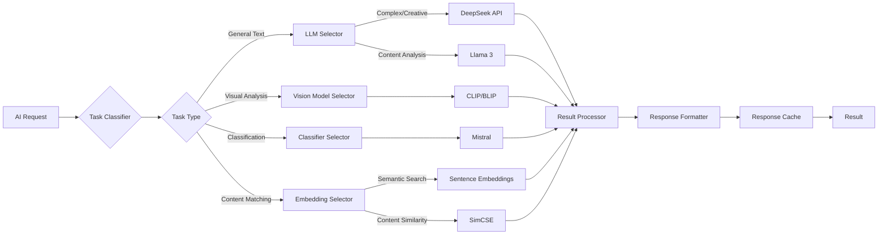

## Engagerr AI System Architecture

### Overview

Engagerr's AI system is a multi-model architecture designed to provide specialized processing for various tasks, including content analysis, relationship detection, creative suggestions, and more. This document outlines the system's components, model selection logic, and integration with platform features.

The AI system is designed with the following principles in mind:

- **Specialization**: Use specialized models for different tasks to optimize performance and accuracy.
- **Resilience**: Implement fallback mechanisms to ensure service continuity even if primary models are unavailable.
- **Scalability**: Design the system to handle increasing workloads and data volumes.
- **Maintainability**: Structure the code for easy updates, maintenance, and addition of new models.

### Components

The AI system consists of the following key components:

1.  **AI Router**: The central service that directs AI processing tasks to the appropriate model based on task classification and availability.
2.  **DeepSeek Service**: Integration with the DeepSeek API for general language tasks and creative generation.
3.  **Llama Service**: Self-hosted Llama 3 model for content analysis and relationship detection.
4.  **Mistral Service**: Self-hosted Mistral model for classification tasks.
5.  **CLIP Service**: Integration with CLIP/BLIP for visual content analysis.
6.  **AI Configuration**: Configuration for AI model selection rules and fallback chains.

### Model Selection Logic

The AI Router uses a set of rules to select the most appropriate model for a given task. These rules consider factors such as:

*   Task type (content analysis, relationship detection, etc.)
*   Content length and complexity
*   Required accuracy and speed
*   Model availability and cost

The model selection logic is defined in the `MODEL_SELECTION_RULES` configuration object in `src/backend/src/config/ai.ts`.

### Fallback Mechanisms

To ensure service continuity, the AI system implements fallback mechanisms. If the primary model for a task is unavailable, the AI Router will attempt to use an alternative model. The fallback chains are defined in the `FALLBACK_CHAINS` configuration object in `src/backend/src/config/ai.ts`.

### Integration with Platform Features

The AI system is integrated with various platform features, including:

*   **Content Mapping**: AI-powered analysis for content relationships and categorization.
*   **Creator Discovery**: AI-enhanced matching between brands and creators.
*   **Content Analysis**: AI-driven insights into content performance and audience engagement.

### Code References

The following code references provide more details about the AI system implementation:

*   **AI Router Service**: `src/backend/src/services/ai/router.ts`
*   **DeepSeek Service**: `src/backend/src/services/ai/deepseek.ts`
*   **Llama Service**: `src/backend/src/services/ai/llama.ts`
*   **Mistral Service**: `src/backend/src/services/ai/mistral.ts`
*   **CLIP Service**: `src/backend/src/services/ai/clip.ts`
*   **AI Configuration**: `src/backend/src/config/ai.ts`
*   **Llama Dockerfile**: `src/backend/Dockerfile.llama`
*   **Mistral Dockerfile**: `src/backend/Dockerfile.mistral`
*   **AI Docker Compose**: `src/backend/docker-compose.ai.yml`

### Containerization

The Llama and Mistral models are containerized using Docker to ensure consistent and reproducible deployments. The Dockerfiles for these models are located in `src/backend/Dockerfile.llama` and `src/backend/Dockerfile.mistral`, respectively.

The AI services are orchestrated using Docker Compose, as defined in `src/backend/docker-compose.ai.yml`. This file defines the services, networks, and volumes required to run the AI system.

### Future Enhancements

The AI system is continuously evolving to meet the changing needs of the Engagerr platform. Planned future enhancements include:

*   Adding support for new AI models and tasks.
*   Improving the accuracy and efficiency of the model selection logic.
*   Implementing more sophisticated fallback mechanisms.
*   Integrating the AI system with additional platform features.