# Engagerr Analytics Architecture

## 1. Introduction

The Analytics Engine is a core differentiator for Engagerr, enabling content creators to understand their true reach and impact across multiple platforms. Traditional analytics tools provide siloed views of performance on individual platforms, forcing creators to manually combine and interpret fragmented data. Engagerr's analytics system solves this fundamental problem by unifying metrics across platforms, standardizing different engagement definitions, and providing holistic insights through content relationship mapping.

### Purpose & Goals

The Engagerr Analytics system is designed to:

- Unify fragmented analytics from multiple social platforms into a cohesive view
- Track hierarchical content relationships to show the full lifecycle performance of content
- Standardize inconsistent metrics across platforms into comparable formats
- Calculate aggregated performance across content families
- Generate actionable insights based on cross-platform patterns
- Visualize complex analytics in intuitive, interactive formats

## 2. Architecture Overview

The Analytics Engine architecture implements a modular, pipeline-oriented approach to process raw platform data into standardized, aggregated metrics with relationship context.

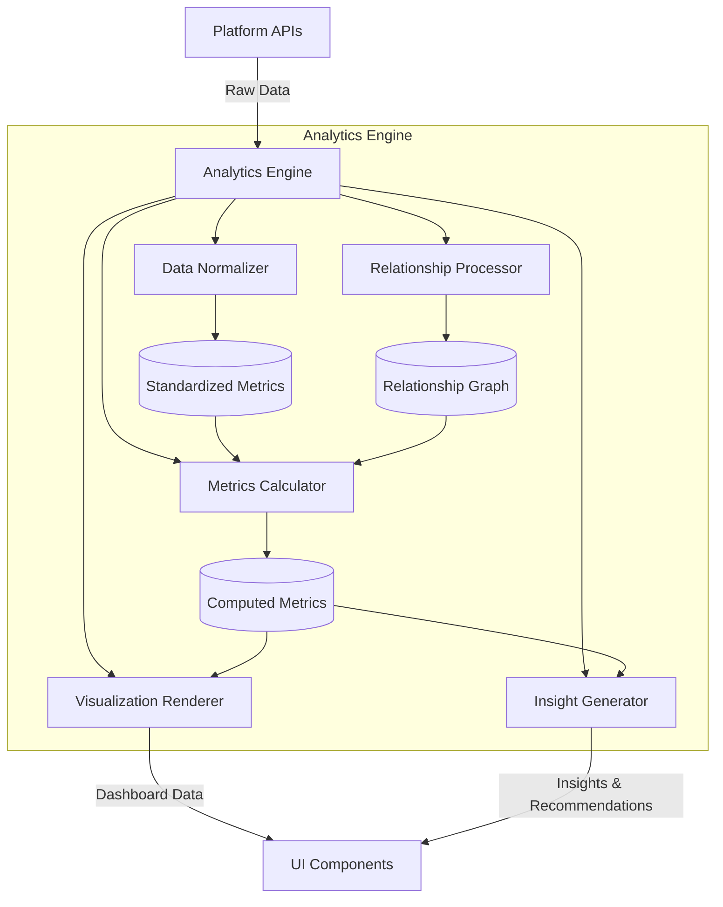

The Analytics Engine operates as a tiered processing system:

1. **Data Acquisition Layer**: Collects raw metrics from platform APIs through the Integration Framework
2. **Processing Layer**: Normalizes, relates, and calculates metrics
3. **Insight Layer**: Generates insights and visualizations
4. **Delivery Layer**: Serves processed data to user interfaces

## 3. Key Components

### 3.1. Data Normalizer

The Data Normalizer standardizes inconsistent metrics from different platforms into a unified measurement framework:

**Primary Responsibilities:**
- Convert platform-specific metrics to standard definitions
- Apply normalization formulas for engagement types
- Resolve unit and time-period inconsistencies
- Handle platform-specific anomalies
- Apply weighting factors for different engagement types
- Detect and flag statistical outliers

**Standardization Examples:**

| Platform Metric | Standardization Process | Output Metric |
| --- | --- | --- |
| YouTube Views + Instagram Views | Direct sum with duplication correction | Total Views |
| YouTube Likes + Instagram Hearts + TikTok Likes | Weighted normalization with platform coefficients | Standardized Engagements |
| YouTube Watch Time + TikTok Average View Duration * Views | Time-based normalization with completion rate adjustment | Total Watch Minutes |
| YouTube Comments + Instagram Comments + TikTok Comments | Direct sum with sentiment analysis | Total Comments |
| YouTube Shares + Instagram Shares + TikTok Shares | Direct sum with attribution tracking | Total Shares |

**Key Algorithms:**
- Platform-specific normalization coefficients
- Engagement weighting based on platform and content type
- Audience overlap estimation formulas
- Statistical anomaly detection

### 3.2. Relationship Processor

The Relationship Processor creates and maintains the hierarchical content relationship graph:

**Primary Responsibilities:**
- Identify relationships between content items
- Maintain the content family graph structure
- Validate logical parent-child relationships
- Track content attribution across platforms
- Calculate performance inheritance through the hierarchy

**Relationship Model:**

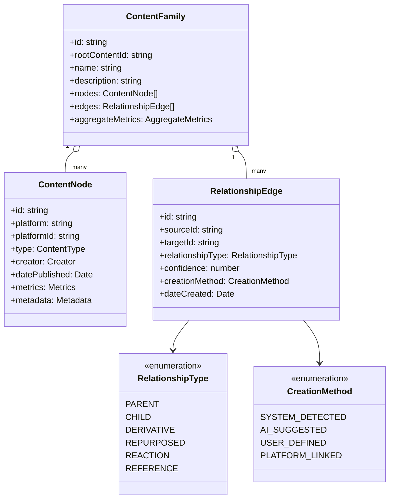

**Technical Implementation:**
- PostgreSQL with LTREE extension for hierarchical path storage
- Graph traversal algorithms for relationship navigation
- AI-assisted relationship detection for automatic mapping
- Confidence scoring for suggested relationships

### 3.3. Metrics Calculator

The Metrics Calculator processes standardized platform data and relationship information to produce comprehensive analytics:

**Primary Responsibilities:**
- Aggregate metrics across platforms with deduplication
- Calculate composite performance scores
- Analyze trends over time
- Estimate audience deduplication
- Compare metrics against relevant benchmarks

**Key Metrics Calculated:**

| Metric | Calculation Method | Considerations |
| --- | --- | --- |
| **Total Reach** | Sum of unique viewers across content family with overlap estimation | Requires platform-specific audience identifiers or statistical modeling |
| **Engagement Rate** | Weighted sum of interactions divided by reach | Weights vary by platform and interaction type |
| **Content Value** | Engagement rate × reach × monetization factor | Monetization factor derived from industry benchmarks |
| **Performance Score** | Weighted combination of all metrics compared to benchmarks | Machine learning model trained on successful content |
| **Audience Retention** | Analysis of view duration across content formats | Adjusted for platform-specific viewing patterns |

**Processing Workflow:**

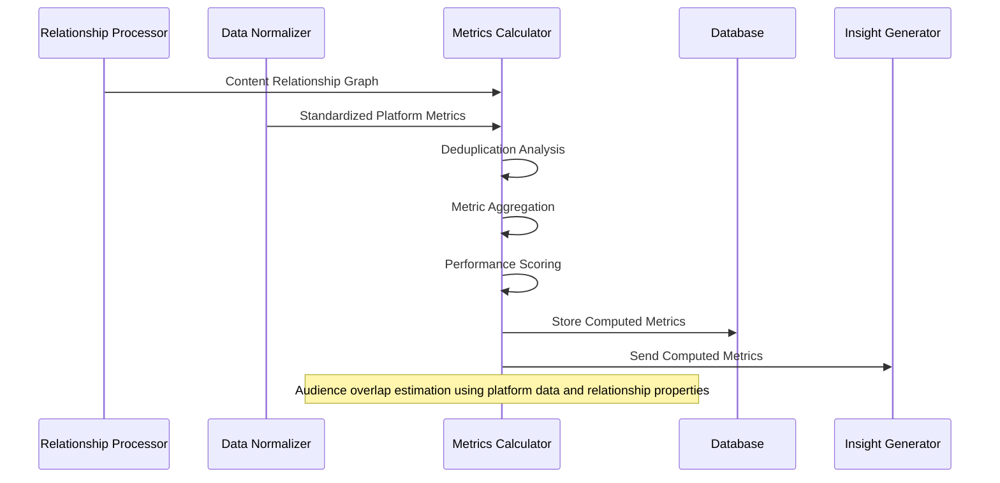

### 3.4. Insight Generator

The Insight Generator analyzes computed metrics to produce actionable insights and recommendations:

**Primary Responsibilities:**
- Identify successful content patterns
- Detect performance anomalies
- Suggest platforms or formats for expansion
- Compare performance to similar creators
- Recommend content strategies based on performance

**Insight Generation Process:**

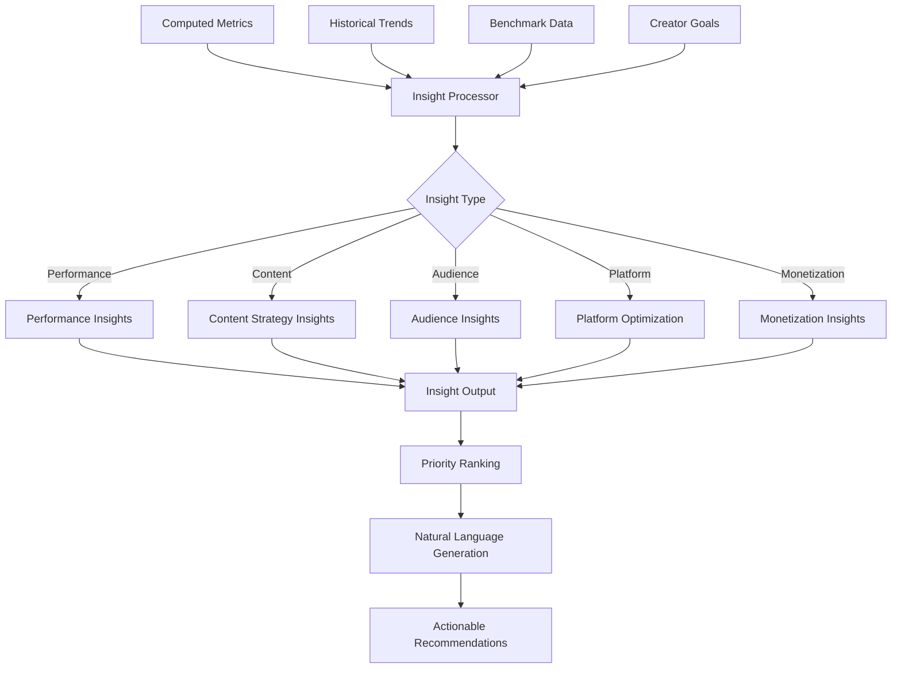

**Insight Types:**
- **Performance Insights**: "Your Instagram content outperforms your TikTok content by 35% in engagement rate"
- **Content Strategy Insights**: "Short-form video derivatives of your podcast get 3x the engagement of text summaries"
- **Audience Insights**: "Your content performs best with 25-34 age group across all platforms"
- **Platform Optimization**: "Your YouTube audience watches 40% longer when content is published before 6pm"
- **Monetization Insights**: "Your tech review content generates 2.5x higher estimated value than lifestyle content"

### 3.5. Visualization Renderer

The Visualization Renderer transforms complex analytics data into intuitive visual representations:

**Primary Responsibilities:**
- Generate standardized chart configurations
- Build interactive data visualizations
- Render the content relationship graph
- Assemble visualizations into cohesive dashboards
- Prepare visualizations for exports and media kits

**Visualization Types:**
- Time-series trend charts
- Performance comparison charts
- Audience demographic visualizations
- Content relationship network graphs
- Geographic distribution maps
- Platform comparison breakdowns

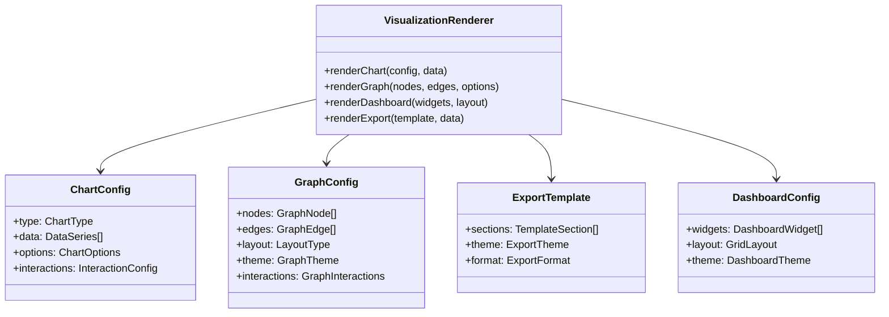

## 4. Data Flow

### 4.1. Integration and Ingest Pipeline

The analytics data flow begins with the Integration Framework connecting to multiple social platform APIs:

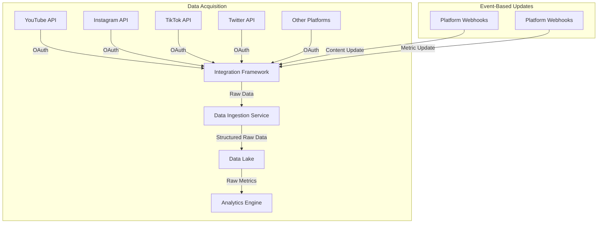

This pipeline includes:
1. **Authentication**: OAuth-based authentication for secure API access
2. **Scheduled Polling**: Regular retrieval of updated metrics
3. **Webhook Processing**: Real-time updates when available from platforms
4. **Rate Limit Management**: Intelligent handling of API rate limits
5. **Error Handling**: Graceful degradation when platform APIs are unavailable

### 4.2. Processing Pipeline

Once raw data is ingested, it flows through the processing pipeline:

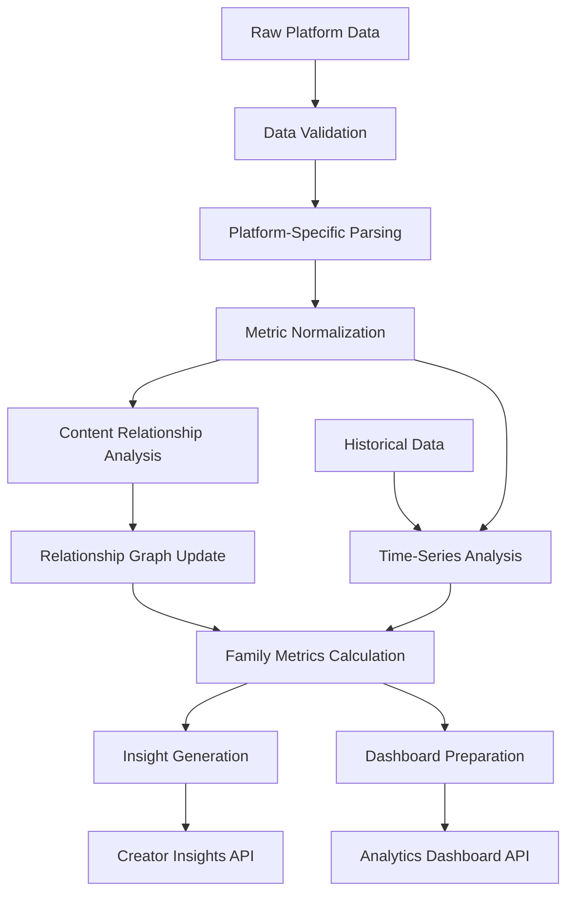

Key processing stages:
1. **Validation**: Ensures data quality and integrity
2. **Parsing**: Extracts relevant metrics from platform-specific formats
3. **Normalization**: Standardizes metrics using platform-specific formulas
4. **Relationship Analysis**: Maps content to the relationship graph
5. **Metrics Calculation**: Computes aggregated and derived metrics
6. **Insight Generation**: Produces actionable insights
7. **Dashboard Preparation**: Formats data for visualization

### 4.3. Data Access Flow

Analytics data is accessed through several channels:

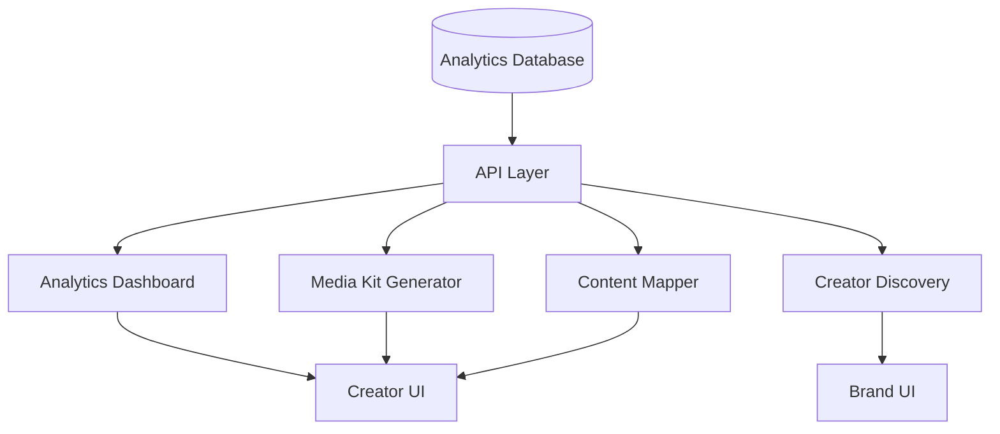

Access patterns include:
1. **Creator Dashboard**: Main analytics viewing experience
2. **Media Kit Generator**: Creation of shareable performance summaries
3. **Content Mapper**: Association of content items with analytics
4. **Creator Discovery**: Brand-facing creator metrics

## 5. Standardization Process

### 5.1. Metric Normalization Framework

The standardization process converts inconsistent platform metrics into a unified measurement framework:

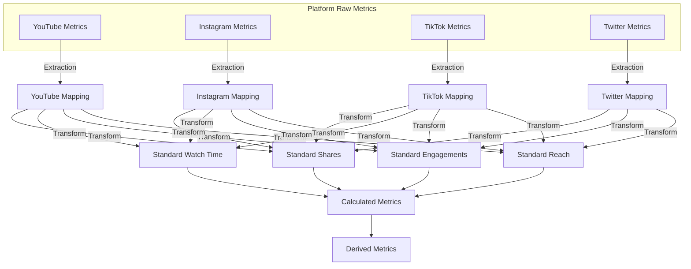

### 5.2. Platform-Specific Transformations

Each platform requires specific transformations to standardize metrics:

| Platform | Metric | Transformation | Standard Metric |
| --- | --- | --- | --- |
| YouTube | Views | Direct mapping | Standard Views |
| YouTube | Watch time | Direct mapping (minutes) | Standard Watch Time |
| YouTube | Likes | Value × 1.0 (baseline) | Standard Engagements |
| YouTube | Comments | Value × 5.0 (weighted) | Standard Engagements |
| YouTube | Shares | Value × 10.0 (weighted) | Standard Shares |
| Instagram | Impressions | Value × 0.8 (reach adjustment) | Standard Views |
| Instagram | Video views | Direct mapping | Standard Views |
| Instagram | Hearts/Likes | Value × 0.9 (platform adjustment) | Standard Engagements |
| Instagram | Comments | Value × 4.5 (weighted) | Standard Engagements |
| Instagram | Saves | Value × 15.0 (weighted) | Standard Engagements |
| TikTok | Views | Direct mapping | Standard Views |
| TikTok | Video play time | Value ÷ 60 (seconds to minutes) | Standard Watch Time |
| TikTok | Likes | Value × 0.85 (platform adjustment) | Standard Engagements |
| TikTok | Comments | Value × 4.8 (weighted) | Standard Engagements |
| TikTok | Shares | Value × 12.0 (weighted) | Standard Shares |

These transformations are regularly calibrated based on platform changes and industry standards.

### 5.3. Derived Metrics Calculation

From standardized base metrics, the system calculates these key derived metrics:

- **Engagement Rate**: `(Total Standard Engagements / Standard Views) × 100`
- **View-Through Rate**: `(Completed Views / Total Views) × 100`
- **Average Watch Time**: `Standard Watch Time / Standard Views`
- **Share Rate**: `(Standard Shares / Standard Views) × 100`
- **Content Value**: Complex formula based on engagement, reach, and platform value coefficients
- **Performance Score**: Weighted score relative to creator's historical performance and industry benchmarks

### 5.4. Audience Deduplication

A critical component of cross-platform analytics is audience deduplication:

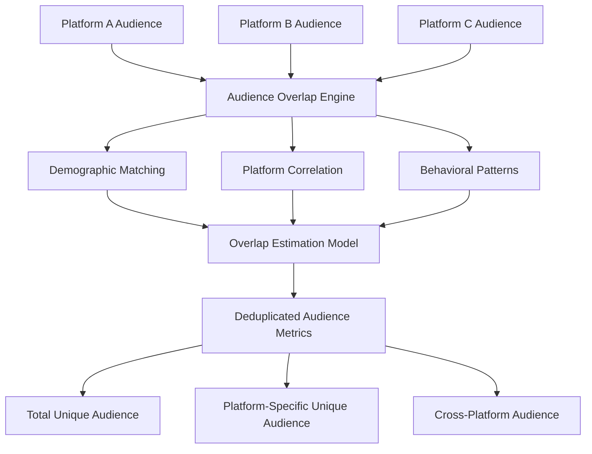

Deduplication approaches include:
1. **Demographic Pattern Matching**: Statistical model of audience overlap based on demographics
2. **Platform-to-Platform Correlation**: Historical data on typical overlap between platforms
3. **Behavioral Pattern Analysis**: Engagement patterns suggesting the same users across platforms
4. **Creator-Specific Models**: Refined overlap estimates based on creator's historical data

## 6. Technology Stack

### 6.1. Core Technologies

The Analytics Engine is built on these core technologies:

| Component | Technology | Purpose |
| --- | --- | --- |
| **Database** | PostgreSQL with LTREE extension | Relational data storage with hierarchical relationship capabilities |
| **ORM Layer** | Prisma | Type-safe database access with generated TypeScript types |
| **API Layer** | NextJS API routes | Server-side API endpoints for analytics data access |
| **Processing** | Node.js with TypeScript | Analytics data processing and calculations |
| **Visualization** | D3.js, Recharts | Interactive data visualization components |
| **Caching** | Vercel Edge Cache, Redis (future) | Performance optimization for frequent queries |

### 6.2. Data Storage

The analytics data storage architecture implements:

1. **Time-Series Data**:
   - Partitioned tables for efficient time-range queries
   - Incremental aggregation for fast access to historical trends

2. **Relationship Data**:
   - LTREE path structures for hierarchical content relationships
   - Graph traversal functions for relationship analysis

3. **Materialized Views**:
   - Pre-computed aggregates for common analytics queries
   - Scheduled refreshes to balance freshness and performance

4. **Caching Strategy**:
   - Multi-level caching (edge, application, database)
   - Cache invalidation based on data update patterns

### 6.3. API Endpoints

Key analytics API endpoints include:

| Endpoint | Purpose | Parameters | Response |
| --- | --- | --- | --- |
| `/api/analytics/overview` | High-level analytics summary | timeframe, platforms | Summary metrics and trends |
| `/api/analytics/content/:id` | Analytics for specific content | contentId, metrics | Content-specific metrics |
| `/api/analytics/family/:id` | Analytics for content family | rootContentId, metrics | Aggregated family metrics |
| `/api/analytics/platforms` | Platform comparison | timeframe | Platform-specific performance |
| `/api/analytics/audience` | Audience demographics | segmentation | Audience breakdown |
| `/api/insights/:creatorId` | AI-generated insights | limit, categories | Prioritized insights list |

## 7. Scalability & Performance

### 7.1. Database Scalability

The analytics database implements these scalability features:

1. **Partitioning Strategy**:
   - Time-based partitioning for metrics data
   - Range partitioning for large creator accounts
   - Custom partitioning for high-volume platforms

2. **Query Optimization**:
   - Materialized views for common aggregation queries
   - Optimized indexes for frequent access patterns
   - Custom database functions for complex calculations

3. **Read/Write Splitting**:
   - Primary database for writes
   - Read replicas for analytics queries
   - Custom routing based on query type

### 7.2. Processing Scalability

The analytics processing pipeline scales through:

1. **Asynchronous Processing**:
   - Background jobs for intensive calculations
   - Queue-based processing for platform data ingestion
   - Event-driven updates for real-time changes

2. **Incremental Processing**:
   - Delta-based updates rather than full recalculation
   - Progressive computation of complex metrics
   - Lazy evaluation for rarely-accessed metrics

3. **Parallel Processing**:
   - Horizontal scaling for data processing
   - Platform-specific processing workers
   - Workload distribution based on data volume

### 7.3. Performance Optimization

Key performance optimizations include:

1. **Caching Strategy**:
   - Time-based caching for relatively static data
   - Edge caching for frequently accessed metrics
   - Cache invalidation on data updates

2. **Data Aggregation**:
   - Pre-aggregation of common time periods
   - Progressive loading of detailed metrics
   - On-demand calculation of complex metrics

3. **Query Patterns**:
   - Optimized database access patterns
   - Batch retrieval of related data
   - Pagination for large result sets

## 8. Relationship Tracking

### 8.1. Content Relationship Model

The content relationship tracking uses an advanced hierarchical model:

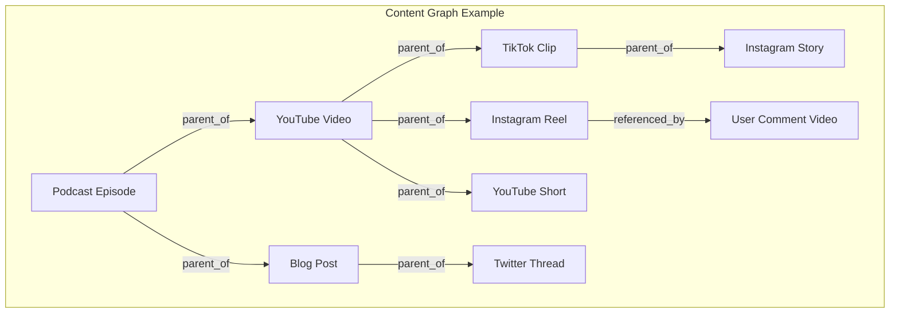

### 8.2. Relationship Types

The system tracks these relationship types:

| Relationship Type | Description | Analytics Implication |
| --- | --- | --- |
| **Parent** | Original source content | Root of content family tree |
| **Child** | Direct derivative of parent | First-level performance attribution |
| **Derivative** | Content derived from another piece | Secondary attribution |
| **Repurposed** | Reformatted for different platform | Platform-specific performance |
| **Reaction** | User-generated response content | Engagement extension |
| **Reference** | Content that references without derivation | Influence tracking |

### 8.3. Technical Implementation

The relationship tracking is implemented using:

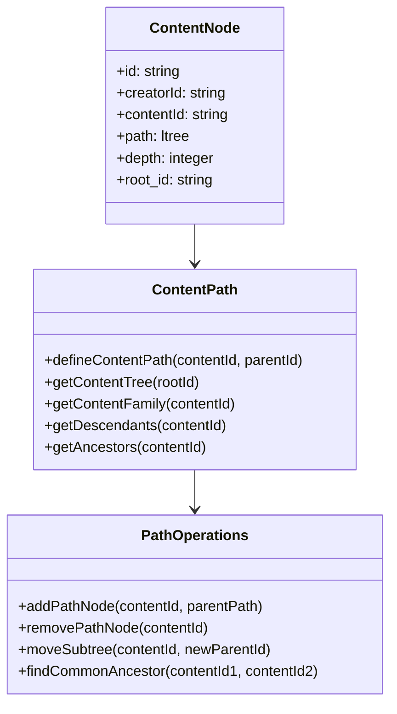

PostgreSQL's LTREE extension provides efficient storage and querying of hierarchical relationships:

| Path Format | Example | Description |
| --- | --- | --- |
| Root Node | `content_123` | Original parent content |
| First Level | `content_123.youtube_456` | Direct child content |
| Second Level | `content_123.youtube_456.tiktok_789` | Derivative of child content |
| Cross-Platform | `content_123.*.tiktok_789` | Any TikTok content derived from root |

This implementation enables:
- Fast tree traversal queries
- Efficient subtree operations
- Ancestor and descendant retrieval
- Flexible path-based filtering

### 8.4. Relationship Detection

Content relationships are detected through multiple methods:

1. **Manual Definition**:
   - Creator explicitly connects content items
   - Direct parent-child assignment in content mapper

2. **Platform Signals**:
   - Platform-provided connections (e.g., YouTube Shorts from longer videos)
   - Cross-links in content descriptions or metadata

3. **AI Detection**:
   - Content similarity analysis
   - Temporal pattern recognition
   - Title and description matching
   - Visual/audio fingerprinting

4. **Behavioral Patterns**:
   - User engagement patterns suggesting relationships
   - Sequential publishing patterns
   - Cross-platform promotion signals

## 9. Analytics Features

### 9.1. Cross-Platform Aggregation

The system provides these aggregation capabilities:

1. **Metric Aggregation**:
   - Total reach across platforms
   - Combined engagement metrics
   - Weighted performance scoring
   - Content family performance

2. **Time-Based Aggregation**:
   - Daily, weekly, monthly trends
   - Year-over-year comparisons
   - Custom date range analysis
   - Publishing time analysis

3. **Content Type Aggregation**:
   - Performance by content format
   - Platform-specific content analysis
   - Content family comparisons
   - Topic and category analysis

### 9.2. Trend Analysis

Advanced trend analysis features include:

1. **Performance Trends**:
   - Growth rate calculations
   - Seasonal pattern detection
   - Anomaly identification
   - Forecast modeling

2. **Comparative Trends**:
   - Platform-to-platform comparisons
   - Content type effectiveness
   - Publishing strategy impact
   - Engagement pattern shifts

3. **Audience Trends**:
   - Demographic shifts
   - Platform preference changes
   - Engagement behavior evolution
   - Loyalty and retention patterns

### 9.3. Audience Analysis

Audience analytics features include:

1. **Demographic Analysis**:
   - Age distribution across platforms
   - Gender breakdown comparisons
   - Geographic distribution
   - Language preferences

2. **Behavioral Analysis**:
   - Engagement patterns by segment
   - Platform preferences
   - Content type preferences
   - Interaction time patterns

3. **Cross-Platform Audience**:
   - Audience overlap estimation
   - Platform-specific segments
   - Cross-platform journey mapping
   - Audience loyalty metrics

### 9.4. Performance Benchmarking

Benchmarking capabilities include:

1. **Historical Benchmarking**:
   - Comparison to creator's historical performance
   - Growth rate benchmarking
   - Seasonal adjustments
   - Content evolution analysis

2. **Peer Benchmarking**:
   - Anonymous comparison to similar creators
   - Category-specific benchmarks
   - Platform performance relativity
   - Engagement rate context

3. **Industry Benchmarking**:
   - Vertical-specific performance context
   - Platform average comparisons
   - Growth trend contextualization
   - Monetization potential analysis

### 9.5. AI-Powered Insights

The Insight Generator provides these AI-powered features:

1. **Performance Insights**:
   - Anomaly detection with explanations
   - Success pattern identification
   - Underperforming content diagnosis
   - Growth opportunity spotting

2. **Strategic Recommendations**:
   - Content format suggestions
   - Optimal posting schedule
   - Platform expansion opportunities
   - Content repurposing strategies

3. **Audience Insights**:
   - Demographic-based recommendations
   - Engagement driver analysis
   - Audience growth strategies
   - Retention improvement suggestions

## 10. Data Storage & Management

### 10.1. Database Schema

The analytics database schema includes these key tables:

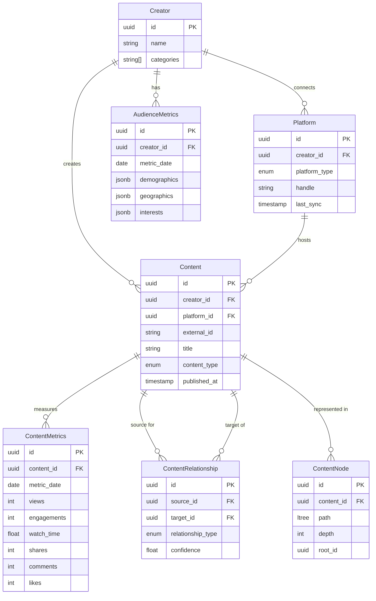

### 10.2. Partitioning Strategy

Analytics data is partitioned for optimal performance:

1. **Time-Based Partitioning**:
   - Metrics tables partitioned by month
   - Automated partition creation and management
   - Historical data archiving policies

2. **Creator-Based Sharding**:
   - Large creator accounts on dedicated partitions
   - Balanced distribution based on data volume
   - Optimized query routing

3. **Platform-Specific Partitioning**:
   - Platform-specific metrics partitioned separately
   - Optimization for platform-specific queries
   - Balanced storage distribution

### 10.3. Data Lifecycle Management

Analytics data follows this lifecycle:

1. **Active Data**:
   - Recent metrics (0-3 months)
   - Full detail retention
   - Optimized for frequent access
   - Regular backup schedule

2. **Warm Data**:
   - Medium-term metrics (3-12 months)
   - Selective aggregation
   - Less frequent access patterns
   - Regular backup schedule

3. **Cold Data**:
   - Historical metrics (12+ months)
   - Higher aggregation level
   - Archived storage optimization
   - Less frequent backup schedule

### 10.4. Caching Strategy

The multi-level caching strategy includes:

1. **Database-Level Caching**:
   - Materialized views for common aggregations
   - Query results caching
   - Connection pooling optimization

2. **Application-Level Caching**:
   - In-memory caching for frequent calculations
   - User-specific data caching
   - Time-based cache invalidation

3. **Edge Caching**:
   - CDN caching for static analytics components
   - Regional edge caching for improved performance
   - Stale-while-revalidate pattern for freshness

4. **Client-Side Caching**:
   - React Query data caching
   - Progressive loading strategies
   - Optimistic UI updates

## 11. API & Integration Points

### 11.1. Analytics API

The Analytics API provides these main endpoints:

```mermaid
flowchart TD
    API[Analytics API] --> Overview[/api/analytics/overview]
    API --> ContentAPI[/api/analytics/content/:id]
    API --> FamilyAPI[/api/analytics/family/:id]
    API --> PlatformAPI[/api/analytics/platforms]
    API --> AudienceAPI[/api/analytics/audience]
    API --> TrendAPI[/api/analytics/trends]
    API --> InsightAPI[/api/insights/:creatorId]
    API --> ExportAPI[/api/analytics/export]
```

### 11.2. Integration with Other Systems

The Analytics Engine integrates with these system components:

1. **Creator Dashboard**:
   - Analytics widgets and visualizations
   - Performance overview components
   - Trend visualization components

2. **Content Mapper**:
   - Content relationship visualization
   - Performance data for content items
   - Relationship impact analysis

3. **Media Kit Generator**:
   - Standardized performance metrics
   - Audience demographic summaries
   - Visual performance components

4. **Creator Discovery**:
   - Standardized creator metrics
   - Performance trend indicators
   - Engagement quality metrics

5. **Integration Framework**:
   - Platform connector coordination
   - Data refresh scheduling
   - Webhook event processing

### 11.3. Data Export Capabilities

The system provides these export capabilities:

1. **Format Options**:
   - JSON data export
   - CSV for spreadsheet analysis
   - PDF reports
   - Media kit formats

2. **Export Scopes**:
   - Full analytics data
   - Filtered time periods
   - Specific platforms
   - Custom metric selections

3. **Automated Exports**:
   - Scheduled report generation
   - Email delivery options
   - API-triggered exports
   - Webhook-based exports

## 12. Security & Privacy

### 12.1. Access Control

Analytics data is protected through:

1. **Role-Based Access Control**:
   - Creator-only access to full analytics
   - Team member access based on permissions
   - Brand access limited to discovery data
   - Administrative access controls

2. **Row-Level Security**:
   - Database-level access control
   - Creator-specific data isolation
   - Team-based permission inheritance
   - Attribute-based access control

3. **Data Sharing Controls**:
   - Selective metric sharing in media kits
   - Temporary access grants for partnerships
   - Anonymized data for benchmarking
   - Granular permission management

### 12.2. Data Protection

Analytics data is protected through:

1. **Data Anonymization**:
   - Audience data aggregation
   - Demographic data generalization
   - Benchmark anonymization
   - PII protection

2. **Encryption**:
   - Encryption at rest for sensitive data
   - Encryption in transit (TLS)
   - Secure key management
   - Platform credential protection

3. **Audit Logging**:
   - Access logging for analytics data
   - Export and sharing audit trail
   - Administrative action logging
   - Anomaly detection for access patterns

### 12.3. Compliance

The analytics system maintains compliance with:

1. **GDPR Compliance**:
   - Data minimization principles
   - Purpose limitation enforcement
   - Right to access implementation
   - Right to be forgotten processes

2. **CCPA Compliance**:
   - Data inventory maintenance
   - Disclosure requirements
   - Opt-out mechanisms
   - Data deletion processes

3. **Platform Compliance**:
   - Adherence to platform terms of service
   - API usage policy compliance
   - Data retention policy alignment
   - Usage limitations enforcement

## 13. Future Enhancements

Planned enhancements to the Analytics Engine include:

1. **Advanced AI Capabilities**:
   - Predictive performance modeling
   - Content topic optimization
   - Automated content strategy generation
   - Advanced audience segmentation

2. **Enhanced Visualization**:
   - Interactive content journey mapping
   - 3D visualization options
   - Custom dashboard builders
   - Advanced export templates

3. **Extended Relationship Tracking**:
   - Multi-creator collaboration tracking
   - Competitive content analysis
   - Influence network mapping
   - Content lifecycle optimization

4. **Performance Optimizations**:
   - Real-time analytics capabilities
   - Enhanced caching strategies
   - Query optimization enhancements
   - Distributed processing improvements

5. **Integration Expansions**:
   - Additional platform connectors
   - Advanced API capabilities
   - Webhook enhancement
   - Third-party analytics integration

---

This architecture document provides a comprehensive overview of the Engagerr Analytics Engine. It covers the system's core components, data flows, standardization processes, and key features that enable the platform's differentiated analytics capabilities.