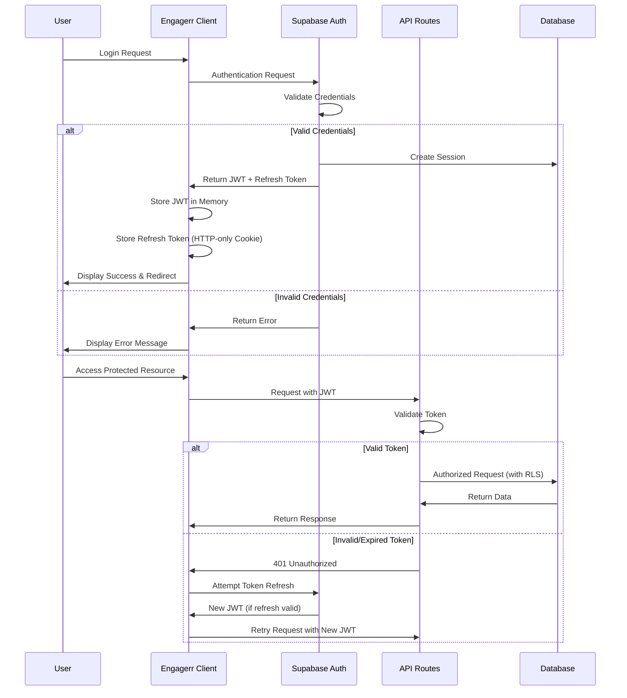
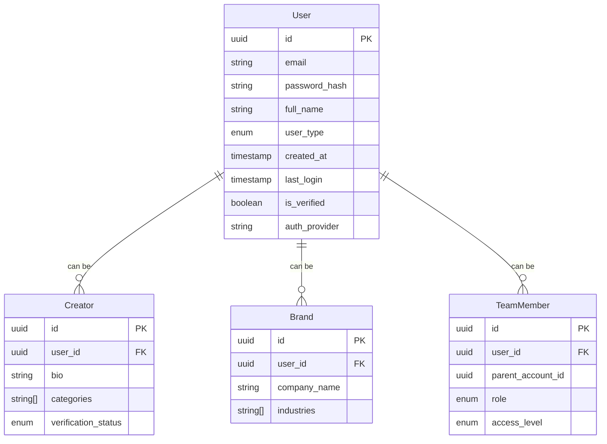
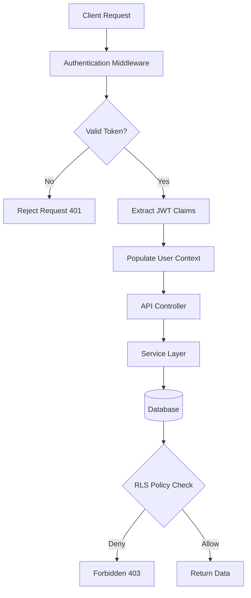

# Authentication Architecture

## Overview

Engagerr implements a comprehensive authentication system built on Supabase Auth, providing secure identity management for both creator and brand users. The authentication architecture prioritizes security, user experience, and scalability while supporting various authentication methods including email/password, social login, and multi-factor authentication.

## Authentication Flow



## User Identity Management

### User Types

Engagerr supports multiple user types, each with specific roles and permissions:

| User Type | Description | Registration Path |
| --- | --- | --- |
| **Creator** | Content creators who track their content across platforms | Creator registration flow |
| **Brand** | Businesses looking to partner with creators | Brand registration flow |
| **Team Member** | Users with delegated access to creator or brand accounts | Invitation by account owner |
| **Admin** | System administrators with privileged access | Internal creation only |

### User Profiles

Each user has a base profile containing common attributes and a specialized profile based on their type:



## Authentication Methods

### Email & Password

The primary authentication method using email address and password with the following security controls:

- **Password Requirements**: Minimum 10 characters with complexity requirements
- **Account Verification**: Email verification required before full access
- **Password Reset**: Secure time-limited token-based reset flow
- **Breach Detection**: Check against known compromised passwords

### OAuth Providers

Social authentication options for simplified onboarding:

| Provider | Implementation | Scope |
| --- | --- | --- |
| Google | OAuth 2.0 | Email, Profile |
| Apple | Sign in with Apple | Email, Name |

### Platform-specific OAuth

For connecting creator accounts to content platforms:

| Platform | OAuth Version | Data Access |
| --- | --- | --- |
| YouTube | OAuth 2.0 | Read content and analytics |
| Instagram | Graph API OAuth | Content and metrics |
| TikTok | OAuth 2.0 | Content and analytics |
| Twitter | OAuth 2.0 | Tweet data and metrics |
| LinkedIn | OAuth 2.0 | Posts and engagement |

## Multi-Factor Authentication (MFA)

Engagerr implements a risk-based MFA approach:

| MFA Type | Implementation | Requirement |
| --- | --- | --- |
| Time-based OTP | Supabase Auth MFA | Optional for standard accounts |
| App Authenticator | TOTP Standard | Required for financial operations |
| SMS Verification | Twilio integration | Required for Enterprise tier |

MFA is enforced in these high-security contexts:
- Administrative actions
- Payment operations above $1,000
- Login from new devices
- Enterprise account access

## Token Management

The system implements a multi-tiered token architecture:

| Token Type | Lifespan | Storage | Purpose |
| --- | --- | --- | --- |
| JWT Access Token | 4 hours | Memory (client-side) | API authentication |
| Refresh Token | 30 days | HTTP-only, secure cookie | Token renewal |
| Platform Access Tokens | Platform-specific | Encrypted in database | Platform API access |
| Verification Tokens | 24 hours | Database | Email verification, password reset |

### Token Rotation and Invalidation

Secure token lifecycle management:

- **JWT Rotation**: New JWT issued on refresh token use
- **Refresh Token Rotation**: Optional rotation on use for enhanced security
- **Automatic Invalidation**: All tokens invalidated on password change or security event
- **Token Revocation**: API endpoint for explicit session termination

## Session Management

| Aspect | Implementation | Security Benefit |
| --- | --- | --- |
| Session Duration | 4-hour active JWT | Limits exposure of active sessions |
| Refresh Tokens | 30-day HTTP-only cookie | Secures long-term authorization |
| Concurrent Sessions | Session registry with limits | Prevents unauthorized access |
| Session Revocation | Immediate server-side invalidation | Mitigates compromised accounts |

Sessions are automatically terminated under these conditions:
- Password change
- MFA reset
- Suspicious activity detection
- User-initiated logout
- Exceeding maximum concurrent sessions (varies by tier)

## Authorization Framework

### Role-Based Access Control (RBAC)

| Role | Description | Capabilities |
| --- | --- | --- |
| System Admin | Engagerr administrators | Full system access and administration |
| Creator Owner | Primary account holder | Full creator account management |
| Creator Manager | Delegated administrator | Content and analytics management |
| Creator Analyst | Team member | View-only for analytics and content |
| Brand Owner | Primary brand account | Full brand account management |
| Brand Manager | Campaign administrator | Campaign and partnership management |
| Brand Viewer | Team member | View-only for campaigns and analytics |

### Resource-Level Access Control

Access control is enforced at the database level using Supabase Row Level Security (RLS) policies:

```sql
-- Example RLS policy for content access
CREATE POLICY "Users can only access their own content"
  ON content
  FOR ALL
  USING (creator_id IN (
    SELECT c.id FROM creators c
    WHERE c.user_id = auth.uid()
  ));
```

## Database Security

### Row Level Security (RLS) Implementation

Supabase RLS policies control data access at the row level based on the authenticated user's identity and roles:

| Entity | Policy Type | Policy Rule |
| --- | --- | --- |
| User Data | Access | Only self or admin can view full profile |
| Creator Content | Ownership | Creator and authorized team members only |
| Analytics Data | Visibility | Based on subscription tier and ownership |
| Partnership Data | Dual Access | Both creator and brand have appropriate access |
| Platform Credentials | Restricted | Encrypted with application-level access only |

## Security Monitoring and Auditing

### Authentication Event Logging

Comprehensive logging of authentication-related events:

| Event Category | Logged Data | Retention Period |
| --- | --- | --- |
| Authentication Events | User ID, timestamp, IP, device, success/failure | 1 year |
| Authorization Decisions | Resource, action, decision, policy applied | 90 days |
| Sensitive Operations | Full request details, affected resources | 3 years |
| Data Access | Resource type, operation, user context | 90 days |

### Suspicious Activity Detection

Proactive security monitoring for potential threats:

| Threat Vector | Detection Method | Response Action |
| --- | --- | --- |
| Account Takeover | Login anomalies, geography changes | Step-up authentication, account freeze |
| Brute Force Attempts | Multiple failed logins | Progressive timeout, account lockout |
| Session Hijacking | Token anomalies, IP changes | Force re-authentication |
| Privilege Escalation | Unauthorized access attempts | Access termination, security alert |

## Implementation Architecture

### Backend Implementation

The authentication system is implemented using Supabase Auth with custom enhancements:



### Frontend Implementation

Client-side authentication is handled through React context and hooks:

```jsx
// Simplified example of auth context consumption
import { useAuth } from '../hooks/useAuth';

function ProtectedComponent() {
  const { user, isLoading } = useAuth();
  
  if (isLoading) return <Loading />;
  if (!user) return <Redirect to="/login" />;
  
  return <div>Protected Content for {user.email}</div>;
}
```

## Security Considerations

### OWASP Compliance

The authentication system addresses key OWASP security concerns:

- **Broken Authentication**: Strong password policies, MFA, secure token management
- **Sensitive Data Exposure**: Encrypted storage of sensitive auth data
- **Broken Access Control**: Layered authorization with RBAC and RLS
- **Security Misconfiguration**: Standardized security settings across environments
- **Cross-Site Scripting**: HTTP-only cookies for refresh tokens

### Regulatory Compliance

The authentication system is designed to meet requirements for:

- **GDPR**: User consent, data access controls, right to be forgotten
- **CCPA**: Privacy notices, data access requests
- **PCI-DSS**: (for payment-related authentication) Secure authentication practices