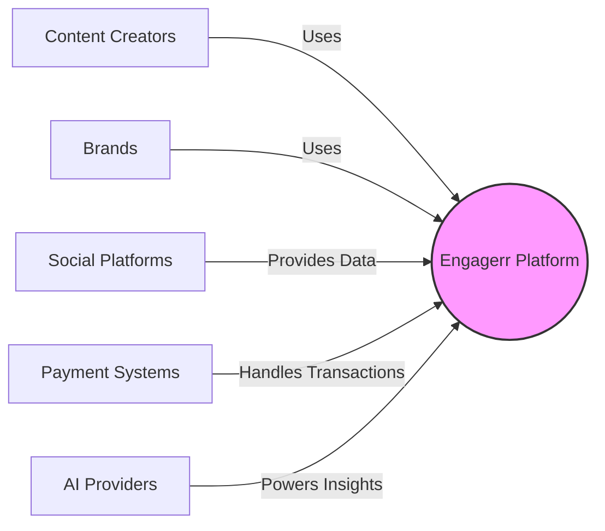
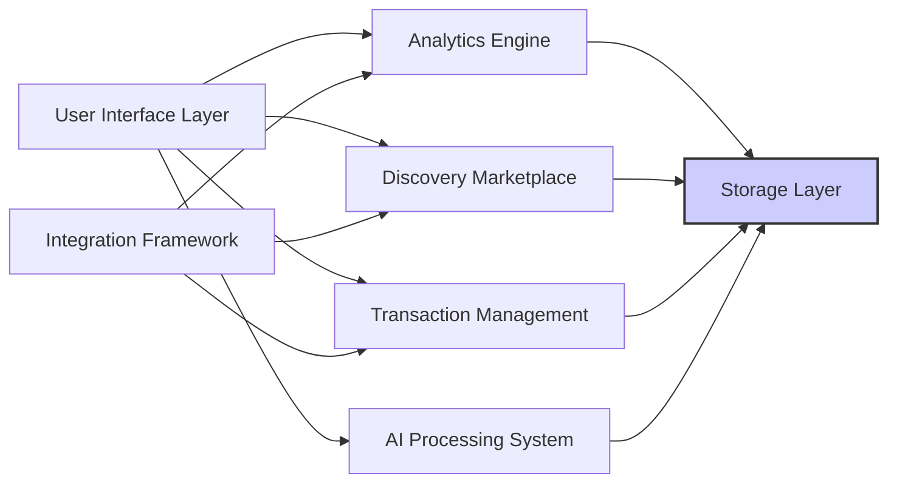

## Engagerr Platform Architecture Overview

### Introduction

This document provides a comprehensive overview of the Engagerr platform's technical architecture. It introduces the core design decisions, system components, and how different parts interact to create a cohesive system.

#### Platform Purpose

Engagerr is a two-sided marketplace connecting content creators and brands through data-driven insights and relationship mapping.

#### Business Context

The architecture is designed to address the core business problems of fragmented creator analytics and inefficient brand partnership processes, meeting the needs of content creators, brands, and marketing agencies.

#### Key Technical Differentiators

Engagerr differentiates itself through proprietary content mapping technology, cross-platform analytics standardization, and AI-driven insights.

### Architectural Overview

This section provides a high-level description of Engagerr's architecture, including key components, interactions, and design decisions.

#### Architecture Principles

The architecture is guided by the following core principles:

- **API-First Design**: All functionality is exposed through well-defined API routes.
- **Server & Client Components**: Strategic use of React Server Components for data-intensive operations and Client Components for interactive elements.
- **Modular Monolithic Approach**: Functional service components are used within a unified application.

#### System Context Diagram

This diagram shows Engagerr's position in relation to users, social platforms, payment systems, and other external entities.

#### High-Level Component Diagram

This diagram visualizes major system components and their relationships, serving as a map for the detailed architecture sections.

### Technology Stack

This section provides a comprehensive overview of the technology stack, explaining key choices and their benefits.

#### Development Languages

TypeScript is used throughout the stack for type safety and developer productivity.

#### Core Frameworks

NextJS 14 with App Router is used for unified full-stack development, React 18 for components, TailwindCSS for styling, and Prisma ORM for type-safe database access.

#### Database & Storage

PostgreSQL with LTREE extension is used for content relationships, managed through Supabase with Row Level Security (RLS).

#### Third-Party Services

Supabase Auth, Stripe for payments, Resend for emails, and various AI providers (DeepSeek, Hugging Face) are used.

#### Development & Deployment

Vercel is used for hosting and CI/CD, Docker for AI model containerization, and GitHub for repository management.

### Architecture Patterns

This section describes key architectural patterns employed throughout the system.

#### Modular Monolith

The modular monolithic approach using NextJS rather than microservices is explained, detailing the benefits for the current scale and complexity.

#### Server & Client Components

The strategic use of React Server Components for data-intensive operations and Client Components for interactive elements is described.

#### API-First Design

The API-first approach that exposes all functionality through well-defined endpoints is explained.

#### Event-Driven Integration

Details on asynchronous processing for platform integrations, analytics calculations, and notification workflows are provided.

#### Graph-Based Data Modeling

An overview of how hierarchical relationships are modeled using PostgreSQL's LTREE extension for content mapping is given.

### Core System Components

This section provides a detailed description of the main system components and their responsibilities.

#### Next.js Application

The architecture of the unified application handling both frontend and backend functionality through the App Router model is described.

#### Analytics Engine

An overview of the system for processing, standardizing, and visualizing cross-platform content metrics is given.

#### Content Relationship Mapping

A description of the proprietary system for tracking and visualizing content relationships across platforms is provided.

#### Discovery Marketplace

The architecture of the creator discovery and matching component for brands is described.

#### Transaction Management

The design of the system handling subscriptions, marketplace transactions, and escrow payments is explained.

#### Multi-Model AI System

An overview of the specialized AI architecture that routes tasks to appropriate models based on requirements is given.

#### Integration Framework

A description of the system connecting Engagerr with external platforms and services is provided.

### Database Architecture

This section provides a detailed explanation of the database design and data management approach.

#### Schema Design

An overview of the core data models and their relationships is given.

#### Graph Implementation

Details on implementing hierarchical content relationships using PostgreSQL's LTREE extension are provided.

#### Access Control

Implementation of Row Level Security (RLS) for fine-grained data access control is described.

#### Database Scaling

Strategies for scaling the database including read replicas and time-series partitioning are explained.

### Security Architecture

This section provides a comprehensive overview of the security measures implemented throughout the system.

#### Authentication & Authorization

An overview of the authentication system using Supabase Auth and multi-factor authentication is given.

#### Data Protection

Approaches to securing sensitive data, including encryption and masking, are described.

#### API Security

Security measures for API endpoints including authentication, rate limiting, and input validation are explained.

#### External Integration Security

Security measures for external service integrations including secure token storage are described.

### Deployment & Infrastructure

This section describes the deployment architecture and infrastructure management.

#### Vercel Deployment

Details of the Vercel-based deployment strategy including environment management are provided.

#### Containerized AI Models

An explanation of the Docker-based deployment for self-hosted AI models is given.

#### Infrastructure as Code

An overview of Terraform usage for infrastructure provisioning and management is provided.

#### CI/CD Pipeline

Details of the continuous integration and deployment workflows are given.

### Monitoring & Observability

This section provides an overview of the monitoring and observability approach for the platform.

#### Logging Strategy

Details of the structured logging approach across system components are provided.

#### Metrics Collection

An explanation of performance and business metrics collection and analysis is given.

#### Alerting Framework

An overview of the alerting system for detecting and responding to issues is provided.

#### Health Monitoring

Details of the health check implementation for system components are given.

### Scalability Approach

This section describes strategies for scaling the system to accommodate growth.

#### Vertical & Horizontal Scaling

The approach to scaling different components based on their characteristics is explained.

#### Caching Strategy

A multi-level caching approach from edge to database for performance optimization is described.

#### Database Scaling

Specific strategies for scaling the database as data volume grows are explained.

#### AI Processing Scaling

Approaches to scaling AI model processing for increased demand are described.

### Resilience & Fault Tolerance

This section details how the system handles failures and maintains service availability.

#### Fallback Mechanisms

An overview of graceful degradation and fallback strategies across components is provided.

#### Circuit Breakers

Implementation of circuit breakers for external service dependencies is described.

#### Error Handling

A standardized approach to error handling throughout the system is explained.

#### Disaster Recovery

Backup strategies and recovery procedures for system failures are described.

### Future Architecture Evolution

This section outlines planned architectural changes to support future growth and features.

#### Scaling for Growth

Architectural adaptations planned for increased user base and data volume are described.

#### Geographic Distribution

Plans for multi-region deployment and data residency considerations are outlined.

#### API Extensibility

A strategy for evolving the API to support future integrations and use cases is provided.

#### Advanced AI Capabilities

Architectural plans for enhanced AI features and specialized models are described.

### Architecture Decision Records

This section outlines key architectural decisions and their rationales.

#### NextJS vs Microservices

A decision record explaining the choice of a modular monolith over microservices is provided.

#### PostgreSQL with LTREE vs Dedicated Graph Database

A decision record for using PostgreSQL's LTREE instead of a specialized graph database is provided.

#### Multi-Model AI Architecture

A decision record for implementing multiple specialized AI models rather than a single general-purpose model is provided.

#### Vercel & Supabase Platform Selection

A decision record for choosing managed platforms over self-hosted infrastructure is provided.

### Component Interactions

This section provides a detailed explanation of how key components interact during critical operations.

#### Content Analysis Workflow

A step-by-step flow of content ingestion, analysis, and relationship mapping is provided.

#### Creator Discovery Process

A detailed process flow for brand discovery of creators through the marketplace is provided.

#### Partnership Formation

An end-to-end flow of partnership creation from proposal to contract and payment is provided.

#### Analytics Generation

A process flow for collecting, normalizing, and presenting analytics data is provided.

### Appendix

This section contains additional reference materials and documentation.

#### Glossary of Terms

Definitions of domain-specific and architectural terms used throughout the documentation are provided.

#### Technology Version Matrix

A comprehensive list of technologies and their versions used in the system is provided.

#### Reference Documentation

Links to detailed documentation for specific components and related systems are provided.

#### Architecture Diagrams

A collection of all architecture diagrams in a single location for reference is provided.