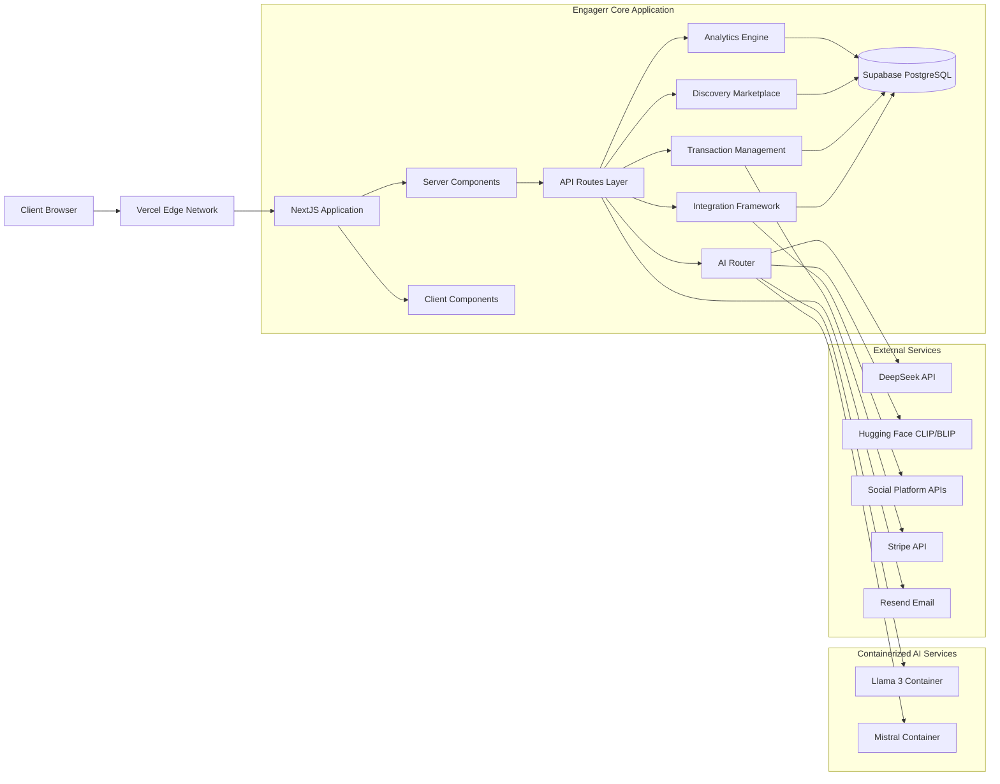

## Engagerr Platform Deployment Guide

### Introduction

This document provides a comprehensive guide for deploying the Engagerr platform to staging and production environments. It covers infrastructure setup, environment configuration, deployment processes, monitoring, and maintenance procedures.

The Engagerr platform utilizes a modern cloud-native architecture, leveraging serverless functions and containerized AI models for scalability and maintainability. The deployment process is designed to be automated and repeatable, ensuring consistent deployments across all environments.

This guide assumes familiarity with cloud computing concepts, command-line tools, and basic DevOps practices.

#### Deployment Architecture

The Engagerr platform is deployed using the following architecture:

- **Frontend & Backend**: Next.js application hosted on Vercel's global edge network
- **Database**: PostgreSQL database managed by Supabase
- **Authentication**: Supabase Auth for user authentication and session management
- **Storage**: Supabase Storage for media assets and document storage
- **AI Services**: Containerized AI models (Llama 3, Mistral) deployed on AWS ECS
- **Payment Processing**: Stripe for subscription management and marketplace transactions
- **Email Delivery**: Resend for transactional emails and notifications



For a detailed overview of the platform architecture, refer to the [Architecture Overview](docs/architecture/overview.md) document.

#### Deployment Strategy

The deployment process follows these key steps:

1.  **Infrastructure Provisioning**: Set up cloud resources using Terraform.
2.  **Environment Configuration**: Configure environment-specific settings.
3.  **CI/CD Pipeline Setup**: Configure automated build, test, and deployment workflows.
4.  **Application Deployment**: Deploy the Next.js application to Vercel.
5.  **Database Setup**: Initialize the Supabase database and apply schema migrations.
6.  **AI Services Deployment**: Deploy containerized AI models to AWS ECS.
7.  **Monitoring Setup**: Configure monitoring and alerting for all components.
8.  **Security Hardening**: Implement security best practices for production.

This guide provides detailed instructions for each of these steps.

#### Environments

The Engagerr platform is deployed to the following environments:

-   **Development**: Local development environment for individual developers.
-   **Preview**: Ephemeral environments automatically created for each pull request.
-   **Staging**: Pre-production environment for testing and validation.
-   **Production**: Live user-facing environment.

#### Local Development

A separate guide is available for setting up a local development environment. Please refer to the documentation in the `docs/setup` directory for instructions.

### Prerequisites

Before starting the deployment process, ensure you have the following accounts, permissions, and tools:

-   [ ] **Vercel Account**: A Vercel account with appropriate team permissions for deploying Next.js applications.
-   [ ] **Supabase Account**: A Supabase account with production-tier access for managing the PostgreSQL database and related services.
-   [ ] **AWS Account**: An AWS account with permissions to create and manage ECS clusters, load balancers, and related resources for hosting AI models.
-   [ ] **GitHub Repository Access**: Access to the Engagerr GitHub repository with admin permissions for setting up CI/CD pipelines and managing secrets.
-   [ ] **Stripe Account**: A Stripe account for managing subscriptions and processing payments.
-   [ ] **DeepSeek AI and Hugging Face API Keys**: API keys for accessing the DeepSeek AI and Hugging Face Inference APIs.
-   [ ] **Domain Name and DNS Access**: A domain name and access to DNS settings for configuring custom domains for the staging and production environments.
-   [ ] **Terraform CLI (>= 1.0.0)**: The Terraform command-line interface for infrastructure provisioning.
-   [ ] **AWS CLI Configured with Appropriate Credentials**: The AWS command-line interface configured with credentials for accessing AWS resources.
-   [ ] **Docker and Docker Compose**: Docker and Docker Compose installed for local testing and building container images.

### Infrastructure Setup

Engagerr uses Terraform to provision and manage cloud infrastructure resources. This approach ensures consistency, repeatability, and version control for infrastructure changes.

1.  **Terraform Project Structure**:

    The Terraform project is organized into modules for each major infrastructure component:

    ```text
    terraform/
    ├── modules/
    │   ├── vpc/
    │   │   ├── main.tf
    │   │   ├── variables.tf
    │   │   └── outputs.tf
    │   ├── ecs/
    │   │   ├── main.tf
    │   │   ├── variables.tf
    │   │   └── outputs.tf
    │   └── ...
    ├── environments/
    │   ├── staging/
    │   │   ├── main.tf
    │   │   ├── variables.tf
    │   │   └── terraform.tfvars
    │   └── production/
    │       ├── main.tf
    │       ├── variables.tf
    │       └── terraform.tfvars
    └── ...
    ```

2.  **Terraform Backend Configuration**:

    Configure a Terraform backend for state management. This can be a cloud storage service like AWS S3 or Azure Blob Storage.

    Example for AWS S3:

    ```terraform
    terraform {
      backend "s3" {
        bucket = "engagerr-terraform-state"
        key    = "engagerr/terraform.tfstate"
        region = "us-east-1"
      }
    }
    ```

3.  **Environment-Specific Variables**:

    Define environment-specific variables in `terraform.tfvars` files for each environment (staging, production).

    Example for staging:

    ```terraform
    environment = "staging"
    aws_region  = "us-east-1"
    instance_type = "t3.medium"
    ```

4.  **Infrastructure Provisioning**:

    Run the following commands to initialize, plan, and apply the Terraform configuration:

    ```bash
    cd terraform/environments/<environment>
    terraform init
    terraform plan
    terraform apply
    ```

5.  **Post-Infrastructure Setup Verification**:

    Verify that all resources have been created successfully in the cloud provider console.

6.  **Infrastructure Management and Updates**:

    Use Terraform to manage and update infrastructure as needed. Always review the Terraform plan before applying changes.

7.  **Terraform Module Organization and Customization**:

    Organize Terraform modules for reusability and customization. Use variables to configure module behavior for different environments.

8.  **Security Considerations for Infrastructure**:

    -   Enable encryption for all storage resources.
    -   Configure network security groups to restrict access to resources.
    -   Use IAM roles with least privilege for all AWS resources.
    -   Regularly review and update security configurations.

### Environment Configuration

Configure environment-specific settings for the staging and production environments.

1.  **Staging Environment Setup**:

    -   Create a separate Vercel project for the staging environment.
    -   Configure a staging Supabase project with appropriate resources.
    -   Set up a dedicated AWS ECS cluster for staging AI models.
    -   Configure a staging domain name and DNS settings.

2.  **Production Environment Setup**:

    -   Create a production Vercel project.
    -   Configure a production Supabase project with high availability and backup configurations.
    -   Set up a production AWS ECS cluster with auto-scaling and load balancing.
    -   Configure a production domain name and DNS settings.

3.  **Environment-Specific Variable Configuration**:

    Define environment variables in Vercel, Supabase, and AWS for each environment.

    Example Vercel environment variables:

    ```text
    DATABASE_URL=<staging_database_url>
    SUPABASE_ANON_KEY=<staging_supabase_anon_key>
    DEEPSEEK_API_KEY=<staging_deepseek_api_key>
    ```

4.  **Secrets Management for Each Environment**:

    Use secure secrets management tools like Vercel Secrets or AWS Secrets Manager to store sensitive information.

5.  **Database Configuration for Different Environments**:

    Configure database connection settings, including connection pooling and timeouts, for each environment.

6.  **Environment Isolation and Security Considerations**:

    -   Use separate AWS accounts or VPCs for staging and production environments.
    -   Configure network security groups to restrict access to resources.
    -   Implement strict access control policies for all environments.

7.  **Setting Up Monitoring and Alerting per Environment**:

    Configure monitoring and alerting for each environment using tools like Vercel Analytics, Supabase Monitoring, and AWS CloudWatch.

8.  **Environment Promotion and Validation Strategy**:

    -   Promote code changes from staging to production after thorough testing and validation.
    -   Use feature flags to gradually roll out new features in production.
    -   Monitor performance and error rates after each deployment.

### CI/CD Pipeline Setup

Set up a CI/CD pipeline using GitHub Actions to automate the build, test, and deployment processes.

1.  **GitHub Actions Workflow Structure**:

    Create a GitHub Actions workflow file (e.g., `.github/workflows/deploy.yml`) with the following structure:

    ```yaml
    name: Deploy to Production
    on:
      push:
        branches:
          - main
    jobs:
      deploy:
        runs-on: ubuntu-latest
        steps:
          - uses: actions/checkout@v3
          - name: Set up Node.js
            uses: actions/setup-node@v3
            with:
              node-version: 18
          - name: Install dependencies
            run: npm install
          - name: Run tests
            run: npm test
          - name: Deploy to Vercel
            run: vercel deploy --prod --token=${{ secrets.VERCEL_TOKEN }}
    ```

2.  **Setting Up Required Secrets in GitHub Repository**:

    Add the following secrets to the GitHub repository settings:

    -   `VERCEL_TOKEN`: Vercel API token for deployment.
    -   `SUPABASE_SERVICE_KEY`: Supabase service key for database migrations.
    -   `AWS_ACCESS_KEY_ID`: AWS access key ID for ECS deployment.
    -   `AWS_SECRET_ACCESS_KEY`: AWS secret access key for ECS deployment.

3.  **Configuring Deployment Triggers and Conditions**:

    Configure the workflow to trigger on pushes to the `main` branch.

4.  **Testing Strategy Integration within the Pipeline**:

    Include unit tests, integration tests, and end-to-end tests in the workflow.

5.  **Deployment Approval Process Configuration**:

    Implement a manual approval step before deploying to production.

6.  **Rollback Procedures and Configuration**:

    Configure the workflow to automatically roll back to the previous deployment if the new deployment fails.

7.  **Notification Setup for Deployment Events**:

    Set up notifications for deployment events using Slack or email.

8.  **Pipeline Monitoring and Troubleshooting**:

    Monitor the CI/CD pipeline using GitHub Actions and troubleshoot any issues that arise.

### Vercel Deployment

Deploy the Next.js application to Vercel.

1.  **Setting Up the Vercel Project for Engagerr**:

    -   Create a new project in Vercel and connect it to the Engagerr GitHub repository.
    -   Configure the project to use the `main` branch for production deployments.

2.  **Configuring Build Settings and Environment Variables**:

    -   Set the build command to `npm run build`.
    -   Set the output directory to `.next`.
    -   Configure environment variables in the Vercel project settings.

3.  **GitHub Integration for Automated Deployments**:

    -   Enable automatic deployments for the `main` branch.
    -   Configure Vercel to create preview deployments for pull requests.

4.  **Custom Domain Setup and SSL Configuration**:

    -   Add a custom domain to the Vercel project.
    -   Configure DNS settings to point the domain to Vercel.
    -   Vercel automatically provisions SSL certificates for custom domains.

5.  **Environment Specific Settings and Configurations**:

    -   Configure separate Vercel projects for staging and production environments.
    -   Use environment variables to differentiate between environments.

6.  **Optimizing for Edge Network Deployment**:

    -   Use serverless functions for API routes and data processing.
    -   Leverage Vercel's edge caching capabilities to improve performance.
    -   Optimize images and assets for fast loading times.

7.  **Deployment Verification and Testing**:

    -   Verify that the application is deployed successfully and accessible through the custom domain.
    -   Run end-to-end tests to validate core functionality.

8.  **Performance Monitoring and Optimization**:

    -   Use Vercel Analytics to monitor performance metrics.
    -   Identify and address any performance bottlenecks.
    -   Continuously optimize the application for speed and efficiency.

### Supabase Setup

Set up and manage the Supabase database services.

1.  **Creating and Configuring Supabase Projects for Each Environment**:

    -   Create separate Supabase projects for staging and production environments.
    -   Select an appropriate database plan based on resource requirements.

2.  **Database Initialization with Required Extensions (LTREE)**:

    -   Enable the `LTREE` extension in the Supabase database.

        ```sql
        CREATE EXTENSION ltree;
        ```

3.  **Setting Up Row Level Security Policies**:

    -   Configure RLS policies to restrict data access based on user roles and permissions.

4.  **Executing Schema Migrations Using Prisma**:

    -   Use Prisma Migrate to apply database schema changes.

        ```bash
        npx prisma migrate deploy
        ```

5.  **Database Backup and Recovery Configuration**:

    -   Configure automated database backups in Supabase.
    -   Test the backup and recovery process to ensure it works correctly.

6.  **Setting Up Database Replication and Read Replicas**:

    -   Configure read replicas to improve read performance.
    -   Configure connection pooling to manage database connections efficiently.

7.  **Performance Tuning and Optimization**:

    -   Monitor database performance and identify slow queries.
    -   Optimize database queries and indexes to improve performance.

8.  **Database Maintenance Procedures**:

    -   Regularly vacuum and analyze the database to maintain performance.
    -   Monitor database logs for errors and warnings.

### AI Services Deployment

Deploy and manage containerized AI services.

1.  **Overview of the Multi-Model AI Architecture Deployment**:

    -   The AI system uses a multi-model architecture with specialized models for different tasks.
    -   The AI Router directs requests to the appropriate model based on task requirements.

2.  **Building and Pushing AI Model Docker Images**:

    -   Build Docker images for the Llama 3 and Mistral models.

        ```bash
        docker build -t engagerr-llama -f Dockerfile.llama .
        docker build -t engagerr-mistral -f Dockerfile.mistral .
        ```

    -   Push the Docker images to a container registry like Docker Hub or AWS ECR.

        ```bash
        docker tag engagerr-llama <dockerhub_username>/engagerr-llama:latest
        docker push <dockerhub_username>/engagerr-llama:latest
        ```

3.  **Setting Up Container Orchestration with Docker Compose**:

    -   Use Docker Compose to define and manage the AI services.

        ```yaml
        version: '3.8'
        services:
          llama:
            image: <dockerhub_username>/engagerr-llama:latest
            ports:
              - "5000:5000"
          mistral:
            image: <dockerhub_username>/engagerr-mistral:latest
            ports:
              - "5001:5000"
        ```

4.  **AWS Configuration for ECS Deployment**:

    -   Create an ECS cluster in AWS.
    -   Define task definitions for the Llama 3 and Mistral models.
    -   Create ECS services for the Llama 3 and Mistral models.

5.  **Load Balancer and Networking Setup**:

    -   Set up a load balancer to distribute traffic to the AI services.
    -   Configure network security groups to restrict access to the AI services.

6.  **Resource Allocation for Different AI Models**:

    -   Allocate appropriate CPU, memory, and GPU resources to each AI model based on its requirements.

7.  **GPU Configuration for Inference Acceleration**:

    -   Configure GPU acceleration for the Llama 3 and Mistral models.

8.  **AI Services Monitoring and Scaling**:

    -   Monitor the AI services using AWS CloudWatch.
    -   Configure auto-scaling to handle increased demand.

9.  **Model Update and Deployment Procedures**:

    -   Implement a process for updating and deploying new versions of the AI models.

### Database Migrations

Manage database migrations for production.

1.  **Database Migration Strategy Overview**:

    -   Use Prisma Migrate to manage database schema changes.
    -   Follow a consistent migration workflow to ensure data integrity.

2.  **Creating and Testing Migrations Using Prisma**:

    -   Create a new migration using Prisma Migrate.

        ```bash
        npx prisma migrate dev --name <migration_name>
        ```

    -   Test the migration in a development environment.

3.  **Migration Deployment Process and Safeguards**:

    -   Apply the migration to the staging environment.

        ```bash
        npx prisma migrate deploy --env staging
        ```

    -   Verify that the migration was applied successfully.
    -   Apply the migration to the production environment.

        ```bash
        npx prisma migrate deploy --env production
        ```

4.  **Rollback Procedures for Failed Migrations**:

    -   If a migration fails, roll back to the previous version.

        ```bash
        npx prisma migrate down --to <migration_name>
        ```

5.  **Data Migration for Large Datasets**:

    -   Use batch processing and background jobs to migrate large datasets.

6.  **Schema Versioning Strategy**:

    -   Use semantic versioning for database schema changes.

7.  **Database Performance Monitoring During Migrations**:

    -   Monitor database performance during migrations to identify any issues.

8.  **Zero-Downtime Migration Approaches**:

    -   Use techniques like blue-green deployments to minimize downtime during migrations.

### Monitoring Setup

Set up monitoring and observability.

1.  **Configuring Logging for Application Components**:

    -   Use a structured logging format (e.g., JSON) for all application components.
    -   Include relevant context in log messages (e.g., request ID, user ID).

2.  **Setting Up Metrics Collection and Dashboards**:

    -   Use Prometheus and Grafana to collect and visualize metrics.
    -   Create dashboards for key performance indicators (KPIs).

3.  **Alert Configuration and Notification Channels**:

    -   Configure alerts for critical events (e.g., high error rates, low disk space).
    -   Use notification channels like Slack or email to send alerts.

4.  **Health Check Implementation and Monitoring**:

    -   Implement health checks for all application components.
    -   Monitor the health checks to detect any issues.

5.  **Performance Monitoring and Optimization**:

    -   Monitor application performance and identify bottlenecks.
    -   Optimize code and infrastructure to improve performance.

6.  **Cost Monitoring and Optimization**:

    -   Monitor cloud resource costs and identify areas for optimization.
    -   Use cost management tools to track and control spending.

7.  **Setting Up Synthetic Transaction Monitoring**:

    -   Create synthetic transactions to simulate user behavior.
    -   Monitor the synthetic transactions to detect any issues.

8.  **Incident Response Process and Procedures**:

    -   Define a clear incident response process.
    -   Document procedures for handling common incidents.

### Security Considerations

Implement security best practices for production deployment.

1.  **Secrets Management and Rotation**:

    -   Use a secure secrets management tool to store sensitive information.
    -   Regularly rotate secrets to prevent unauthorized access.

2.  **Authentication and Authorization for Production**:

    -   Enforce multi-factor authentication (MFA) for all users.
    -   Implement strong password policies.
    -   Use role-based access control (RBAC) to restrict access to resources.

3.  **Network Security Configuration**:

    -   Configure network security groups to restrict access to resources.
    -   Use a web application firewall (WAF) to protect against common attacks.

4.  **Database Security Best Practices**:

    -   Enable encryption at rest and in transit for the database.
    -   Regularly audit database access and permissions.

5.  **Vulnerability Scanning and Remediation**:

    -   Use automated vulnerability scanning tools to identify security vulnerabilities.
    -   Regularly apply security patches and updates.

6.  **Compliance Considerations (GDPR, PCI-DSS)**:

    -   Ensure compliance with relevant regulations.
    -   Implement data privacy and security controls.

7.  **Regular Security Audits and Penetration Testing**:

    -   Conduct regular security audits and penetration testing to identify vulnerabilities.

8.  **Incident Response Plan for Security Events**:

    -   Define a clear incident response plan for security events.
    -   Regularly test the incident response plan.

### Scaling Strategy

Implement a strategy for scaling the platform to accommodate growth.

1.  **Automatic Scaling Configuration for Vercel**:

    -   Configure Vercel to automatically scale the application based on traffic.

2.  **Database Scaling with Read Replicas and Connection Pooling**:

    -   Use read replicas to improve read performance.
    -   Configure connection pooling to manage database connections efficiently.

3.  **AI Service Scaling for Increased Demand**:

    -   Use auto-scaling to scale the AI services based on demand.

4.  **Resource Capacity Planning**:

    -   Regularly review resource utilization and plan for future capacity needs.

5.  **Performance Bottleneck Identification and Resolution**:

    -   Use monitoring tools to identify performance bottlenecks.
    -   Optimize code and infrastructure to improve performance.

6.  **Cost Optimization During Scaling**:

    -   Use cost management tools to track and control spending.
    -   Optimize resource utilization to reduce costs.

7.  **Multi-Region Deployment Considerations**:

    -   Consider deploying the application to multiple regions to improve availability and performance.

8.  **Scaling for Specific Growth Scenarios**:

    -   Plan for scaling based on specific growth scenarios (e.g., increased user base, increased data volume).

### Disaster Recovery

Implement disaster recovery procedures and planning.

1.  **Backup Strategy and Implementation**:

    -   Configure automated backups for all critical data.
    -   Store backups in a secure, offsite location.

2.  **Recovery Time Objective (RTO) and Recovery Point Objective (RPO)**:

    -   Define RTO and RPO for each critical component.

3.  **Backup Verification Procedures**:

    -   Regularly test the backup and recovery process to ensure it works correctly.

4.  **Disaster Recovery Testing Process**:

    -   Conduct regular disaster recovery drills to test the recovery process.

5.  **Step-by-Step Recovery Procedures**:

    -   Document step-by-step procedures for recovering from different types of disasters.

6.  **Data Restoration Process**:

    -   Define a process for restoring data from backups.

7.  **Communication Plan During Outages**:

    -   Develop a communication plan for notifying stakeholders during outages.

8.  **Regular Disaster Recovery Drills**:

    -   Conduct regular disaster recovery drills to ensure the recovery process is effective.

### Maintenance Procedures

Document routine maintenance procedures.

1.  **Regular Update Procedures**:

    -   Regularly update dependencies and apply security patches.

2.  **Dependency Updates and Security Patches**:

    -   Use automated tools to manage dependencies and security patches.

3.  **Database Maintenance (Vacuum, Index Rebuilding)**:

    -   Regularly vacuum and analyze the database to maintain performance.
    -   Rebuild indexes as needed to improve query performance.

4.  **Log Rotation and Management**:

    -   Configure log rotation to prevent logs from consuming too much disk space.
    -   Use a log management tool to analyze and monitor logs.

5.  **Backup Verification**:

    -   Regularly verify that backups are working correctly.

6.  **Performance Tuning and Optimization**:

    -   Regularly monitor performance and identify areas for optimization.

7.  **Resource Utilization Reviews**:

    -   Regularly review resource utilization and identify any inefficiencies.

8.  **Documentation Updates**:

    -   Keep documentation up to date with any changes to the system.

### Troubleshooting

Document common deployment issues and solutions.

1.  **Deployment Failure Diagnostics**:

    -   Check Vercel logs for deployment errors.
    -   Review the CI/CD pipeline for any failures.

2.  **Database Connection Issues**:

    -   Verify database credentials and connection settings.
    -   Check network connectivity to the database.

3.  **AI Service Startup Problems**:

    -   Check container logs for errors.
    -   Verify that the AI services are properly configured.

4.  **Performance Degradation Investigation**:

    -   Use monitoring tools to identify performance bottlenecks.
    -   Analyze database queries and code for inefficiencies.

5.  **Authentication and Authorization Problems**:

    -   Verify authentication and authorization configurations.
    -   Check user roles and permissions.

6.  **Integration Failure Troubleshooting**:

    -   Check API keys and credentials.
    -   Verify network connectivity to external services.

7.  **Rollback Procedures**:

    -   Follow documented rollback procedures to revert to a previous state.

8.  **Escalation Paths and Support Resources**:

    -   Define escalation paths for critical issues.
    -   Provide contact information for support resources.